Salesforce is a customer relationship management solution that brings companies and customers together.  
Salesforce connector pulls the event monitoring data that contains information useful for assessing organisation usage trends and user behavior.

## **Prerequisites**

- Connectivity with salesforce API using valid credentials

- Required credentials:
    - Username
    
    - Password
    
    - Consumer key
    
    - Consumer secret
    
    - Security token
    
    - Instance URL

## **Steps to setting up salesforce account**

### **CREATE A CONNECTED APP**

Follow below steps to create a connected app

- Login to Salesforce Administrator account.

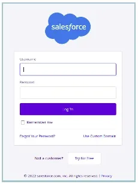

- Click on the setup icon on the navigation bar.

- Navigate to the **Platform Tools** tab on the left panel.

- Navigate to Apps > App Manager.  
    

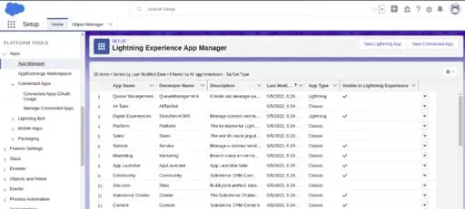

- Click **New Connected App**.

- Fill out the necessary fields, select **Enable OAUTH** settings checkbox

- Enter value for callback url

- Select Manage user data via APIs (api) and Perform requests at any time (refresh\_token, offline\_access) in Selected OAuth Scopes column

- Uncheck Require Secret for Refresh Token Flow checkbox  
      
    

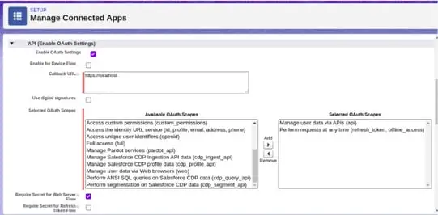

- Click **Save**.

- Navigate to **Platform Tools > Apps > App Manager**.

- Navigate to your created connected app and click on the arrow on the right side.  
      
    

- Select view option from the menu.

- Navigate to API (Enable OAuth Settings) section, click on **Manage Consumer Details** button.  
      
    

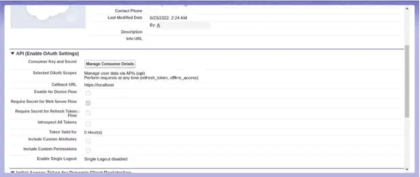

- Copy the values of the consumer key and consumer secret and keep it.  
    

### **CREATE USER PROFILES**

User profiles defines user's access to objects and data, and tasks allowed to the user within the application.

Follow below steps to create user profile in salesforce:

- Login to salesforce administrator account.

- Click on the setup icon on the navigation bar.

- Navigate to **ADMINISTRATION** tab on left panel

- Navigate to **Users > Profiles** section

- Click on the new profile button  
      
    

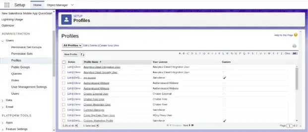

- Select existing profile as standard user

- Specify a name for the profile  
      
    

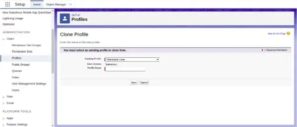

- Click **Save**

- Now click on the edit button.

- Navigate to Connected App Access, select the connected apps you want to access using this profile.  
      
    

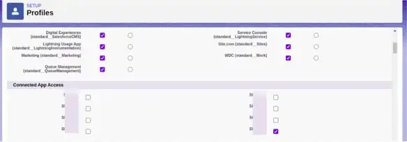

- Navigate to **Administrative Permissions**, select **API Enabled** and **Manage Users** checkbox.  
      
    

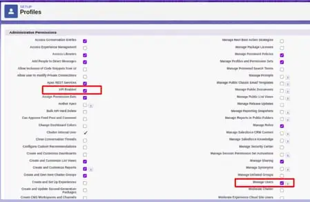

- Navigate to **General User Permissions**, select **View Event Log Files** checkbox.  
      
    

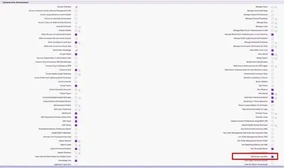

- Click **Save**.

### **CREATE A USER IN SALESFORCE**

Follow below steps to create user in salesforce:

- Login to salesforce administrator account.

- Click on the setup icon on the navigation bar.

- Navigate to the ADMINISTRATION tab on the left panel.

- Navigate to Users > Users.

- Click on the New User  
      
    

- Fill out the necessary fields, select user license as Salesforce and select the profile we created in the previous step  
    

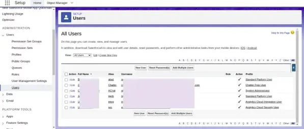

- To obtain a user password, select the “Generate new password and notify the user immediately” checkbox.

- Click on save.

### **GET SECURITY TOKEN**

Follow the steps to get a security token.

- Login to Salesforce using the Salesforce account to be used by the connector.

- Click the view profile section located in the upper right corner, then click Settings.  
      
    

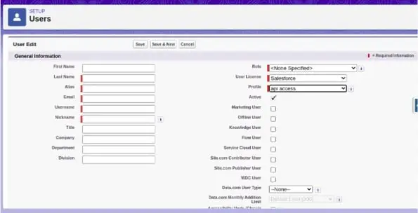

- In the right panel of the page, navigate to **My Personal Information** > **Reset My Security Token**.  
      
    

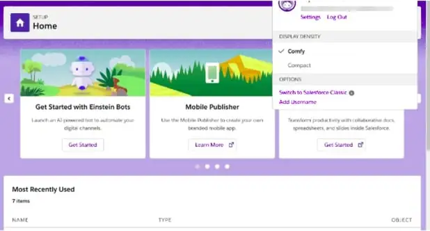

- Click **Reset Security Token**.

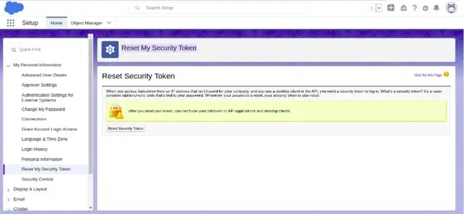

- Token will be sent to you via email.

## **Configurations**

The following are the configurations to forward **Salesforce** logs to DNIF.‌  

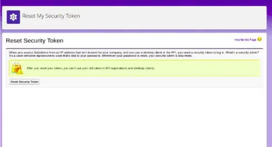

| **Field Name**  | **Description** |
| --- | --- |
| Connector Name | Enter a connector name |
| Connector Type | Enter salesforce\_connector |
| Instance URL | Enter salesforce instance URL |
| Salesforce User | Enter salesforce username |
| Salesforce User Password | Enter salesforce user password |
| Consumer key | Enter salesforce Consumer key |
| Consumer secret | Enter salesforce Consumer secret |
| Security Token | Enter salesforce Security Token |

- Click **Save** after entering all the required details and click **Test Connection**, to test the configuration.

- A **Connection successful** message will be displayed on screen along with the time stamp.

- If the connection is not successful an error message will be displayed. Refer [Troubleshooting Connector Validations](https://dnif.it/kb/troubleshooting-and-debugging/troubleshooting-connector-validations/) for more details on the error message.

Once the connector is configured, validate if the connector is listed under **[Collection Status](https://dnif.it/kb/operations/collection-status/)** screen with status as **Active**. This signifies the connector is configured successfully and data is ready to ingest.
