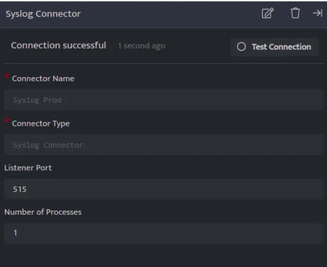

Syslog Connector can receive logs from various devices and log sources via UDP connection on port 514 of the Adapter

## **Pre-requisites**

- Ensure that port 514UDP is open and is not occupied by some other services to enable forwarding of log events.

- Log in to the server as the root user.

- Install syslog package, if you haven’t installed it using the below command:

```
apt-get install rsyslog
```

- Edit rsyslog configuration with vim /etc/rsyslog.d/50-default.conf and paste following line below

```
*.* @DNIF-Adapter-IP:514
```

- Save the syslog configuration file.

- Restart the rsyslog service using the below command

```
/etc/init.d/rsyslog restart
```

## **Configurations**

The following are the configurations to forward Syslog Connector logs to DNIF.‌  



| **Field Name** | **Description** |
| --- | --- |
| Connector Name | Enter a name for the connector |
| Connector Type | Enter Syslog connector |
| Listener Port | Enter the port number at which you want to start the connector |
| Number of Processes | Number of processes to run for the connector |

- Click **Save** after entering all the required details and click **Test Connection**, to test the configuration.

- A **Connection successful** message will be displayed on screen along with the time stamp.

- If the connection is not successful an error message will be displayed. Refer [Troubleshooting Connector Validations](https://dnif.it/kb/troubleshooting-and-debugging/troubleshooting-connector-validations/) for more details on the error message.

Once the connector is configured, validate if the connector is listed under **[Collection Status](https://dnif.it/kb/operations/collection-status/)** screen with status as **Active**. This signifies the connector is configured successfully and data is ready to ingest.
