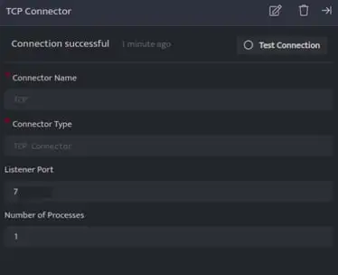

TCP Connector can receive logs from various devices and log sources via TCP connection on any custom port of the Adapter.

## **Pre-requisites**

Ensure that the port where a device or log source is forwarding logs is open and is not occupied by some other service to enable forwarding of log events.

## **Configurations**

The following are the configurations to forward TCP Connector logs to DNIF.‌

| **Field Name**  | **Description** |
| --- | --- |
| Connector Name  | Enter a name for the connector |
| Connector Type | Enter TCP connector |
| Listener Port | Enter the port number at which you wan to start the connector |
| Number of Processes | Number of processes to run for the connector |

- Click **Save** after entering all the required details and click **Test Connection**, to test the configuration.

- A **Connection successful** message will be displayed on screen along with the time stamp.

- If the connection is not successful an error message will be displayed. Refer [Troubleshooting Connector Validations](https://dnif.it/kb/troubleshooting-and-debugging/troubleshooting-connector-validations/) for more details on the error message.

Once the connector is configured, validate if the connector is listed under **[Collection Status](https://dnif.it/kb/operations/collection-status/)** screen with status as **Active**. This signifies the connector is configured successfully and data is ready to ingest.
