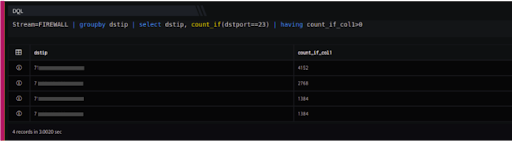

The count\_if function returns the number of records that satisfy the condition. The following illustrates the syntax of the count\_if function:

```
stream=FIREWALL|groupby dstip|select dstip, count_if(dstport==23)|having count_if_col1>0
```

Here,

- Stream is Firewall

- Groupby function allows to organize similar data into groups i.e. groupby destination IP Address.

- Select function helps you to retrieve records from one or more tables, the records retrieved are known as a result set.

- The count\_if (condition) function returns a count of events where condition is met.

In this example, on execution it should retrieve all fields for each event where the stream is a firewall, it retrieves the total count of events against the appropriate destination ip address, The output is shown as below:


