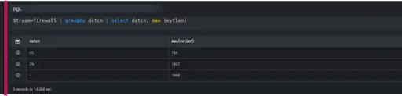

  
The MAX function that allows you to find the maximum value in a set of values. The following illustrates the syntax of the MAX function.

```
Stream=firewall | groupby dstcn | select dstcn, max (evtlen)
```

Here,

- Stream is Firewall

- Groupby function allows to organize similar data into groups i.e. groupby destination country.

- Select function helps you to retrieve records from one or more tables, the records retrieved are known as a result set.

- The max ( ) function returns the highest value (maximum) in a set of non-NULL values.

In this example, on execution it should retrieve all fields for each event where the stream is firewall, it retrieves the maximum value in each group. The output is shown as below:


