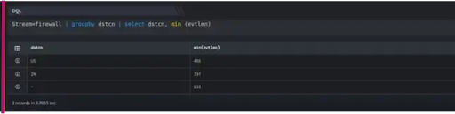

  
The MIN function returns the minimum value in a set of values. The following demonstrates the syntax of the MIN function.

```
Stream=firewall | groupby dstcn | select dstcn, min (evtlen)
```

Here,

- Stream is Firewall

- Groupby function allows to organize similar data into groups i.e. groupby destination country.

- Select function helps you to retrieve records from one or more tables, the records retrieved are known as a result set.

- The min ( ) function returns the lowest value (minimum) in a set of non-NULL values.

In this example, on execution it should retrieve all fields for each event where the stream is a firewall; it retrieves the minimum value in each group. The output is shown as below:


