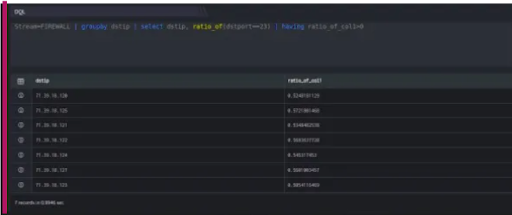

The ratio\_of function computes the ratio value where the condition is met. The following illustrates the syntax of the ratio\_of function:

```
Stream=FIREWALL | groupby dstip | select dstip, ratio_of (dstport==23) | having ratio_of_col1>0
```

Here,

- Stream is Firewall

- Groupby function allows to organize similar data into groups i.e. groupby destination IP Address.

- Select function helps you to retrieve records from one or more tables, the records retrieved are known as a result set.

- The ratio\_of (condition) function returns the ratio value of a numeric column.

In this example, on execution it should retrieve all fields for each event where the stream is a firewall; it retrieves the ratio value in each group. The output is shown as below:


