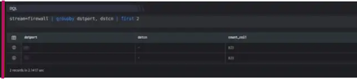

  
The first keyword picks the oldest or earliest events to be a part of the result set. Hence, the oldest/earliest events appear first in the result set. The result set is then limited to the number of events specified in the query after the first keyword.

Take a look at the example given below:

```
stream=firewall | groupby dstport, dstcn | first 2
```

This query retrieves two fields: destination port and destination country. However, we limit the result set (first 2) to only 2 oldest events which satisfy the where condition. The result set is sorted in the ascending order.


