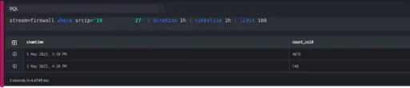

  
Gives a count of events in each bucket (time interval). It aggregates data by different fixed-time intervals and returns a rounded-up input TIMESTAMP value to a value that corresponds with the start or end of the time slice interval.

Given an input TIMESTAMP value such as 2000-10-28T00:00:01, the start time of a 3-second time slice interval is 2000-10-28T00:00:00, and the end time of the same time slice is 2000-10-28T00:00:03.

###### **USING $CNAMTIME**

The timeslice keyword groups events based on the time they were stored in DNIF. It also gives a count of events in each bucket (time interval). It is widely used in queries written to create charts (for example, line charts and bar charts) which involve timelines/time intervals. By default, the timeslice function creates these time intervals using the $CNAMTime field. The duration (length) of these time intervals is specified along with the timeslice keyword.

$CNAMTime is the time (timestamp) when an event was received and stored by DNIF

Take a look at the example given below:

```
stream=firewall where srcip='172.26.10.238' | duration 1h | timeslice 1h | limit 100
```



This query retrieves all fields for each event where the result set is grouped into buckets of 1 hour intervals on $CNAMTime along with the count for each interval. By default, the result set is sorted such that the oldest (earliest) time interval appears first.

Along with the timeslice keyword, use 'm' for minute and 'h' for hour.

**Example:** Use timeslice 1h to create intervals of 1 hour each. Use timeslice 1m to create intervals of 1 minute each.

The starting point of the time intervals (hh:15 or hh:30 and so on) are based on the value (interval length) specified along with the timeslice keyword. Also, if any row (time interval) is missing in the result set, it means that no events were received during that time interval.

As you see the timeslice keyword is followed by 1h which means one hour, you could also use 'm' for minute.
