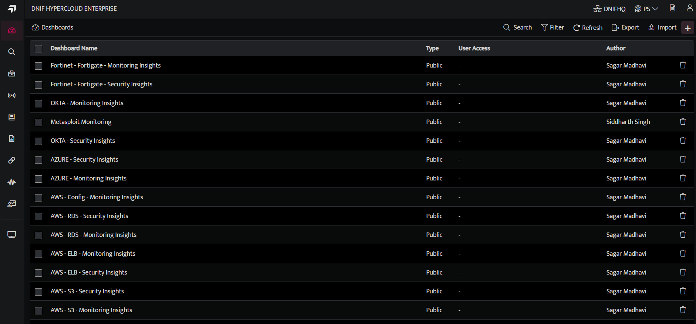
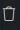
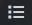
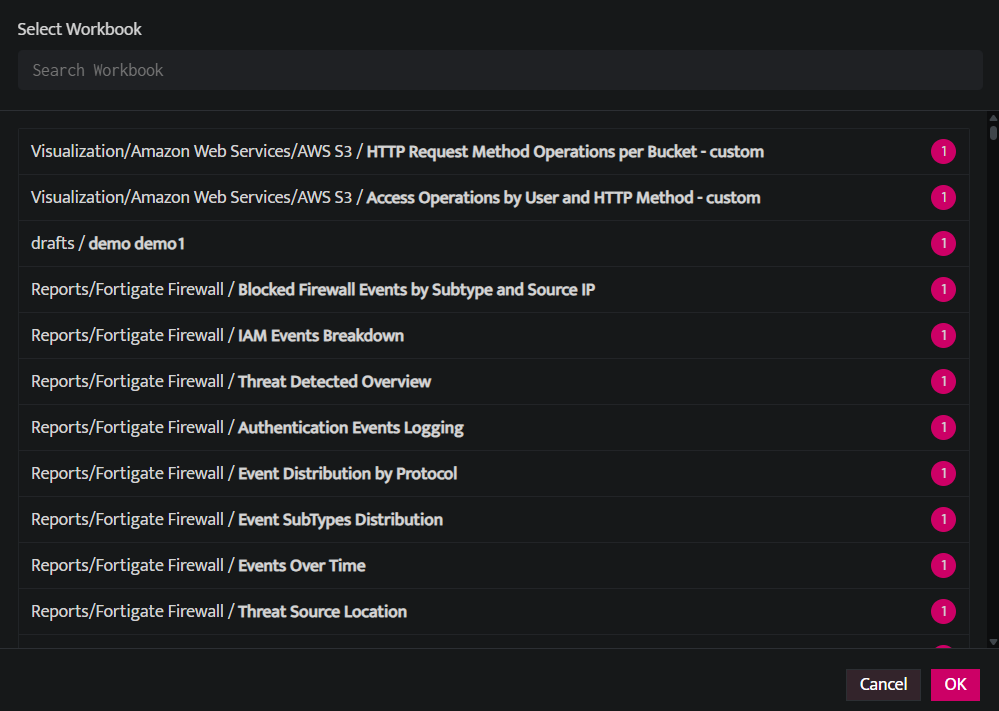

A Dashboard is an element of a graphical user interface (GUI) that displays information of different widgets to a single place or provides a specific way for a user to interact with DNIF. It allows users to build a customized view that is relevant to them, data is added and displayed on the dashboard through the widgets.

## **How to add Widgets to Dashboard?**

- Click **Dashboards** icon on the left navigation bar, it will display the list of existing Dashboard visualizations.

### **Dashboard List**

<!-- C:\Users\Bharti Nirnejak\Downloads\DNIF_KB - Copy\DNIF_KB - Copy\docs\documents\7.Operations\c.Manage Dashboard\image\create-a-dashboard-2.webp -->

The Dashboard List screen displays the following fields:  

| Field Name | Description |
| --- | --- |
| **Dashboard Name** | Displays the list of saved dashboards. Click the dashboard name to view the specific dashboard. |
| **Type** | Displays the access type of the dashboard (e.g., Public, Private). |
| **User Access** | Displays the user access permissions for the dashboard. |
| **Author** | Displays the name of the user who created this dashboard visualization. |
|  | Used to delete the specific dashboard visualization. |

Dashboard allows you to add and arrange multiple widgets to analyze up-to-date information so they can make smarter, data-driven decisions. Dashboards help you to Improve data discovery and helps to identify the true impact of data.

- Go to Dashboard, Click **plus** sign. The lists of all saved workbooks are displayed.

- The blue circle next to the Workbook name indicates the count of Visualization Graphs available in the Workbook.

- The bullet list icon  next to the workbook indicates that there are no visualization blocks added to the workbook. For these workbooks, you can directly render the query result as a dashboard widget .

- Select the workbooks to be rendered as a dashboard widget.

- Displayed below is a dashboard view after rendering multiple workbooks.

<!-- TODO: Fix broken image link below. Original path: images/image205-Dec-08-2023-10-40-02-4451-AM.jpg -->
<!--  -->

The following icons are displayed on every individual widget on the dashboard.

| **Icons** | **Description** |
| --- | --- |
|  | Use this icon to open a particular workbook |
|  | Use this icon to refresh the widget |
|  | Use this icon to remove the widget from dashboard. This icon will be displayed only in edit mode. |

**Introduced in v9.1.1**  
UNET sync is a process that is running on core and it automatically syncs your dashbaord every 30 minutes.

## **Delete a Panel**

- Click on **Delete** icon on the right corner of the Panel to delete the panel.
