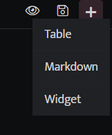
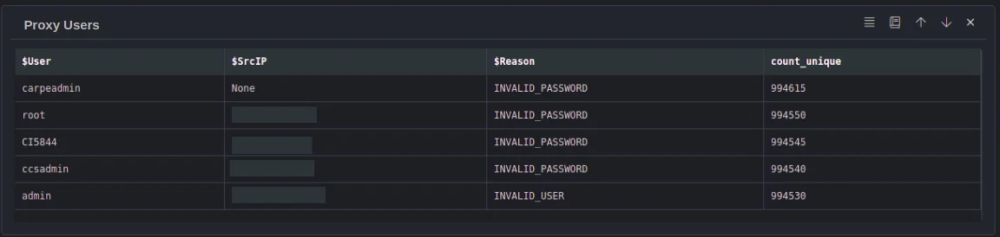
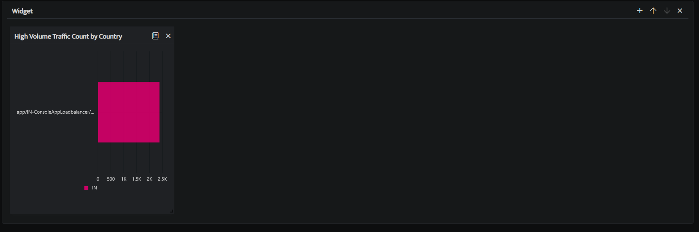
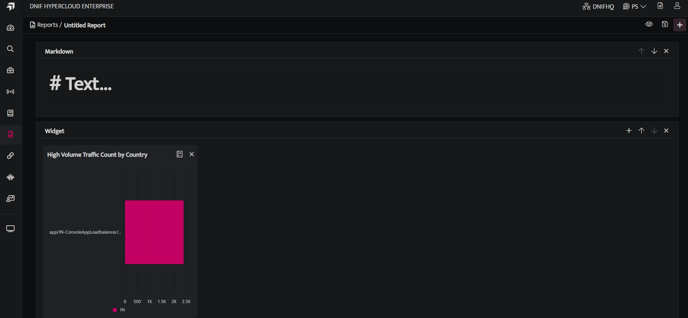

Go to **Reports**, click the **plus** icon, the following list will be displayed on screen.

## **Table**

Tables can be used to generate reports. Select this and it will list all workbooks, select a workbook and click **ok**, the query results of the selected workbooks will be added to the report in table format.

## **Markdown**

Markdown is used to add a title or a brief description about the report or include some details about the tables or the widgets added.

## **Widgets**

Widgets are used to add widgets to your report page. Select this and it will list all workbooks with visual blocks added, select a particular workbook or the visual blocks and will be added as a widget to a report.

- Click **Save** icon after adding all the Tables, Markdowns and Widgets.

- Click the **eye** icon on top of the page to have a pdf preview of the report page.

- The saved report will be displayed on the report list page.
