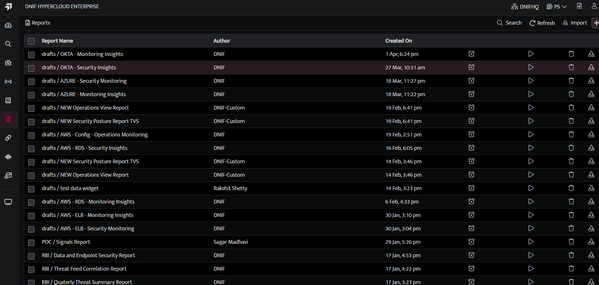
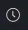
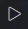
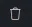
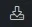
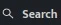
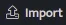
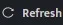

Reports are an elegant way to represent any type of data. In our case, we see a lot of log-based information from various devices in our console. This data can sometimes become a nightmare to understand. So we have come up with a simple, yet effective, process to create reports within our console.

## **How to View Reports?**  
  

- Click the **Reports** icon on the left navigation bar, it will display the list of existing Reports.

- The **Manage Report** list screen displays the following fields and its details:

| **Field Name** | **Description** |
| --- | --- |
| Report Name | Displays the list of saved reports, click this report name to view the particular Report. |
| Author | Displays the name of the user who created this Report |
| Created On | Displays the date and time when this report was created |
|  | Use this icon to schedule the report |
|  | Use this icon to invoke the report and send it to an email address |
|  | Use this icon to delete the specific Report |
|  | Use this icon to download the report. |
|  | Use this to search for a specific report |
|  | Use this icon to import a specific report |
|  | Use this to refresh the Reports list page |
|  | Use the icon to preview the report. |

Report allows you to add and arrange multiple tables, widgets to analyze up-to-date information so they can make smarter, data-driven decisions.
