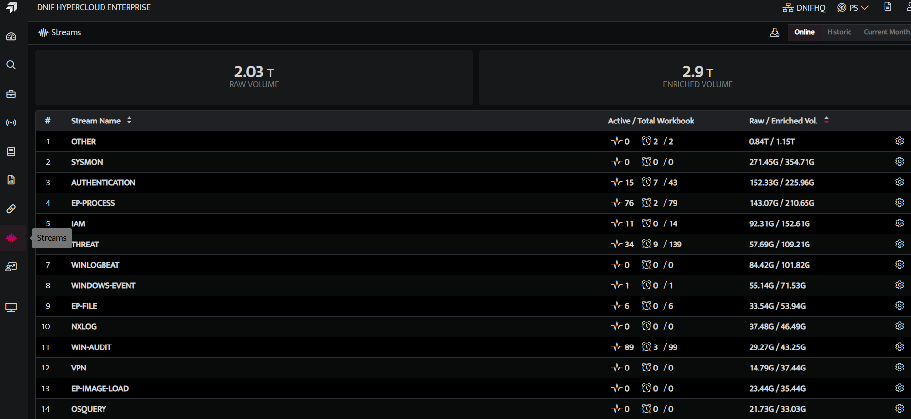
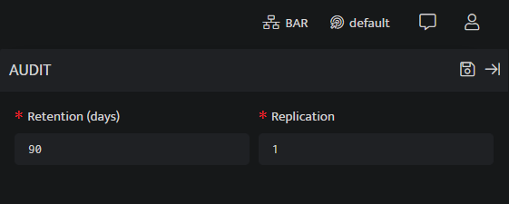

## **Overview**

Stream Management is management of a specific collection of data that is used as a log. The data is written to and read from the log stream in a specific format so that all the instances of a particular stream are diverted into a single segment.

Data in a log stream can be compressed, replicated, and retained for a specific time period. DNIF allows you to configure customized settings for each stream in the organizational network. It will help you to compress the data without affecting the query speed, and also store data for compliance purposes without occupying much disk space.

## **Retention**

Retention settings can be used to specify how long log events are stored in DNIF. By default, the log data retention period is for 90 days. The log data retention is configurable as per organizational requirements and all the data older than the current retention configurations will be deleted automatically.

## **Data Compression**

The growth of big data has created a demand for ever-increasing processing power and efficient storage. Compressing big data can help address these demands by reducing the amount of storage and bandwidth required for data sets.  
DNIF uses compression algorithms to manage large amounts of data. Compression can also remove irrelevant or redundant data, making analysis and processing easier and faster. It typically reduces the size of a file, which reduces both cost and transfer time.

## **Replication**

DNIF Data Replication is the asynchronous process of storing the same data in multiple locations to improve data availability and accessibility, and to improve system resilience and reliability. One common use of data replication is for disaster recovery, to ensure that an accurate backup exists at all times in case of a catastrophe, hardware failure, or a system breach where data is compromised. By default, the data will be replicated once.

## **How to configure Streams?**

- Click **Streams** icon on the left navigation bar of the Home Screen, to view list of all the streams configured

The **Stream Management** screen displays the following details

- The top section of the screen displays the total consumption of the tenant (previously known as cluster ) such as total volume of raw logs, enriched logs, disk space, percentage of compression.

- The total consumption by an individual stream is displayed in the grid format as follows:

| Field Name | Description |
| --- | --- |
| **Stream Name** | Displays the name of the stream. |
| **Active / Total Workbook** | Shows the number of active and total workbooks associated with the stream. |
| **Raw / Enriched Vol.** | Displays the total volume of raw logs and enriched logs for that particular stream in the format **Raw Volume / Enriched Volume**. |
| **Size on Disk** | Displays the disk space occupied by each stream. |
| **Compression** | Displays the rate at which the logs are compressed for that particular stream in percentage. |

You can also apply the following filters to the above grid view

| **Filters** | **Description** |
| --- | --- |
| Online | Use this to view all the streams that are currently online |
| Historic | Use this to view all the streams ever since DNIF deployment |
| Current Month | Use this to view all the streams for the current month. By default, the details are displayed for the current month. |

- Click **Edit** icon displayed against each stream to configure details.

- The **Edit** screen displays the following configurations:  
    

| Field Name | Description |
| --- | --- |
| **Compression** | Enter the compression type. By default, the compression type used is **Normal**. You can also change the compression type to **High** as per your requirement. |
| **Retention (days)** | Enter the retention period. By default, the retention period is **90 days**. |
| **Replication** | Enter the replication factor. By default, the replication factor is **1**. **Note:** 1 indicates only the original data. If set to 2, it indicates the original and one copy, and so on. |

- Modify the required configuration details and Click **Save**, to save the configuration.

- You can click **Collection Status** to view more details about the source streams from where logs are collected. Refer [Device Collection Status](https://dnif.it/kb/operations/collection-status/).
