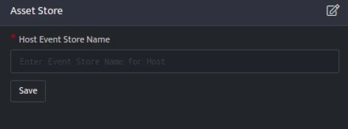
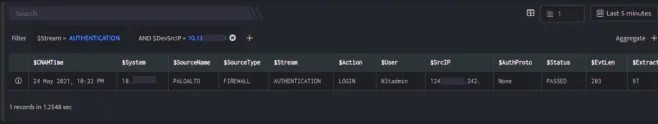
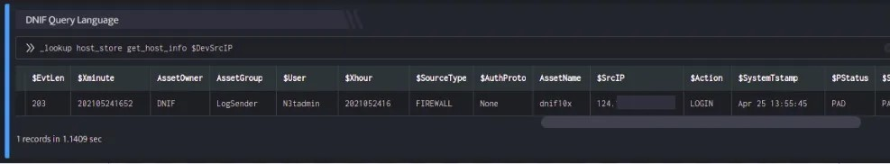

Asset Store integration is used to lookup on custom event stores uploaded to DNIF for various Hosts in an organization.

## **Pre-requisites**

- The custom [event store](https://dnif.it/kb/operations/event-stores/) must contain a column named **$Host** in the event store data.

## **Configuration**

The following configuration should be done for Asset Store.

- Follow the initial configuration steps in [How to Configure Automation?](https://dnif.it/kb/uncategorized/configuring-automation/).  
      
      
    

- Click the edit icon to add details.  
    

| **Field**  | **Description** |
| --- | --- |
| Host Event Store Name | Enter valid Event Store Name for Host |

- Enter the above details and click **Save**.  
    

## **Lookup integrated with Asset Store**

### **Retrieve Host Details**

The Host for which you want to retrieve details from the event store.

### **Function\_name**

```
get_host_info
```

### **Input**

- The HostDetails is a custom event store created to demonstrate this example.  
    [host\_details.csv](https://m.dnif.it/hubfs/host_details.csv)

- Run a Search  
      
    

The Search query retrieves the $DevSrcIP field for each event in the HostDetails (custom) eventstore.

### **Output**

```
_lookup host_store get_host_info $DevSrcIP
```

In the pipelined query function, the \_lookup directive calls the get\_host\_info function of the host\_store plugin. $DevSrcIP is passed as a parameter to the function. This output contains details about the Device such as the Asset name, Asset Owner, Asset Group and so on. The output is as shown below:



The Lookup call returns output based on the available data in the event store.
