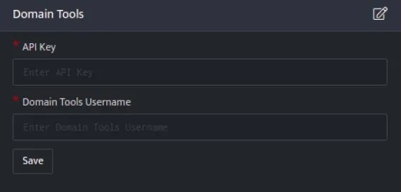
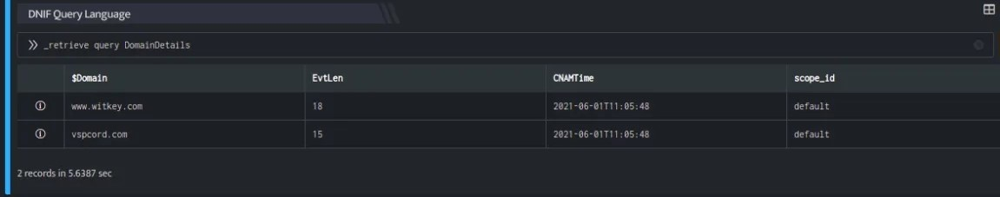
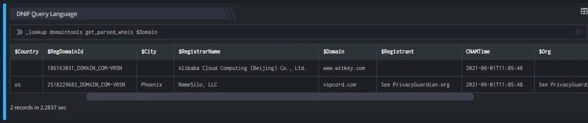
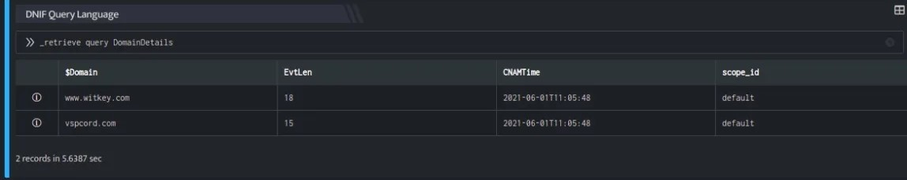
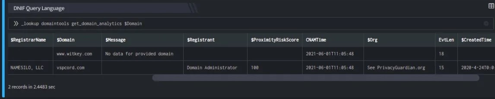
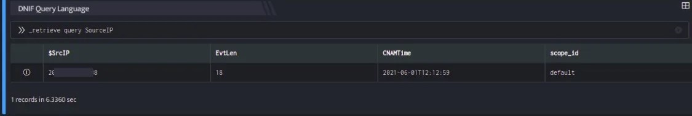
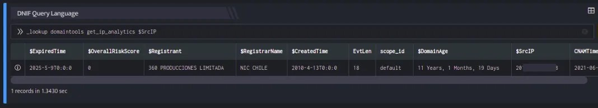

DomainTools helps security analysts turn threat data into threat intelligence. It takes indicators from your network, including domains and IP addresses, and connects them with nearly every active domain on the internet. These connections perform risk assessments, help profile attackers, guide online fraud investigations, and map cyber activity to the attacker’s infrastructure.

DomainTools collects Open Source Intelligence (OSINT) data from many sources, along with historical records, and stores it in a central database. It then indexes and analyzes the OSINT data based on various connection algorithms to deliver actionable intelligence, including domain scoring and forensic mapping.

## **Pre-requisites**

- You will need a DomainTools Enterprise API username and API key to complete the configuration.

- DomainTools typically provides access to obtain the API credentials by creating an account for the primary point of contact in your organization. For more information, visit [https://www.domaintools.com/](https://www.domaintools.com/)

## **Configuration**

- Follow the initial configuration steps in [How to Configure Automation](https://dnif.it/kb/uncategorized/configuring-automation/)?  
      
      
    

- Click the edit icon to add details.

| **Field** | **Description** |
| --- | --- |
| API Key | Enter DomainTools API Key |
| Domain Tools Username | Enter DomainTools Username |

- Enter the above details and click **Save**.  
    

## **DomainTools lookup plugin functions**

**Retrieve parsed information**

This function returns parsed information extracted from the most recent raw WHOIS record.

**Function\_name**

```
get_parsed_whois
```

**Input**

A domain name

```
_retrieve query DomainDetails
```

Here:

The DomainDetails is a custom event store created to demonstrate this example. The \_retrieve directive fetches the $Domain field for each event in the DomainDetails (custom) eventstore. The output is as shown below:



**Output**

```
_lookup domaintools get_parsed_whois $Domain
```

In the pipelined query function, the \_lookup directive calls the get\_parsed\_whois function of the domaintools plugin. $Domain is passed as a parameter to the function. This report contains details about the domain, the source domain, country in which the domain is registered, age of the domain and so on. The output is as shown below:



The Lookup call returns output in the following structure for available data

| **Field** | **Type** | **Description** |
| --- | --- | --- |
| $Domain | text | Source domain for lookup |
| $Org | text | Registrant Organisation for the domain |
| $City | text | City in which the domain is registered |
| $DomainAge | text | Age of the Domain |
| $CreatedTime | text | Domain registration date |
| $Country | text | Country in which the domain is registered |
| $ExpiredTime | text | Domain registration expiry duration |
| $RegDomainId | text | Domain Registry Id |
| $RegistrarName | text | Name of the Registrar |
| $Registrant | text | Name of the Registrant |

**Retrieve Domain Analytics Data**

This function returns risk scores and threat predictions based on DomainTools Proximity and Threat Profile algorithms. It helps in deeper investigation of a domain.

**Function\_name**

```
get_domain_analytics
```

**Input**

A domain name

```
_retrieve query DomainDetails
```

Here:

The DomainDetails is a custom event store created to demonstrate this example. The \_retrieve directive fetches the $Domain field for each event in the DomainDetails (custom) eventstore. The output is as shown below:



**Output**

```
_lookup domaintools get_domain_analytics $Domain
```

In the pipelined query function, the \_lookup directive calls the get\_domain\_analytics function of the domaintools plugin. $Domain is passed as a parameter to the function. This report contains details about the domain, the source domain, overall risk score, proximity risk score for the queried domain and so on. The output is as shown below:



The Lookup call returns output in the following structure for available data

| **Field** | **Type** | **Description** |
| --- | --- | --- |
| $Domain | text | Source domain for lookup |
| $OverallRiskScore | number | Overall Risk Score for the queried domain |
| $ProximityRiskScore | number | Proximity Risk Score for the queried domain |
| $Org | text | Registrant Organisation for the domain |
| $State | text | State in which the domain is registered |
| $DomainAge | text | Age of the Domain |
| $CreatedTime | text | Domain registration date |
| $Country | text | Country in which the domain is registered |
| $ExpiredTime | text | Domain registration expiry duration |
| $RegistrarName | text | Name of the Registrar |
| $Registrant | text | Name of the Registrant |
| $ThreatProfileRiskScore | number | Threat Profile risk Score for the queried domain |

**Retrieve IP Analytics Data**

This function returns a complete report of all threat indicators for a given IP address.

**Function\_name**

```
get_ip_analytics
```

**Input**

```
_retrieve query SourceIP
```

Here:

The SourceIP is a custom event store created to demonstrate this example. The \_retrieve directive fetches the $SrcIP field for each event in the SourceIP (custom) eventstore. The output is as shown below:



**Output**

```
_lookup domaintools get_ip_analytics $SrcIP
```

In the pipelined query function, the \_lookup directive calls the get\_ip\_analytics function of the domaintools plugin. $SrcIP is passed as a parameter to the function. This report contains details about the source domain, overall risk score, proximity risk score for the queried $SrcIP and so on. The output is as shown below:



The Lookup call returns output in the following structure for available data

| **Field** | **Type** | **Description** |
| --- | --- | --- |
| $Domain | text | Source domain for lookup |
| $OverallRiskScore | number | Overall Risk Score for the queried IP |
| $ProximityRiskScore | number | Proximity Risk Score for the queried IP |
| $Org | text | Registrant Organisation for the Domain |
| $State | text | State in which the domain is registered |
| $DomainAge | text | Age of the Domain |
| $CreatedTime | text | Domain registration date |
| $Country | text | Country in which the domain is registered |
| $ExpiredTime | text | Domain registration expiry duration |
| $RegistrarName | text | Name of the Registrar |
| $Registrant | text | Name of the Registrant |
| $ThreatProfileRiskScore | number | Threat Profile risk Score for the queried IP |
