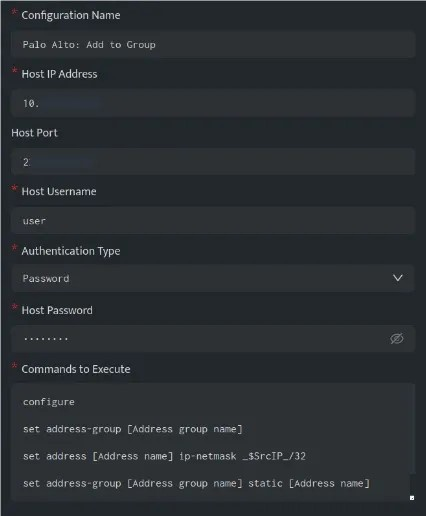
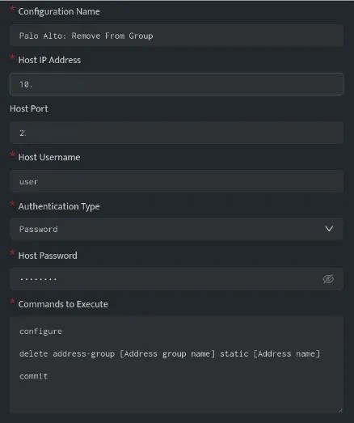
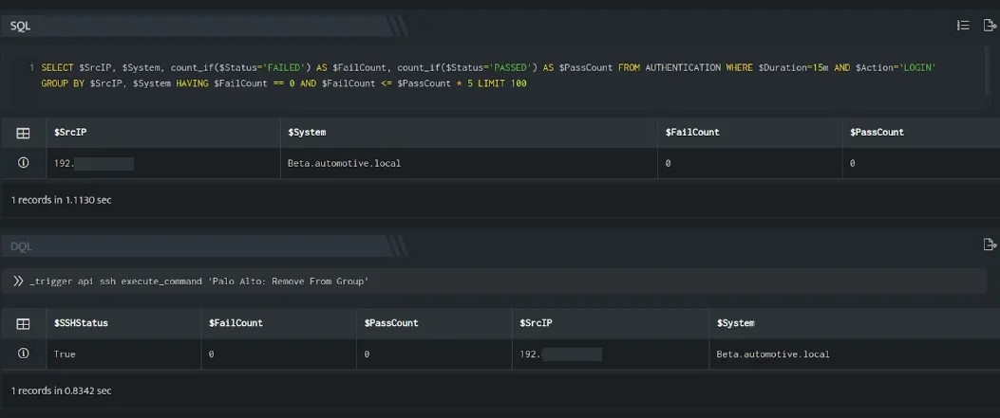

This article lists examples demonstrating practical use cases for taking action on Palo Alto servers.

- [Add Host to Group](#Add-host-to-group-palo-alto)

- [Remove Host from Group](#Remove-host-from-group-palo-alto)

## **Add Host to Group (PaloAlto)**

The below configuration allows user to connect to the Palo Alto host and run any command



In the above configuration, execute the following commands:

```
configureset address-group [Address group name]set address [Address name] ip-netmask _$SrcIP_/32set address-group [Address group name] static [Address name]commit
```

The above set of commands will add an IP Address to a certain group. Ensure the commands are valid for your Palo Alto using the [documentation](https://knowledgebase.paloaltonetworks.com/KCSArticleDetail?id=kA10g000000ClcLCAS).


In the above figure, a search query is executed that displays all the suspicious IP Addresses that have failed at their login attempts more than 50 times. Using \_trigger query, an API call is made to the above ssh integration configuration, which will add the IP Addresses in the $SrcIP column to the group mentioned in the config.

You need to apply the firewall rules to block the IP Addresses present in the group.

## **Remove Host from Group (Palo Alto)**

The below configuration allows you to connect to the Palo Alto host and run any command



In the above configuration, execute the following commands

```
configuredelete address-group [Address group name] static [Address name]commit
```

The above set of commands will remove an IP Address from a certain group. Ensure the commands are valid for your Palo Alto using the link.



In the above figure, a search query is executed that displays all the IP Addresses that don not have failed login attempts. Using \_trigger query, an API call is made to the above ssh integration configuration, which will remove the IP Addresses in the $SrcIP column from the group mentioned in the configuration.
