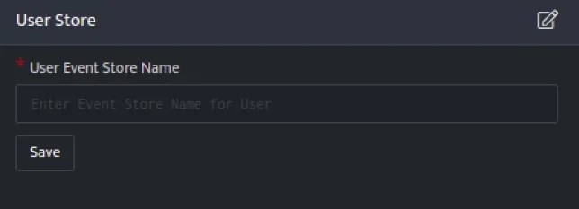
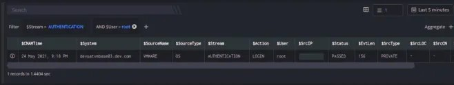
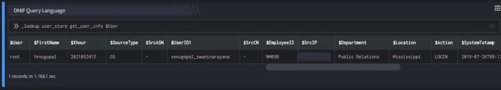

User Store integration is used to lookup on custom event stores uploaded to DNIF for various Users in an organization.

## **Pre-requisites**

- The custom [event store](https://dnif.it/kb/operations/event-stores/) must contain a column named **$User** in the event store data.

## **Configuration**

- Follow the initial configuration steps in [How to](https://www.dnif.it/en/kb/configuring-automation) [Configure](https://dnif.it/kb/uncategorized/configuring-automation/) [Automation?](https://www.dnif.it/kb/configuring-automation).  
      
      
      
    

- Click the edit icon to add details.  
    

| **Field** | **Description** |
| --- | --- |
| User Event Store Name | Enter valid Event Store Name for User |

- Enter the above details and click **Save**.  
    

## **Lookup integrated with User Store**

### **Retrieve User Details**  

The User for which you want to retrieve the details from the eventstore.

### **Function\_name**

```
get_user_info
```

### **Input**

- The UserDetails is a custom event store created to demonstrate this example. [user\_details.csv](https://m.dnif.it/hubfs/user_details.csv)

- Run a Search  
      
    

The Search query retrieves the $User field for each event in the UserDetails (custom) eventstore.

### **Output**

```
_lookup user_store get_user_info $User
```

In the pipelined query function, the \_lookup directive calls the get\_user\_info function of the user\_store plugin. $User is passed as a parameter to the function. This report contains details about the User such as the Employee ID, Department, Location of the User and so on. The output is as shown below:



The Lookup call returns output based on the available data in the event store.
