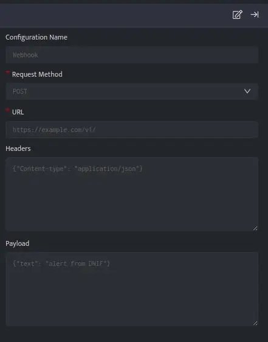

Webhook provides you with a simple interface to integrate DNIF with various third party application’s webhook/api. The Webhook plugin has a handy feature which allows you to use $Variables for substitution in the configuration. Check the Webhook example for Slack to understand its use case.

## **Pre-requisites**

You need to provide the following data depending on the third party webhook/api they intend to use.

- URL

- Headers

- Payload

## **Configuration**

1. Follow the initial configuration steps in [How to Configure Automation](https://dnif.it/kb/uncategorized/configuring-automation/).

- Click the edit icon to add details.

| **Field** | **Description** |
| --- | --- |
| Configuration Name | Name for the configuration |
| Request Method | Select the request method from the drop down |
| URL | URL for the webhook/api |
| Headers | Appropriate headers for the webhook/api in JSON format |
| Payload | Appropriate payload for the webhook/api in JSON/Text/XML format |

Variable substitution is supported in the configuration viz; URL, Headers and Payload

- Enter the above details and click **Save**.

To associate webhook automation config with investigate panel - it must provide exactly one substitution parameter - either $User or $Host.

## Examples

Listed below are few Webhook integration examples, these examples will help you to quickly get started with the configuration process by demonstrating practical use cases.

- [Sl](https://dnif.it/kb/connectors/supported-connectors/slack/)[a](https://dnif.it/kb/automation/supported-automation/slack-configuration/)[ck](https://dnif.it/kb/connectors/supported-connectors/slack/)

- [Microsoft Teams Channel](https://dnif.it/kb/automation/supported-automation/microsoft-teams-channel/)

- [ClickSend](https://dnif.it/kb/automation/supported-automation/clicksend/)

- [PagerDuty](https://dnif.it/kb/automation/supported-automation/pagerduty/)

- [JiraServiceDesk](https://dnif.it/kb/automation/supported-automation/jiraservicedesk/)

- [ServiceNow](https://dnif.it/kb/automation/supported-automation/servicenow/)

- [New Relic](https://dnif.it/kb/automation/supported-automation/new-relic/)

- [Opsgenie](https://dnif.it/kb/automation/supported-automation/opsgenie/)

- [TrendMicro](https://dnif.it/kb/automation/supported-automation/trendmicro/)
