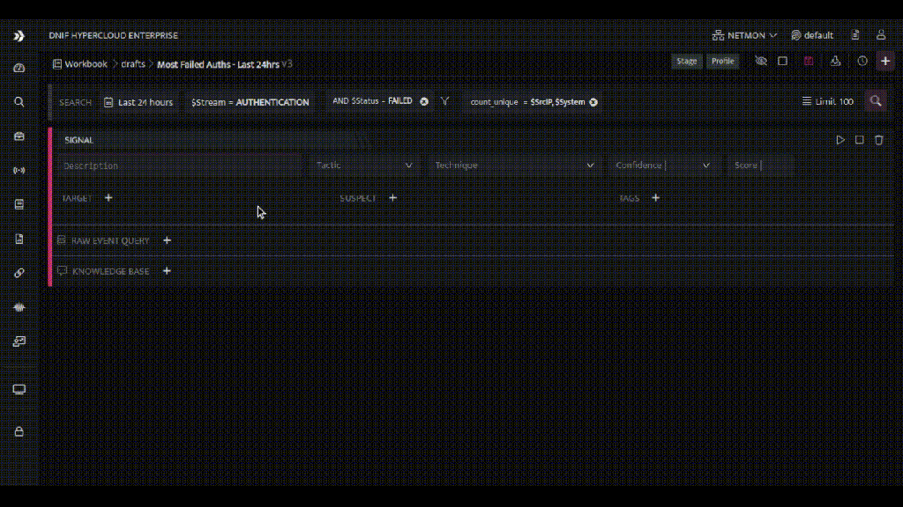
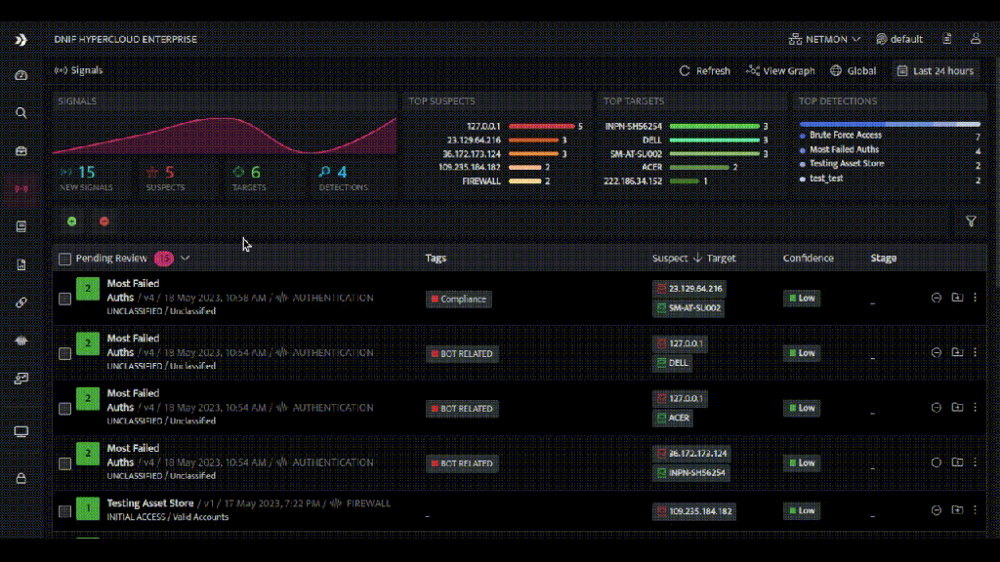
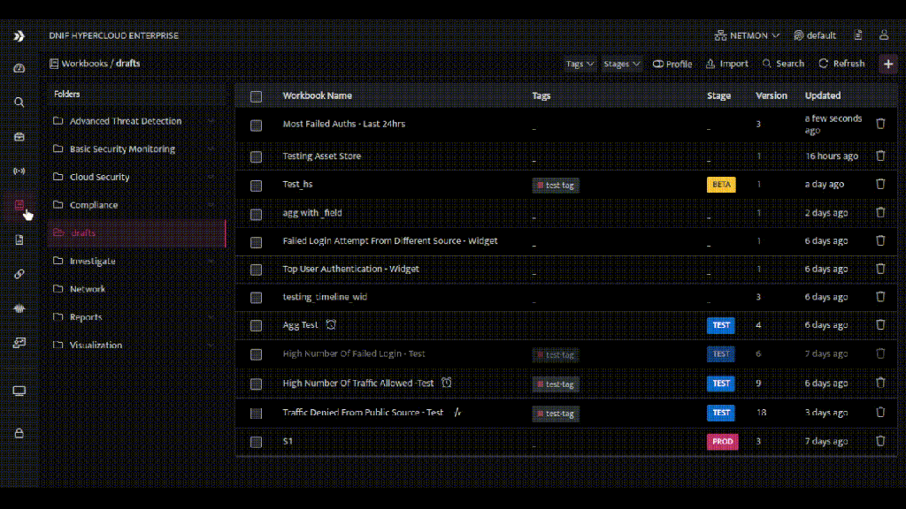

## **Introduction**  
  

Signal Tagging is a powerful feature that allows DNIF HYPERCLOUD users to categorize and organize their signals based on specific criteria or attributes. By assigning tags to signals, users can easily group, filter, and search for relevant alerts, simplifying their alert analysis process.

## **Benefits of Signal Tagging**  
  

- Improved Organization: Users can categorize signals based on their nature, severity, source, threat actor/campaigns, or any other relevant attribute. This helps in creating a well-organized alert management system.

- **Streamlined Analysis**: With tagged signals, users can quickly filter and focus on specific categories of alerts, enabling more efficient and targeted analysis. This saves time and effort in navigating through a large volume of signals.

- **Customized Workflows**: Signal tagging allows users to define their own tagging conventions and workflows, aligning with their specific use cases and requirements. This flexibility enables users to tailor the alert analysis process to their unique needs.

- **Enhanced Collaboration**: Signal tagging promotes collaboration among team members by providing a standardized framework for classifying alerts. It enables efficient knowledge sharing, collaboration, and handover between analysts.

## **Working with Signal Tagging**  
  

### **Step 1: Accessing the Signal Tagging Feature**  
  

- Log in to your DNIF HYPERCLOUD account.

- Navigate to an existing or a new workbook.

- Add a signal block.

### **Step 2: Adding Tags to Signals**  
  

- Look for the "Tag" or "Add Tag" option in the interface and click on it.

- Enter the desired tag(s) in the provided field. You can use existing tags or create new ones.

### **Step 3: Searching and Filtering Signals by Tags**  
  

- To search for signals with specific tags, use the filter functionality within the Signals page.

- Select a tag name to display signals associated with that tag.

- Combine multiple tags or use additional search criteria for more advanced filtering.

Workbooks can be filtered based on the signal tags added within them. This allows for efficient filtering and analysis of workbooks based on the assigned tags. You can visualize and focus on specific subsets of data by applying filters based on the signal tags associated with the workbooks.

