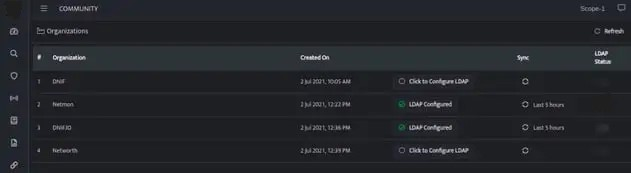
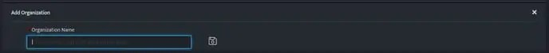
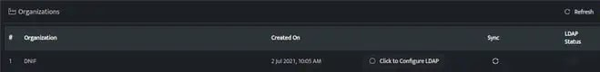
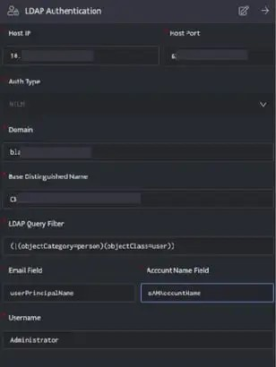
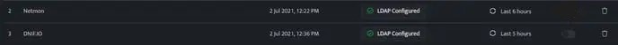
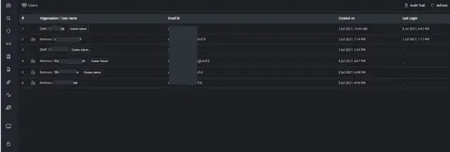

LDAP is a type of software protocol that allows individual users and applications to find and verify whatever information they need within their organization. It would validate whether a user would have access or not, this validation is done by passing user’s credentials. In doing so, IT can point LDAP-enabled systems and applications (for example) to an associated LDAP directory database, which acts as the source of truth for authenticating user access.

In DNIF, users can login to DNIF Console using LDAP authentication and the following authentications are used:

- **NTLM:** This type of authentication mode uses LDAP protocol with SSL enabled to communicate with microsoft active directory

- **Secured LDAP:** This authentication mode uses the ldaps:// protocol over SSL encrypted port (typically 636) or the one specified in configuration.

- **Unencrypted:** This authentication mode uses the ldap:// protocol over unencrypted port (typically 389) or the one specified in configuration.

## **Prerequisites**

- Connectivity between LDAP Server and DNIF console

- A user must exist in DNIF and LDAP

- User email in DNIF and LDAP should match.

- User must be present in the configured baseDN and matching ldapfilter results

## **How to Configure LDAP authentication?**

- Navigate to **Administration Panel** **\> Organizations**, the following screen will be displayed.

- Click on the plus sign on the top right corner of the page to add an organization.

- Enter an Organization name and click save, the saved organization name will be listed and will display as **click to configure LDAP**.

An Organization can be deleted only if no users are bound to it.

- Click on the **click to configure LDAP**, the following screen will be dispalyed.

- Enter the following details.

| **Field** | **Description** |
| --- | --- |
| Host IP | Enter bind IP of the LDAP Server |
| Host Port | Enter bind Port of the LDAP Server |
| Auth Type | Select an Auth Type from dropdown values: Supported Auth Types are \[NTLM, Unencrypted, Secure LDAP\] |
| Domain | Enter Domain of the LDAP Server, this option is displayed only when auth type NTLM is selected. |
| Base Distinguished Name | Enter Base Distinguished name for LDAP Server |
| LDAP Query Filter | Enter LDAP query filters to search LDAP database |
| Email Field | Enter the field name for email id stored in LDAP database |
| Account name Field | Enter the field name for account name or login name stored in LDAP database |
| LDAP Username | Enter a LDAP Username |
| Password | Enter password for LDAP user enterred in LDAP username field |

- Enter all the above details and click save.

- Once the configuration is successfully completed, it will be displayed as follows:  
      
    

- On successful configuration the LDAP users in the organization will be synced to DNIF.

Users should be manually added to the organization 

- By default, sync will occur on 2 am UTC for organizations where LDAP is enabled.

- On updating any user details, a manual sync should be done from the Organizations page.

- Password Reset is not allowed for any LDAP users.

- On the [Manage Users](https://dnif.it/kb/user-management-access-control/manage-organization-and-users/manage-users/) page, an icon is added next to the username indicating that the user is an LDAP connected user.

- Once LDAP is configured for an organization, it is mandatory for all users belonging to that organization to use LDAP authentication.

 In case of connectivity issues between LDAP server and DNIF console, only a tenant admin user ( previously known as cluster admin user) (created before enabling LDAP authentication) will be allowed to login using DNIF credentials.
