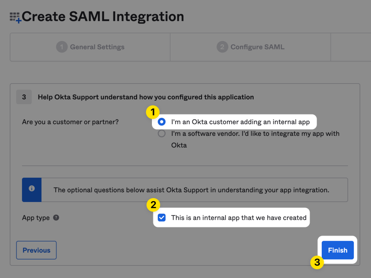

DNIF provides SAML Authentication for the following:

1. [OKTA](#samlwithokta)

3. [Google Workspace](#steps_to_setup_saml_integration_on_google)

## Steps to set SAML Auth for OKTA on DNIF Console

- Changing Authentication Type
    - Login to DNIF Console using customer organization admin credentials.
    
    - Hover on the Administration tab and click on Organizations.  
          
          
          
        
    
    - Select the organization from the organization list.  
          
          
          
        
    
    - The organization details page will open,Click on Edit Organization button.  
          
          
          
        
    
    - Edit Organization Modal will open. Select SSO from Authentication Type Dropdown > Select Okta from SSO Provider dropdown.  
          
          
          
          
        
    
    - Click on Next Button and copy the SSO URL and Entity ID URL from the config form.  
          
          
          
        
    
    - Go to the Okta account to configure the SAML integration.

- ### **Creating a New Organization with SAML as Authentication Type.**
    - Login to DNIF Console using customer organization admin credentials.
    
    - Navigate to System tab  > Organizations.
    
    - Navigate to the organizations page through the System tab.  
          
          
          
        
    
    - Click on Create Organization Button.  
          
          
          
        
    
    - Organization creation form will open.
        - Select Authentication Type as SSO.  
              
              
              
            
        
        - SSO Provider as Okta.  
              
              
              
            
        
        - Click on the next button.

## **Steps to setup SAML integration on Okta** 

- Login to your okta account.

- Navigate to Applications > Applications from main menu. Click on create app integration.  
      
      
      
    

- Select SAML 2.0 as the sign-in method and click Next.  
      
      
      
    

- Then name the application and optionally upload the DNIF logo.

- Click the Next button to proceed to the SAML Settings page.

- Populate the form fields gathered from AUTH configuration on DNIF console.
    - Single Sign-On URL: value copied from DNIF console as SSO Url
    
    - Audience URI: value copied from DNIF console as Entity ID URL.  
          
          
          
          
          
        

- Set the Name ID format to EmailAddress, Application username to Email and check that Update application username on is set to Create and update.

- Then scroll to the Attribute Statements section and create a name custom attribute.  
      
      
      
      
    

- Finally, scroll down to the bottom of the page and click the Next button.

- Mark the app as an internal application, then click the Finish button to complete the creation of the SAML 2.0 application.  
      
      
      
      
    

- Click the Sign On tab for the DNIF application in Okta, then scroll down and copy the Metadata URL.  
      
      
      
      
      
      
    

- Go to the DNIF console. Navigate to Administration  > > Organizations.

- Select the organization from the organization list. The organization details page will open > Click on Edit Organization button > Edit Organization Modal will open > Click Next (As SSO for Authentication Type and Okta for SSO Provider will already have been selected).

- Fill out the Manifest Url copied in Step 11 and save the config.

- Click on the Assignments tab for the DNIF application and assign accounts you want to provide access to the DNIF application.  
      
      
      
      
      
    

## **Steps to setup SAML Auth for Google Workspace on DNIF Console**

- ### **Changing Authentication Type**
    - Login to DNIF Console using customer organization admin credentials.
    
    - Hover on the Administration tab and click on Organizations.
    
    - Navigate to the organizations page through the System tab.  
          
          
          
        
    
    - Select the organization from the organization list. The organization details page will open.  
          
          
          
        
    
    - Click on Edit Organization button  
          
          
          
        
    
    - Edit Organization window will open, Select SSO from Authentication Type Dropdown  
          
          
          
        
    
    - Select Google from SSO Provider dropdown.  
          
          
          
        
    
    - Click on Next Button and copy the SSO URL and Entity ID URL from the config form.  
          
          
          
        
    
    - Go to the Google account to configure the SAML integration.

- Creating a New Organization with SAML as Authentication Type.
    - Login to DNIF Console using customer organization admin credentials.
    
    - Hover on the **Administration** tab and click on **Organizations.**
    
    - Navigate to the Organizations page through the System tab.  
          
          
          
        
    
    - Click on Create Organization Button  
          
          
          
        
    
    - Organization creation form will open.
        - Select Authentication Type as SSO  
              
              
              
            
        
        - SSO Provider as Google.  
              
            <!-- TODO: Fix broken image link below. Original path: images/AD_4nXd3tEQDvMTM2EaXCKLib1qQJ4re4eY_Vgfs3lt_T1w41pIgYjqX-97QSabIJkL-BgN21KbSPwjBIWbdUlNhtVxpGFSKwD2WgnYS7AR7hObtNYN6qVxL31V6sO5vcGsnqASZfcc1Dw?key=ILoOuMP7AfRJ4dtNfmDOiveQ -->
            <!--  -->

- - Click on the next button.Steps to setup SAML integration on Google

- ### **Step 1: Add the custom SAML app**
    
    - [Sign in](https://admin.google.com/) with a _super_ _administrator_ account to the [**Google Admin console**](https://support.google.com/a/answer/182076).  
        If you aren't using a super administrator account, you can't complete these steps.
    - In the Admin console, go to Menu > Apps > Web and mobile apps.
    - Click Add App > Add custom SAML app.  
        Enter the app name and, optionally, upload an icon for your app. The app icon appears on the Web and mobile apps list, on the app settings page, and in the app launcher. If you don't upload an icon, an icon is created using the first two letters of the app name.
    - Click Continue.
    - On the Google Identity Provider details page, get the setup information needed by the service provider using one of these options:
        - Download the IDP metadata.
        - Copy the SSO URL and Entity ID.
    - (Optional) To enter the information into the appropriate SSO configuration page, in a separate browser tab or window, sign in to your service provider and enter the information you copied in Step 5, then return to the Admin console.
    - Click Continue.
    - Contact your service provider for these field values. In the Service Provider Details window, enter values acquired after setting up SSO on DNIF console in step 6:
        - ACS URL—The service provider's Assertion Consumer Service URL receives the SAML response. It must start with https://.
        - Entity ID—The globally unique name.
        - Start URL—(Optional) This sets the RelayState parameter in a SAML Request, which can be a URL to redirect to after authentication.
    - (Optional) To indicate that your service provider requires the entire SAML authentication response to be signed, check the Signed response box. If this is unchecked (the default), only the assertion within the response is signed.
    - (Optional) Set Name ID format and Name ID value for your custom SAML app. The default Name ID is the primary email. (keep it as it is)
    - Click Continue.
    - (Optional) To enter group names that are relevant for this app:
        - For Group membership (optional), click Search for a group, enter one or more letters of the group name, and select the group name.
        - Add additional groups as needed (maximum of 75 groups).
        - For App attribute, enter the corresponding groups attribute name of the service provider.
    - Regardless of how many group names you enter, the SAML response includes only groups that a user is a member of (directly or indirectly). For more information, go to [About group membership mapping](https://support.google.com/a/answer/11143403).
    - Click Finish.
    
    ### **Step 2: Turn on your SAML app**
    - [Sign in](https://admin.google.com/) with a _super_ _administrator_ account to the [**Google Admin console**](https://support.google.com/a/answer/182076).  
        If you aren't using a super administrator account, you can't complete these steps.
    
    - In the Admin console, go to Menu > Apps > Web and mobile apps.
    
    - Select your SAML app.
    
    - Click User access.
    
    - To turn a service on or off for everyone in your organization, click On for everyone or Off for everyone, and then click Save.
    
    - (Optional) To turn a service on or off for an organizational unit:
        - At the left, select the organizational unit.
        
        - To change the Service status, select On or Off.
        
        - Choose one:
            - If the Service status is set to Inherited and you want to keep the updated setting, even if the parent setting changes, click Override.
            
            - If the Service status is set to Overridden, either click Inherit to revert to the same setting as its parent, or click Save to keep the new setting, even if the parent setting changes.  
                Note: Learn more about [organizational structure](https://support.google.com/a/answer/4352075).
    
    - (Optional) To turn on a service for a set of users across or within organizational units, select an access group. For details, go to [Use groups to customize service access](https://support.google.com/a/answer/9050643).
    
    - Ensure that the email addresses your users use to sign in to the SAML app match the email addresses they use to sign in to your Google domain.
    
    - Go to the DNIF console. Hover on the Administration and click Organizations.
    
    - Select the organization from the organization list. The organization details page will open > Click on Edit Organization button > Edit Organization Modal will open > Click Next (As SSO for Authentication Type and Google for SSO Provider will already have been selected).
    
    - Fill out the Manifest Google Entity ID URL and Google SSO URL copied in Step 6 and save the config.
