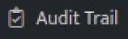

User Management is the process of creating and maintaining a user store. User management establishes a user's authorization to access secure resources, it also serves as a repository of identities and is the source of all identities in an organization. Access control is applied to regulate who can view or use resources in a particular environment.

## **Cluster Administrator**

- The user created at the First time UI stage will be the Cluster Administrator.
- A Cluster Administrator is the Super Administrator and will manage all the scopes that fall under the Cluster.
- The user roles are assigned and managed by Cluster Administrators across all the scopes.

## **Example:**

- Times Group has multiple subsidiaries that are managed by them such as Times Music, Times Internet, Times Business Solutions etc.
- In this case, a DNIF Deployment Scenario could be Time Group as a cluster and the various subsidiaries as various scopes within the Times Group cluster.

## **How to view Managed Users?**

Hover on the Administrator (lock) icon on the left navigation panel and select Manage Users, the following page will be displayed.

<!-- TODO: Fix broken image link below. Original path: images/image%201-Dec-01-2023-10-33-59-3410-AM.jpg -->
<!--  -->

The above page displays the following details.

| **Field** | **Description** |
| --- | --- |
| Organization/User Name | Displays the Organization /Username of the added user |
| Email id | Displays the email address of the user |
| Created on | Displays the date and time when the user was created. |
| Last Login | Displays the date and time when this user last logged in. |
|  | Click this to view the details of the user activity along with the following details, you can click on each row to view the details of the user activity.  - Created on: Displays when the user was created - Source: Displays the IP Adress from where the user activity was initiated - Action: Displays the action performed by the user - User: Displays the username of the user who performed the activity   |
|      | Click this to refresh the user list |
|      | Click this to search for a particular user |
|      | Click this to add a new user |
