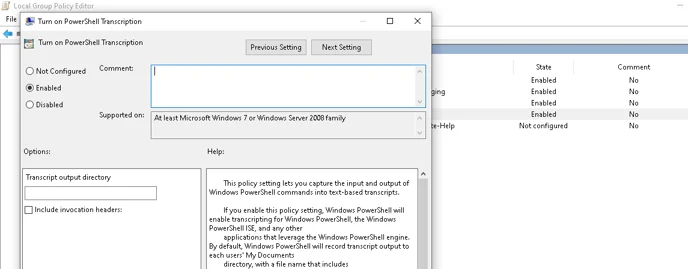

## **Introduction**

We understand the importance of robust logging mechanisms in identifying and mitigating potential security threats. To enhance your organization's security posture and better equip your systems to detect and respond to malicious activities, we have compiled a comprehensive guide on enabling additional logging for Windows environments. This guide aims to provide you with step-by-step instructions and best practices for configuring various logging features within Windows, including PowerShell script block logging, registry modifications, object access auditing, and more.

By implementing these logging measures, you can gain greater visibility into system activities, improve threat detection capabilities, and strengthen your overall cybersecurity defenses.

## **Setup Advanced Logging in Windows**  

### **Step 1 - Enable PowerShell Script Block Logging and Transcription**

To configure script block logging via group policy, either on the local machine or through organization wide policies.

Open the **Local Group Policy Editor** and navigate to **Computer Configuration** > **Administrative Templates** > **Windows Components** > **Windows PowerShell** > **Turn on PowerShell Script Block Logging**. 


  
Select the checkbox to log start and stop events. Similarly configure for **Turn on PowerShell Transcription** policy setting, this lets you capture the input and output of PowerShell commands into text-based transcripts.  



  
For more information on the above policies and latest updates, kindly refer the Windows OEM documentation - [Group Policy Settings](https://learn.microsoft.com/en-us/powershell/module/microsoft.powershell.core/about/about_group_policy_settings?view=powershell-7.4#long-description)

### **Step 2 - Enable Audit logs for Active Directory**

_Note: This configuration is optional and applies only to environments with Active Directory (AD). Implement this configuration on both AD client and server hosts if applicable via Group Policy Management Console or Local Group Policy._

### **Active Directory Domain Services (AD DS)**

- Open the Group Policy Management Console (GPMC) on a domain controller or a computer with administrative tools installed.

- Navigate to the appropriate organizational unit (OU) or domain for which you want to apply the policy.

- Create a new Group Policy Object (GPO) or edit an existing one.

- In the Group Policy Management Editor, go to:
    - Computer Configuration
    
    - Policies
    
    - Windows Settings
    
    - Security Settings
    
    - Advanced Audit Policy Configuration
    
    - Audit Policies

- Configure the following settings:
    - Account Logon: Set both success and failure auditing for all subcategories.
    
    - Logon/Logoff: Set both success and failure auditing for all subcategories.
    
    - Object Access: Set both success and failure auditing for all subcategories.
    
    - DS Access: Set both success and failure auditing for all subcategories.

- Link the GPO to the appropriate container (OU or domain).

### **Active Directory Certificate Services (AD CS)**

- Open the Group Policy Management Console on a server where AD CS is installed.

- Navigate to the appropriate OU or domain.

- Create a new GPO or edit an existing one.

- In the Group Policy Management Editor, go to:
    - Computer Configuration
    
    - Windows Settings
    
    - Security Settings
    
    - Advanced Audit Policy Configuration
    
    - Audit Policies

- Configure the following setting:
    - Certification Services: Set both success and failure auditing.

- Link the GPO to the appropriate container.

### **Active Directory Federation Services (AD FS)**

- Open the Group Policy Management Console on a server where AD FS is installed.

- Navigate to the appropriate OU or domain.

- Create a new GPO or edit an existing one.

- In the Group Policy Management Editor, go to:
    - Computer Configuration
    
    - Administrative Templates
    
    - AD FS
    
    - Auditing

- Configure the setting:
    - "Audit level for computer and user account changes": Set to "Failure, Success, Object Access."

- Link the GPO to the appropriate container.

### **Step 3 - Enable Audit Object Access Policy**

- Launch **Server Manager** or press Windows + R in your Windows instance.

- Under Manage, select **Group Policy Management** and launch the **Group Policy Management console**.

- Navigate to **Forest ➔ Domain ➔ Your domain ➔ Domain Controllers**.

- Create a new GPO and link it to the domain containing the registry to be monitored, or edit any existing GPO that is linked to the domain to open the **Group Policy Management Editor**.

- Navigate to **Computer Configuration ➔ Windows Settings ➔ Security Settings ➔ Local Policies ➔ Audit Policy**.

- The Audit Policy lists all of its sub-policies in the right panel, as shown in the figure below.  
       
      
    [](https://www.manageengine.com/products/active-directory-audit/how-to/images/how-to-audit-windows-registry-changes-1.png)

- Under **Audit Policy**, turn auditing on for Success and failure events of **Audit Object Access** policy.

- Click **Apply** and **OK** to close **Properties** window.

- To enforce these changes throughout the domain, run the command **gpupdate /force**, in the **Run** console.

### **Step 4 - Install Sysmon**

- Download sysmon zip file with installer from [https://download.sysinternals.com/files/Sysmon.zip](https://download.sysinternals.com/files/Sysmon.zip)

- Move the zip file to the C:\\ drive and unzip the same.

- Now a new folder gets created with the name Sysmon.

- Download the configuration file for Sysmon - [sysmon\_dnif\_11.xml](https://m.dnif.it/hubfs/artifacts/sysmon_dnif_11.xml)

- Move the XML file within the folder _C:\\Sysmon_

- Open ‘Command Prompt’ with administrator privileges.

- Navigate to the folder _C:\\Sysmon_

- Execute the following command,

```
$ Sysmon64.exe -accepteula -i -n -l -r$ Sysmon64.exe -c sysmon_dnif_11.xml
```

- To apply the changes, you have to restart the service:

- Go to Control Panel > Services and locate the Sysmon service for 64 bit Windows or locate Sysmon service for 32 bit Windows accordingly.

- Right click on Sysmon or Sysmon64 accordingly and click on restart.

### **Step 5 - Download and Install Nxlog for Log Forwarding**

- Download and install the latest version of [NXLog](https://nxlog.co/products/nxlog-community-edition/download) on the Windows machine from which the logs need to be collected.

- After installation, locate the **nxlog.conf** file in the **C:\\Program Files (x86)\\nxlog\\conf** folder or C:\\**Program Files\\nxlog\\conf** for 64 bit systems.

- Open the **nxlog.conf** file using a text editor and append the below text:

```
#############For Sysmon and windows event logs###############<Extension _json>Module xm_json</Extension><Input in>Module im_msvistalog</Input><Output out>Module om_udpHost DNIF-PICO-IPPort 514Exec to_json();</Output><Route 1>Path in => out</Route>
```

_Note: In the above configuration, replace the text \`DNIF-PICO-IP\` with the Destination IP Address (IP Address of PICO)._

- To apply changes made on nxlog.conf, you have to restart the service again. Go to **Control Panel > Services** and locate the **nxlog** service.  
    Right click on **nxlog** and **restart**  
    
    
    

In addition to the default logging options provided by Windows, we now have advanced telemetry features such as command-line activity tracking, module logging, PowerShell transcription, and script block logging enabled. With these enhancements, your Windows event logs are now seamlessly streamed to your DNIF HYPERCLOUD environment for comprehensive threat detection and analysis.

For Windows-related integrations that focus on less comprehensive logging, please visit the following pages:

1. [Windows Event Logs](https://dnif.it/kb/data-ingestion/windows-event-logs/)

3. [Internet Information Services](https://dnif.it/kb/device-integration/microsoft/iis/)
