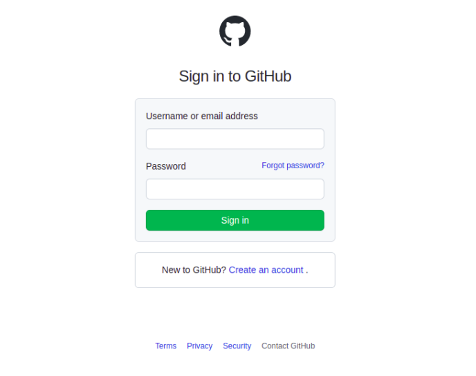
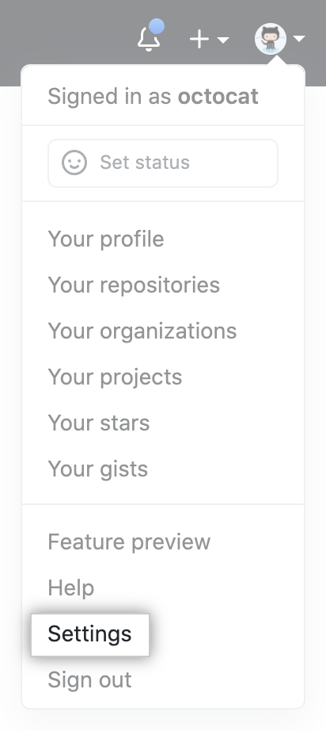
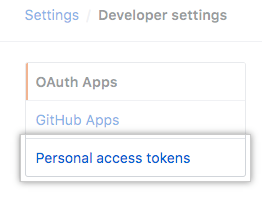
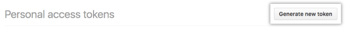
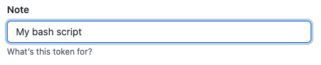
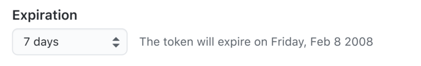
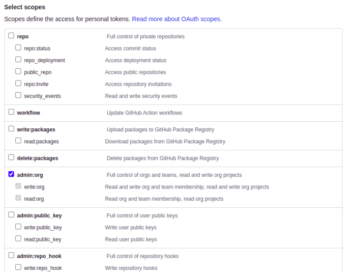
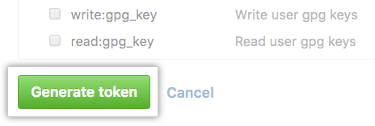
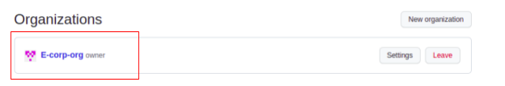
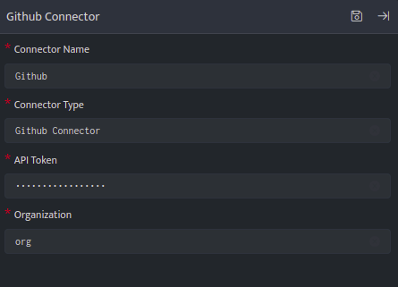

To configure the Github Connector and forward audit logs to DNIF, follow the steps below:

### 1. **Generate an API token**:
    1. Sign in to your Github account using this link: [Github Sign In](https://github.com/login).  
          
          
          
          
        
    
    3. In the upper-right corner of any page, click your profile photo, then click "Settings".  
          
          
          
          
        
    
    5. In the left sidebar, click "Developer settings".  
          
          
          
          
        
    
    7. In the left sidebar, click "Personal access tokens".  
          
          
          
          
        
    
    9. Click "Generate new token".  
          
          
          
          
        
    
    11. Give your token a descriptive name.  
          
          
          
          
        
    
    13. Set an expiration date for the token.  
          
          
          
          
        
    
    15. Select the "admin:org" scope permission for the API token.  
          
          
          
          
        
    
    17. Click "Generate token".  
          
          
          
          
        

### 2. **Get Enterprise name**:
    1. In the top right corner of your Github Enterprise Server, click your profile photo, then click "Your organizations".
    
    3. The enterprise name will be mentioned on the left-hand side.  
          
          
          
          
        

### 3. **Configure the GitHub Connector in DNIF**:  
      
      
       
      
    

### **Fill in the following fields:**

1. **Connector Name**: Enter a name for the connector.

3. **Connector Type**: Enter "Github Connector".

5. **API Token**: Enter the API Token generated in step 1.

7. **Organization**: Enter the organization name for Github obtained in step 2.

Once you have filled in the configurations, you should be able to fetch audit logs from Github using the pull method and the Github REST APIs.
