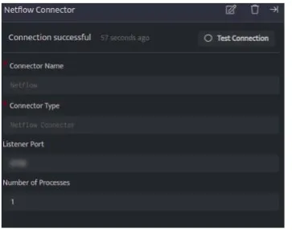

A NetFlow collector is a device (a PC or a Server) embedded in a network to gather all NetFlow information which is sent by routers and switches.

NetFlow generates and collects that information, DNIF will allow it to store and analyze said traffic. Netflow Connector can receive logs from various devices and log sources via UDP connection on port 2055 of the Adapter

The following configurations should be done to forward Netflow logs to DNIF

| **Configuration** | **Description** |
| --- | --- |
| Connector Name | Enter a name for the connector |
| Connector Type | Enter a type for the connector |
| Listener Port | Port being listened to receive Syslog UDP LogEvents |
| Number of Processes | Total number of processes that can be run at a time |

- Click **Save** after entering all the required details and click Test Connection, to test the configuration.

- **Connection successful** message will be displayed on screen along with the time stamp.

- If the connection is not successful an error message will be displayed. Refer [Troubleshooting Connector Validations](https://dnif.it/kb/troubleshooting-and-debugging/troubleshooting-connector-validations/) for more details on the error message.

Once the connector is configured, validate if the connector is listed under **[Collection Status](https://dnif.it/kb/operations/collection-status/)** screen with status as **Active**. This signifies the connector is configured successfully and data is ready to ingest.
