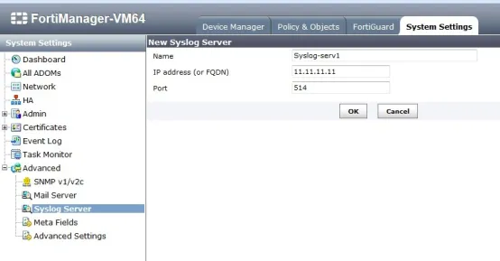

FortiManager is a central management device that can be used to access and configure FortiGate and FortiAP devices in your network. It also allows you to deploy FortiGuard across your network.

## **Integration of FortiManager with DNIF**

### **To forward FortiManager 4.3.X logs to DNIF**

- Log in to FortiManager 4.3.x using CLI:

```
config fmsystem locallog syslogd setting
   set server <IP address> ##Address of DNIF Adapter
   set severity <emergency | alert | critical | error | warning | notification | information | debug> ##Least severity level to log
   set status <enable | disable>
   set facility <facility> ##Which facility for remote syslog.
   set port <port> ##Port that server listens at
end
```

### **To forward FortiManager 5.0.X upto 5.0.6 logs to DNIF** .

- Log in to FortiManager 5.0.x up to 5.0.6 using CLI:

```
config system locallog syslogd setting
   set server <IP address> ##Address of DNIF Adapter server
   set severity <emergency | alert | critical | error | warning | notification | information | debug> ##Least severity level to log
   set status <enable | disable>
   set facility <facility> ##Which facility for remote syslog.
   set port <port> ##Port that server listens at.
end
```

### **To forward FortiManager 5.0.7 and above logs to DNIF** .

- Log in to FortiManager 5.0.7 using web interface naviagte to **System Settings > Advanced > Syslog Server** 

### **The Syslog server can also be defined using CLI**

```
config system syslog
edit <server name>
set ip <DNIF-Adapter-IP>
end
```

### **Enable sending FortiManager local logs to DNIF.**

### **This can be configured only using CLI.**

```
config system locallog syslogd setting
   set syslog-name <Remote syslog server name,defined at previous step>
   set severity <emergency | alert | critical | error | warning | notification | information | debug> ##Least severity level to log
   set status <enable | disable>
   set facility <facility> ##Which facility for remote syslog.
   set port <port> ##Port that server listens at (514)
end
```

FortiManager logs are now streamed to DNIF.
