## **Overview**

  
The Extractor Generator feature revolutionizes the way security engineers create extractors by providing a pre-filled template and initial log analysis, saving valuable time and effort. This feature is particularly useful when dealing with new log samples from recently integrated devices or when existing devices introduce support for new events.

Traditionally, developing an extractor could take an engineer anywhere from a couple of days to a couple of weeks. The engineer simply needs to input sanitized log samples and initiate the extractor generation process.

The engineer will receive a comprehensive extractor that includes information such as a description of the log samples, classification of log events, important fields to be parsed, potential MITRE techniques for investigation, and suggested DNIF streams for parsing the log samples.

Additionally, the Extractor Generator is bundled with the Extractor Validator feature, which ensures syntax validation and assists in creating a high-quality extractor. By utilizing these DNIF AI features, engineers can streamline their workflow, improve efficiency, and focus on more complex tasks.  

## **How does this work?**

To use the Extractor Generator feature, follow these steps:

1. Navigate to the **Extraction** panel from the console.

3. Click the **"+"** icon on the extractor listing page to create a new extractor.

5. Select the "**DNIF AI**" option to open the wizard.  
      
    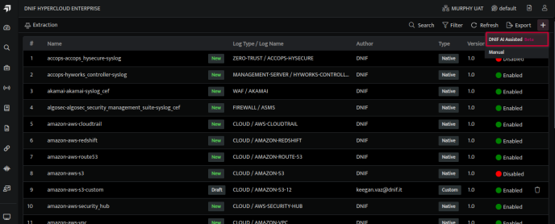  
      
    

7. A new window will open, read through all the instructions provided in the wizard before proceeding.  
      
    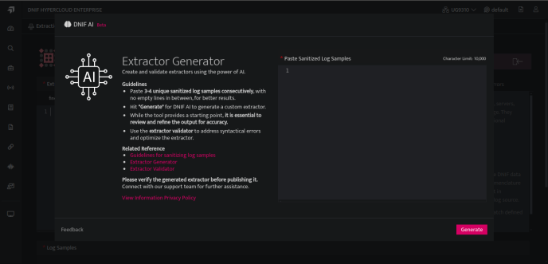  
      
    

9. Paste [sanitized log samples](https://dnif.it/kb/data-ingestion/extractors/guidelines-for-sanitizing-log-samples/) (preferably 3 to 4 unique log samples with a total character limit of 10,000 characters) and click the "**Generate**" button. Providing unique log events helps in improving the quality of the generated extractor. Ensure that each unique log sample is written on separate lines without using the ‘\\n’ line separator between the log samples.  
    **Note** that the log samples must be from the same log source.

11. The process may take a few minutes to generate the extractor and provide the analysis. If there are any **errors**, you will be prompted to regenerate the extractor.

13. If a user accidentally exists from the wizard while the extractor is being generated, the user can re-open the wizard by clicking the "**Generate**" button. The other purpose of this button is to assist the user in re-generating an extractor in case the output obtained is not satisfactory. The user can choose to keep the same log samples or modify them before re-generating the extractor.  
      
    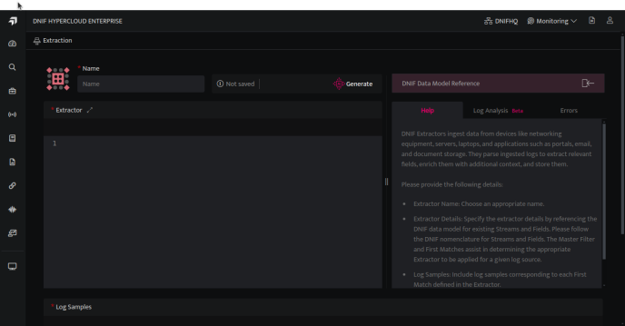  
      
    

15. Once the process is completed, the user can see the output of the generated extractor in the “**Extractor**” pane while the provided log samples will be visible in the “**Log Samples**'' pane. Here, the user can add more log samples (not exceeding a total of 500 log samples where each log sample does not exceed 10000 characters in length. To know more, refer to the [extractor validator](https://dnif.it/kb/data-ingestion/extractors/extractor-validator/#DDM) best practices).  
      
    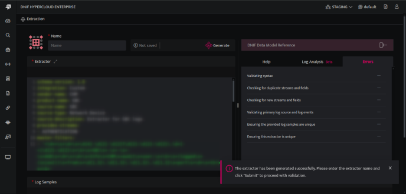  
      
    

17. Provide a unique Extractor **Name** and navigate through the **Help** and **Log Analysis** tabs- 
      
    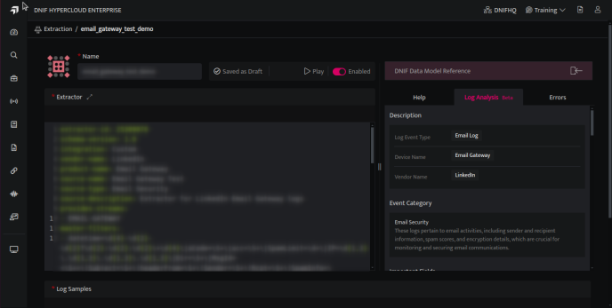  
      
    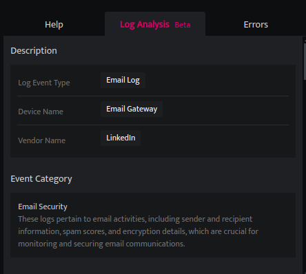  
      
    

19. Review the "**Log Analysis**" tab, which offers valuable information:
    - Initial **Description** indicating the source of the log events  
        

| **Field** | **Description** |
| --- | --- |
| Log Event Type | Type of log samples being forwarded |
| Device Name | Name of the device from which the log samples are emitted |
| Vendor Name | Name of the device vendor |

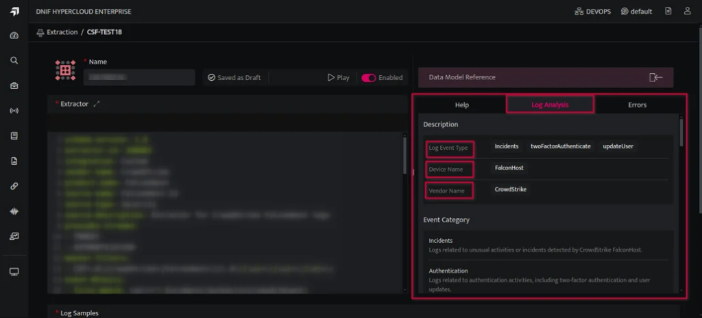

- **Event Category** of Log events to help identify different types of log events emitted by the log source.

- **Important fields** to parse with justifications discussing the importance of that field to ensure engineers do not overlook crucial information relevant to further investigation.

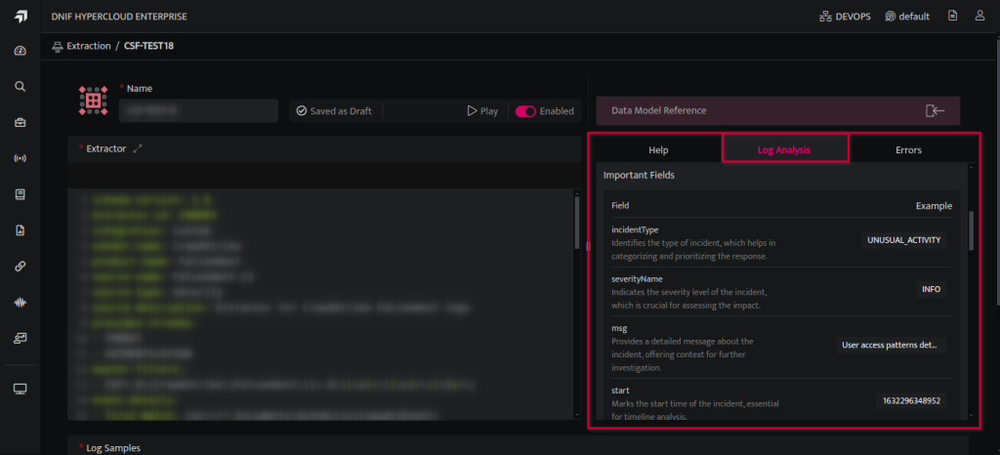

- **MITRE** techniques to investigate, along with sample DQL queries. These queries serve as a starting point and may require customization based on specific requirements and detection rules. Click **Show more** for more details.

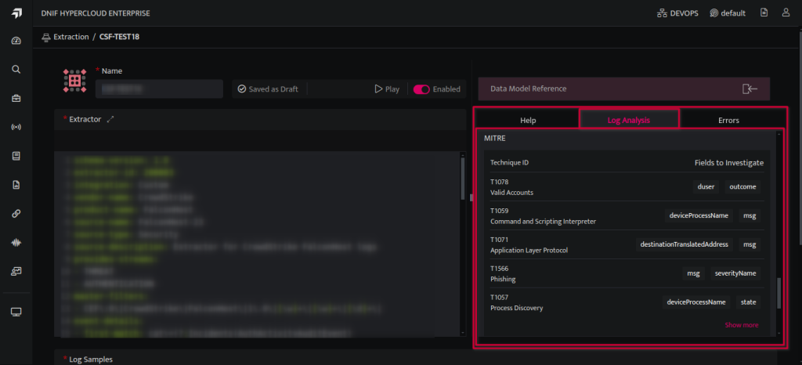

  

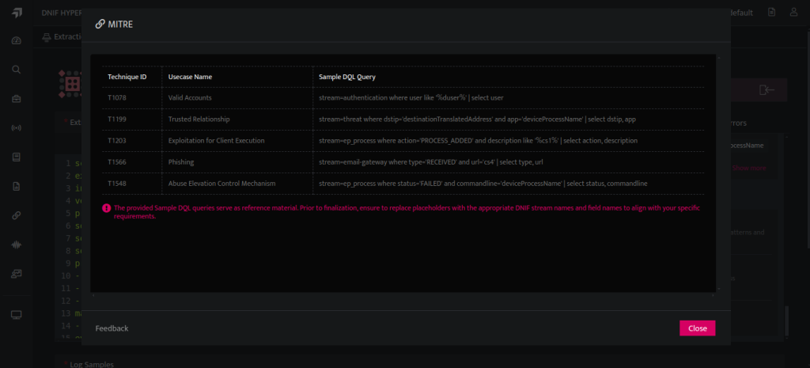

  

- Recommended **DNIF Streams** for parsing the data, including suggestions for new streams that can be created by DNIF's technical support team.

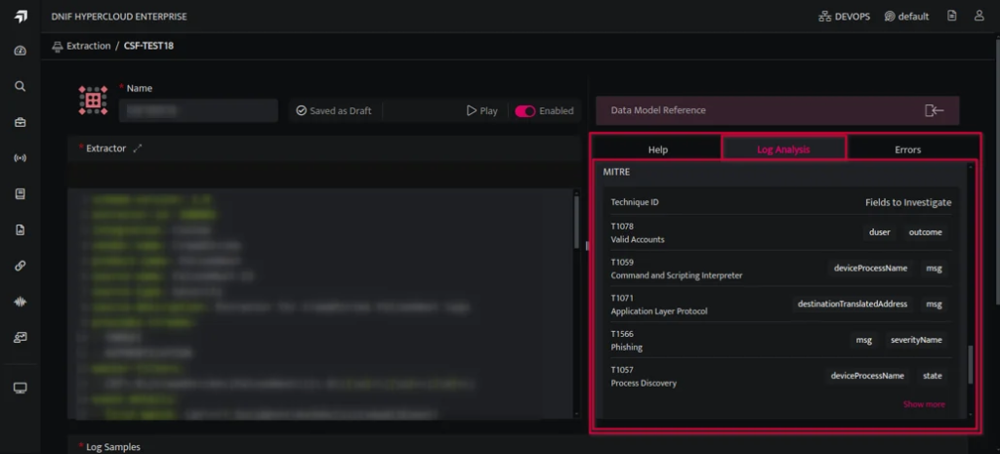

  

11. Modify the generated extractor as needed based on the  **Log Analysis** insights.

13. Click the "**Submit**" button to trigger the extractor validator feature to address any errors encountered. After submitting for error validation, the "**Generate**" button will be disabled.

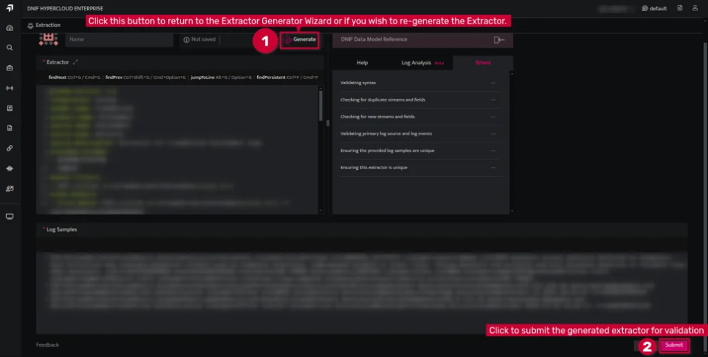

  

13. If any of the checks fail, the extractor is saved in draft mode and the analyst can reach out to DNIF’s support team for further guidance. (For Extractor validation click [here](https://dnif.it/kb/data-ingestion/extractors/extractor-validator/) .)  
      
    

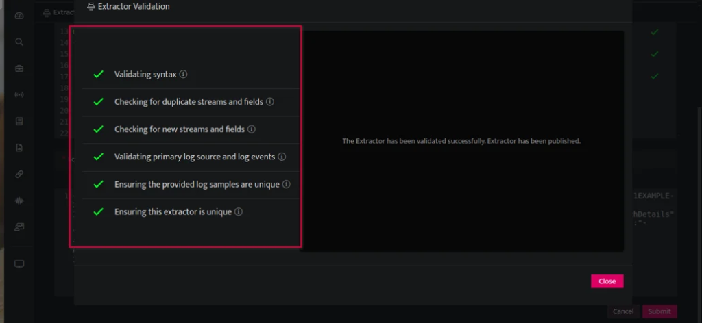

14. If the extractor goes through all the checks, it gets published and enabled by default. **Note**: Any existing copy of this extractor will get disabled by default and ensure to keep only one copy of the extractor enabled at a time.

## **Best practices for extractor generator**

While the Extractor Generator functionality is user-friendly, it is important to note that supervision and review are necessary to create a reliable extractor. As the output is generated using DNIF AI models, it should be considered a starting point and may require adjustments. Always verify and finetune the master filter, and first match regular expressions to ensure accuracy.

This functionality is particularly useful when dealing with new log samples, and it is recommended to avoid testing it with existing log samples or extractors.

During the extractor generation process, users may encounter the following errors:

- **Character Limit Exceeded**: If the provided log samples exceed the character limit of 10,000 characters, you will receive an error. To resolve this, reduce the number of log samples and regenerate the extractor.

- **Problem Generating Extractor**: In case you encounter an issue while generating the extractor, simply click on **"Generate"** to try again. If the problem persists, don't hesitate to contact our support team for assistance.

- **Extractor Syntax Errors**: Errors related to extractor syntax may occur, such as missing fields, duplicate streams, new field, and streams, or issues with the master filter and first match. To troubleshoot these errors, refer to the documentation on [extractor validators](https://dnif.it/kb/data-ingestion/extractors/extractor-validator/) and best practices for building extractors. If you still encounter difficulties, our support team is always available to help. See the images attached below for more information.
