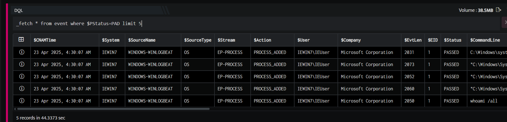
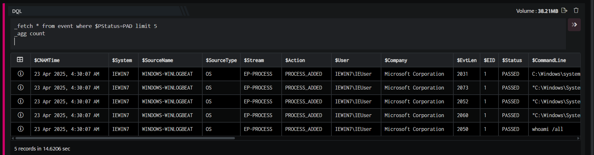
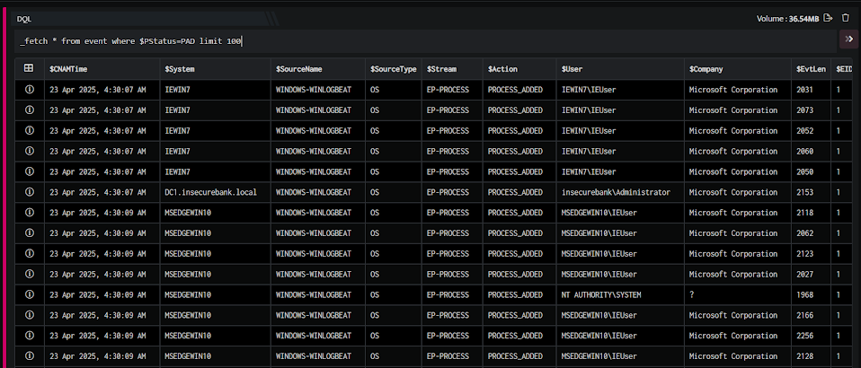
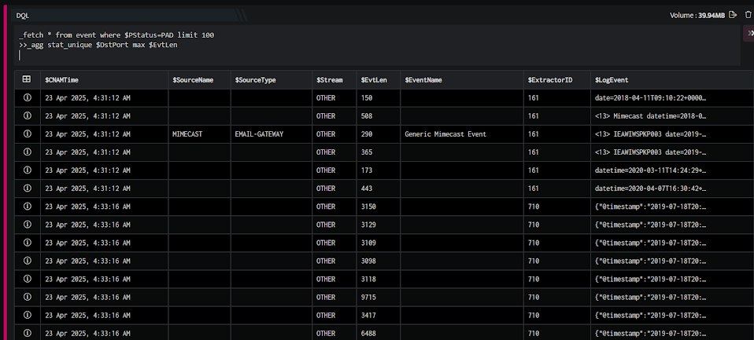
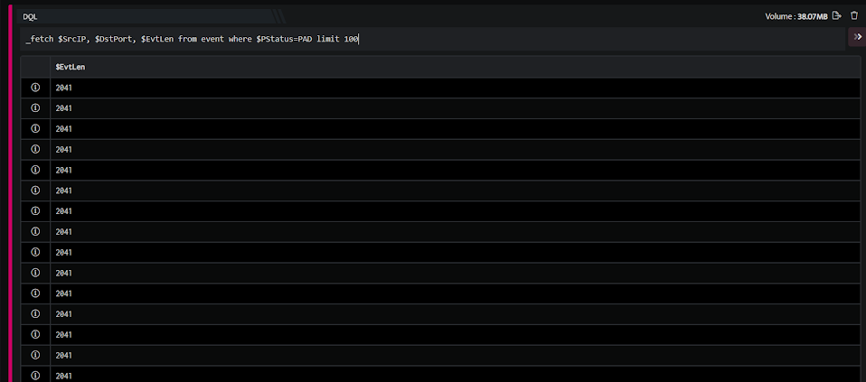
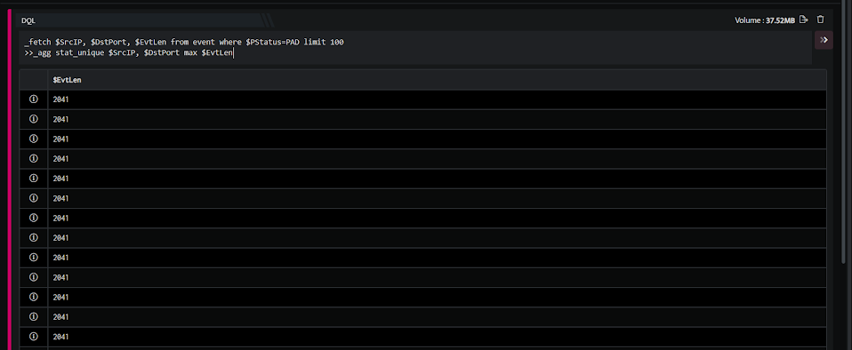
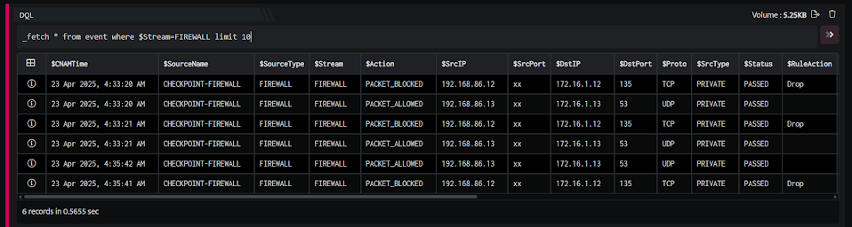
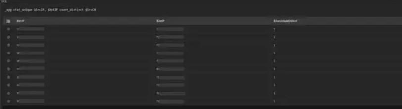

  
The \_agg query directive is used to perform aggregations on the result set.

Example: A quick example is given below:

```
_fetch * from event where $PStatus=PAD limit 5_agg count
```

Here:

1. The \_fetch directive retrieves all fields for each event where $PStatus is PAD. We limit the result set to the 5 latest events satisfying the where clause. The output is as shown below:



1. In the pipelined query function, the \_agg directive uses the count keyword to count the rows in the result set returned by \_fetch.



The \_agg query directive lets you:

- Count rows in a result set

- Group rows in a result set and perform arithmetic operations (on a field) in each group

- Group rows in a result set and count the rows in each group

- Perform arithmetic operations on a field in the entire result set

###### **SYNTAX**

The generic syntax of the \_agg directive is as given below:

```
_agg [function] [$field1, $field2]function:count_unique | stat_unique | count | [sum|min|max|avg] [compute field]stat_unique [$field1, $field2] [sum|min|max|avg|count_distinct] [compute field]count_unique $field1, $field2…,$field4count
```

Here:

- stat\_unique: It performs the sum|min|max|avg|count\_distinct operations in each group on the compute field specified in the query. The keywords stand for summation, minimum value, maximum value and average, respectively, of the specified compute field in each group.

- count\_unique: It counts the rows in each group.

- count: It counts rows in the entire result set.

- sum/min/max/avg: It gives the summation, minimum value, maximum value and average respectively of the specified compute field in the entire result set.  
    

###### **Stat Unique**

The \_agg directive uses the stat\_unique keyword to perform an aggregation (grouping) on one or more specified fields and give a statistic for each group. These statistics include min, max, sum and avg.

EXAMPLE 1  
Take a look at the example given below:

```
_fetch * from event where $PStatus=PAD limit 100>>_agg stat_unique $DstPort max $EvtLen
```

Here:

1. The \_fetch directive retrieves all fields for each event where $PStatus is PAD. We limit the result set to the 100 latest events that satisfy the where clause. The output is as shown below:



The outputs shown in the screenshot may only be partial outputs in many cases.

1. In the pipelined query function, the \_agg directive uses the stat\_unique keyword to aggregate and group unique $DstPort (destination port) values and give the maximum $EvtLen (event length) for each group (using the keyword max). The output is as shown below:



In the result set returned by the \_fetch query function, amongst all rows (events) with the destination port 53, the maximum value of event length was 645. This is highlighted in the image above.

- You can use the keywords min, sum or average (instead of max) to calculate the minimum value, summation or average respectively of a group.

- The number of events fetched by the \_fetch directive is limited to the duration specified in the Date Selector on the Search GUI. By default, the duration is the last 24 hours.

EXAMPLE 2  
We can also form groups using more than one field. Take a look at the example given below:

```
_fetch $SrcIP, $DstPort, $EvtLen from event where $PStatus=PAD limit 100>>_agg stat_unique $SrcIP, $DstPort max $EvtLen
```

Here:

1. The \_fetch directive retrieves the $SrcIP, $DstPort, and $EvtLen fields for each event where $PStatus is PAD. We limit the result set to the 100 latest events satisfying the where clause. The output is as shown below:



1. In the pipelined query function, the \_agg directive uses the stat\_unique keyword to aggregate combinations of the $SrcIP (source IP) and $DstPort (destination port) values and give the maximum $EvtLen (event length) for each group using the keyword max. The output is as shown below:



The destination port 8080 has events in the first combination group of destination port and source IP are such that the maximum length is 517.

###### **Count\_distinct**

- Count\_distinct is one of the operations under stat\_unique which can perform counting of distinct values on the computed fields with respect to the group files of stat\_unique.

- Count\_distinct can compute only on Single Field.

Example 1:

```
_fetch * from event where $Stream=FIREWALL limit 10>> _agg stat_unique $SrcIP count_distinct $DstIP
```



In the above example, the \_fetch directive retrieves all fields for each event where $Stream is FIREWALL. We limit the result set to the 10 latest events that satisfy the where clause.  
In the pipelined query function, the \_agg directive uses the stat\_unique keyword to aggregate and group unique $SrcIP (Source ip) values and give the counting of distinct values of $DstIP (Destination ip) for each group (using the keyword count\_distinct).

Example 2:

```
_fetch * from event where $Stream=FIREWALL limit 10>> _agg stat_unique $SrcIP, $DstIP count_distinct $SrcCN
```



In the above example, the \_fetch directive retrieves all fields for each event where $Stream is FIREWALL. We limit the result set to the 10 latest events that satisfy the where clause.  
In the pipelined query function, the \_agg directive uses the stat\_unique keyword to aggregate and group unique $SrcIP (Source ip) and $DstIP (Destination ip) values and give the counting of distinct values of $SrcCN (Source Country) for each group (using the keyword count\_distinct).
