  
\_fetch is extremely versatile and in most cases the first query function in your analytic. It is used to retrieve data from your datanode, it lets you filter, group, label, and limit your search results. You can also write multiple fetch query functions in a pipeline to create an inclusive result set which includes results of all these fetch query functions. \_fetch is the only query directive that is designed to directly query the datanode.

Example:  
A quick example is given below:

```
_fetch * from event where $Stream=FIREWALL AND $Duration=1M limit 10
```

This query retrieves all fields for each event where $Stream is FIREWALL.

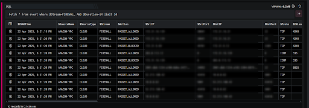

The \_fetch directive allows you to:

- choose the different query logs stored in datanode

- filter data using text pattern matching using wildcard and regex.

- group data and perform certain operations on each group,

- label data for further logical operations

- search raw payload, with logevent in query or payload flag

###### **Syntax**

The generic syntax of the \_fetch directive is as given below:

```
_fetch [*] from [ event] where [$Stream=value] [AND | NOT] field2=value*group [ [sum | min | max | avg] $field] | [ count_unique $field1, $field2,...$field4 ] | [count]| [timeslice <integer>[m|h] ]as #labelnamelimit <integer> | first <integer> | last <integer>
```

Here:

- from: Lets you choose the stream to query.

- where: Lets you filter rows in a result set.

- group: Lets you perform aggregation on the result set to calculate sum, max, min, and avg of a specified field in the entire result set. You can also group unique values of a specified field and count events in each of these groups. Lastly, you can group (bucket) events based on time (timeslice).

- as: Lets you assign a single label to events in a result set retrieved by a query function.

- limit | first | last: Lets you limit the rows in a result set and choose whether to display it in default or reverse order.

###### **Field Selection**

The \_fetch directive can be used to include only certain fields in a result set by mentioning the list of field names separated by a comma immediately after the \_fetch keyword.

Take a look at the example given below:

```
_fetch $DevSrcIP, $LogEvent, $CNAMTime from event limit 10
```

As seen in the image below, this query retrieves three fields: $DevSrcIP, $LogEvent and $CNAMTime for each event. The result set is limited to the 10 latest events.

Below is an example screenshot

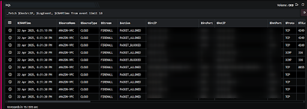

 The outputs shown as screenshots may only be partial. 

To retrieve all available fields, use \* (asterisk) instead of the fields list in the query.

The number of events fetched by the \_fetch directive is limited by the duration specified in the Date Selector on the Search page. The events whose $CNAMTime falls within this duration are retrieved by the fetch query. By default, the duration is the last five minutes. The date selector uses your local timezone. $CNAMTime is internally stored in UTC (time standard). In a fetch query, it is displayed in your local timezone as configured in the console (after conversion).

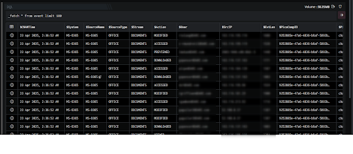

This query retrieves all the fields, for each event. The result set is limited to the 100 latest events.

###### **Where Clause**

The where clause filters data returned by the query based on the conditions you specify immediately after the where keyword. Hence, you can use this clause to search for events based on the values of one or more fields in various permutations as desired.

Take a look at the example given below:

```
_fetch $CNAMTime, $LogEvent, $LogType from event where $Stream=FIREWALL limit 4
```

This query retrieves 2 fields: $CNAMTime, and $LogEvent for each event, where $Stream is FIREWALL. The result set is limited to the 4 latest events satisfying the where clause. The output is as shown below.

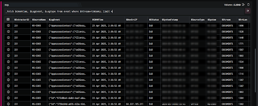

The search is case-sensitive. FIREWALL is not the same as firewall.

###### **IN Operator**

The IN operator will allow you to specify values in a WHERE clause as follows.

- Specify the where clause further by giving a list

```
_fetch * from event where $Duration=1d AND $PStatus IN [PAD, PER] limit 100
```

Here it will return only those logs where the $PStatus matches any of the values in the given list i.e. PAD,PER).

- Choose the where clause variable from the result of first fetch

Query function 1 - Retrieving events from a event store

```
_fetch $MaliciousIP, $Engine from maliciousDB_evt_store where $Duration=1d limit 100
```

Query function 2 - Finding traces of the IPs retrieved above

```
_fetch * from event where $Duration=1d AND $SrcIP IN [_MaliciousIP_] limit 10
```

Here it will return only those logs where the $SrcIP matches any of the values in the specified variable received from the first fetch i.e. \[\__MaliciousIP_ \_\]

###### **Regex**

The regex keyword is used to check if the string values in a result set satisfy a specified regular expression. This keyword offers the flexibility to create and specify your own regular expression to filter results.

Take a look at the example given below:

```
_fetch * from event where $Stream=SYSMON-PROCESS AND $CommandLine=regex(.*\.xlsx.exe|.*\.xls\.exe|.*\.pdf\.exe|.*\.txt.exe.*|.*\.doc.exe.*|.*\.docx.exe.*|.*\.jpg.exe.*|.*\.vbs.exe.*|.*\.ppt.exe.|.*\.pptx.exe.|.*\.docm.exe.*) group count_unique  $System  limit 100
```

This query retrieves all fields for each event where $Stream is SYSMON-PROCESS for the specified regex in $CommandLine. The result set displays all the $Systems along with the command lines and process mentioned in the query. The output is as displayed below:

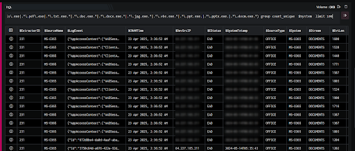


###### **Duration**

This option lets you specify the start and end timestamp for retrieving events from the datanode. On the Search page, by default, we have a duration of five minutes (based on the time you opened the search page) which can be modified using the GUI. However, this can be overridden using the two options below:

Take a look at the example given below:

```
_fetch * from event where $Duration=2d first 10
```

This query retrieves all fields for each event which have been created between Now=2 days and Now ($Duration is 2 days) where Now refers to the time of executing the query. The result set is sorted in the ascending order of $CNAMTime (oldest/earliest event first) using the first keyword. (The first keyword in explained in detail later on in this article.) The integer value after the first keyword is used to limit the number of rows in the result set. We discuss the first keyword in detail later in this article. The output is as shown below:

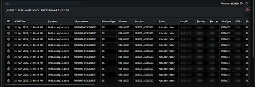

Take a look at another example given below:

```
_fetch * from event where $StartTime=2018-06-25T16:42:15 AND $EndTime=2018-06-26T12:36:19 limit 3
```

This query retrieves all fields for each event which have been received by DNIF between the $StartTime (start time) and $EndTime (end time) specified in the query. The result set is limited to the 10 latest (newest) events (in that duration) satisfying the where clause. The output is as shown below:


\_fetch query directive includes @now in starttime and endtime. @now will consider the current time of the server while the query is being executed.

```
_fetch * from event where $StartTime=@now-3h AND $EndTime=@now-1h limit 10
```

###### **Event Aggregation**

Group clause enables you to aggregate data within the result set

The group clause consist :

- Arithmetic Aggregate

- Count Aggregate

- Time Slice

- Group count

- The group clause works like the \_agg query directive. However, while the group clause performs the aggregation natively on the datanode, the \_agg directive performs the aggregation on the result set of a previous query function in the pipeline.

- You can use **group count** function, that returns the total number of events in that specified duration.

###### **Arithmetic Aggregation**

Lets you perform simple arithmetic functions on a specified field in the entire result set.

The group clause in the \_fetch directive lets you perform simple arithmetic functions on a specified field in the entire result set. These operations include sum, min, max and avg. Take a look at the example given below:

```
_fetch * from event where $Duration=24h group sum $EvtLen limit 10
```

This query retrieves all fields for each event which have been received (stored) in the last 24 hours. The result set is then grouped by the sum of values of $EvtLen (event length). The output is as shown below:

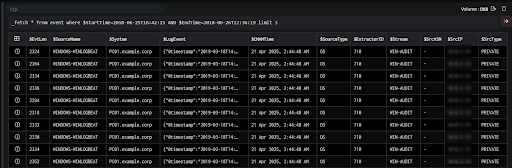

The limit clause has no significance here. It does NOT mean that a summation of event length of only the last 10 events received is displayed. The sum displayed is the summation of event lengths of all events received, lets you count unique occurrences of values of a specified field (or a combination of fields) in the result set as 24 hours. The output would always have one row. However it is mandatory to include a limiting clause as per the generic syntax of the \_fetch directive.

###### **Distinct Occurrences** 

Lets you count unique occurrences of values of a specified field (or a combination of fields) in the result set.

The group clause in the \_fetch directive also lets you count unique occurrences of values of a specified field (or a combination of fields) in the result set. It groups rows based on unique values of a specified field (or combination of fields) and displays the count of each group. This is done using the count\_unique keyword.

Example 1:

Take a look at the example given below:

```
_fetch * from event where $Stream=FIREWALL group count_unique $App limit 5
```

This query retrieves all fields for each event where App\*\* present in it along with their individual row count (count\_unique). The result set is sorted in descending order of count\_unique (by default). It is then limited to 5 rows. The output is as shown below:

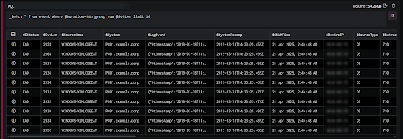

The result set of a count\_unique function will always be sorted in descending order based on the values in count\_unique field.

Example 2:

Take a look at another example given below:

```
_fetch * from event where $Stream=FIREWALL group count_unique $SrcIP,$SrcPort limit 3
```

This query retrieves all the fields for each event where $Stream is FIREWALL. The result set is grouped by unique combinations of $SrcIP and $SrcPort present in it along with their individual row count (count\_unique). The output is as shown below:

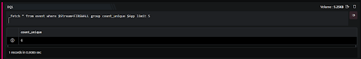

The above screenshot displays, 3 unique $SrcIP, $SrcPort have been included and for each of these, 3 unique events lengths have been included.

You can compare this with the output of the previous example.

- Based on the value of limit (for example limit N ), a maximum of N x N rows will be present in the output. In the above example (limit 3), if the first URL (Here /) had only 2 unique event lengths, there would have been only 8 rows in the result set.

- DQL supports upto four levels of aggregations as shown below:  
    group count\_unique $SrcCN, $SrcISP, $DstIP, $User . Here, $User will be aggregated by $DstIP which will further be aggregated into $SrcISP and $SrcCN.

Example 3:

For \_fetch group function aggregation limit can be set to zero

For DQL Queries with group function, you can apply an aggregate with the limit clause set as zero. This will display all the available records as the limit is zero.

```
_fetch * from event where $LogID=60 group count limit 0
```

Here, The \_fetch directive retrieves all fields for each event where $LogID is 60.

**Example 4:** Query to fetch details using Group Count function

```
_fetch * from event where $Duration=5m AND $Stream=OTHER group count limit 1
```

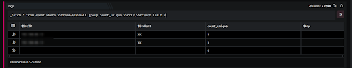

Here, The \_fetch directive retrieves total number of events in that specified duration.

###### **Timeslice**

Gives a count of events in each bucket (time interval)

###### **Using $CNAMTime**

The timeslice keyword groups events based on the time they were stored in DNIF. It also gives a count of events in each bucket (time interval). It is widely used in queries written to create charts (for example, line charts and bar charts) which involve timelines/time intervals. By default, the timeslice function creates these time intervals using the $CNAMTime field. The duration (length) of these time intervals is specified along with the timeslice keyword.

$CNAMTime is the time (timestamp) when an event was received and stored by DNIF.

Take a look at the example given below:

```
_fetch * from event where $Duration=1h group timeslice 1h limit 100
```

This query retrieves all fields for each event where the result set is grouped into buckets of 1 hour intervals on $CNAMTime along with the count for each interval. By default, the result set is sorted such that the oldest (earliest) time interval appears first. The output is as shown below:

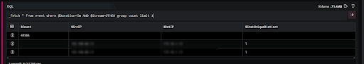

The **Date Selector** on the **Search** page is set at its default value of five minutes. Hence, this query picks events in the last five minutes.

- The limit keyword has no significance here. The number of output rows are not dependant on it. However it is mandatory to include a limiting clause as per the generic syntax of the \_fetch directive.

- Along with the timeslice keyword, use ‘m’ for minute and ‘h’ for hour.

Example: Use timeslice 1h to create intervals of 1 hour each. Use timeslice 1m to create intervals of 1 minute each.

The starting point of the time intervals (hh:15 or hh:30 and so on) are based on the value (interval length) specified along with the timeslice keyword. Also, if any row (time interval) is missing in the result set, it means that no events were received during that time interval.

As you see the timeslice keyword is followed by 1h which means one hour, you could also use ‘m’ for minute.

###### **Labelling**

Lets you add (assign) a label to events in the result set using the as keyword

Labelling lets you add (assign) a label to events in the result set using the as keyword. The same label would be assigned to all events retrieved by one fetch query function. When executing several fetch query functions in one pipeline, a label (for example, A) can be added to the events fetched by the first fetch query function while a different label (for example B) can be added to the result set of the next fetch query function. These assigned labels can be used in subsequent query functions using the \_checkif or \_agg directive to write more complex queries in a simple manner.

Take a look at the example given below:

```
_fetch * from event as #A limit 5>> _fetch * from event where $DstIP=71.XX.XX.120 as #B limit 5>>_agg count_unique $Label
```

The fetch query function (f1) retrieves all fields for each event in the event index and adds a field $Label with the value #A (in the result set) for each of the rows. As we limit the result set to the 5 latest events, these labels are assigned to only the 5 events fetched. The output is as shown below:

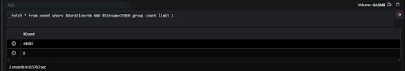

A label #A has been added to these 5 events.

In the pipelined query function (f2), the \_fetch directive retrieves all fields for each event in the event index where $DstIP (destination IP) is as specified in the query function and adds a field $Label with the value #B (in the result set) for each of the rows. As we limit the result set to the latest 5 events satisfying the where clause, these labels are assigned to only the 5 events fetched. The output is as shown below:

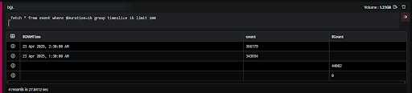

A label #B has been added to the five events having destination IP as 71.XX.XX.120

In the pipelined query function (f3), the \_agg directive using the count\_unique keyword, groups events in the result set based on $Label and gives the count of each. The output is as shown below:

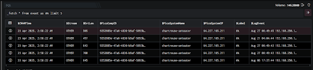

When using labels in a fetch query function, the \_fetch directive defaults to a \_fetch \*. Even if you specify certain field names, instead of the asterisk, it would still retrieve all the fields.

###### **Limit and Windowing**

Limit is used for limiting the number of rows in the result set of a fetch query function. It is a mandatory clause. It also decides which rows (oldest or newest) are chosen to be a part of the final result set.

- DQL non-aggregated limit searches will no longer be sorted by default. use first, last instead.

- Every \_fetch query function should have one of the three keywords: limit/first/last .

The limit keyword picks the newest or latest events to be a part of the result set. Hence, the latest/newest events appear first in the result set. The result set is then limited to the number of rows specified in the query after the limit keyword.

Take a look at the example given below:

```
_fetch $CNAMTime, $LogEvent, $DstPort from event where $DstPort=23 limit 2
```

This query retrieves three fields: $CNAMTime, $LogEvent and $DstPort for each event in the event index where $DstPort is 23. However, we limit the result set (limit 2) to only 2 latest events which satisfy the where condition. The result set is sorted in the descending order of $CNAMTime (new events first). The output is as shown below:


The search page was opened and query executed at 6:30 pm on 28th June, 2018.

The limit keyword is to be understood in context to the query. For example, if a fetch query function uses aggregation ( group keyword) along with count\_unique , the result set does not contain events. Instead, it contains groups and counts for each group. The result set is first sorted in the descending order of counts (count\_unique ) and then limit is applied to limit the number of rows in the result set.

###### **First**

The first keyword picks the oldest or earliest events to be a part of the result set. Hence, the oldest/earliest events appear first in the result set. The result set is then limited to the number of events specified in the query after the first keyword.

Take a look at the example given below:

```
_fetch $CNAMTime, $LogEvent, $DstPort from event where $Stream=FIREWALL AND $Duration=2h AND $DstPort=53 first 2
```

This query retrieves three fields: $CNAMTime, $LogEvent and $DstPort for each event where $DstPort is 53. However, we limit the result set (first 2) to only 2 oldest events which satisfy the where condition. The result set is sorted in the ascending order of $CNAMTime (oldest events first). The output is as shown below:

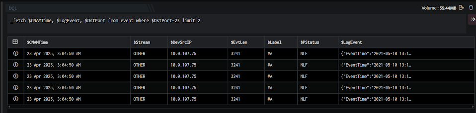

These are the oldest two events satisfying the where clause.

###### **Last**

This works in similar to the limit keyword. This is because the the last keyword also picks the newest/latest events first and then limits the number of events to be included in the final result set.

Take a look at the example given below:

```
_fetch $CNAMTime, $LogEvent, $DstPort from event where $DstPort=23 last 2
```

The output is as shown below:

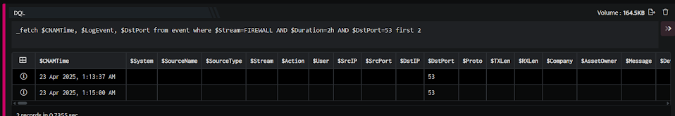

Do not use the first or last keywords along with the group clause.

###### **Statistics**

The \_agg directive uses the stat\_unique keyword to perform an aggregation (grouping) on one or more specified fields and give a statistic for each group. These statistics include min, max, sum and avg.

Take a look at the example given below:

```
_fetch * from event where $PStatus=PAD limit 100>>_agg stat_unique $DstPort max $EvtLen
```

The \_fetch directive retrieves all fields for each event where $PStatus is PAD. We limit the result set to the 100 latest events that satisfy the where clause. The output is as shown below:

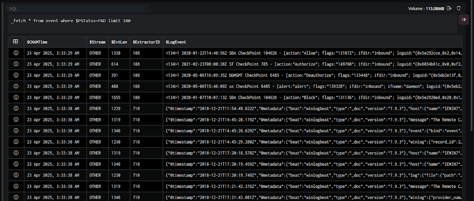

The outputs shown in the screenshot may only be partial outputs in many cases.

In the pipelined query function, the \_agg directive uses the stat\_unique keyword to aggregate and group unique $DstPort (destination port) values and give the maximum $EvtLen (event length) for each group (using the keyword max). The output is as shown below:

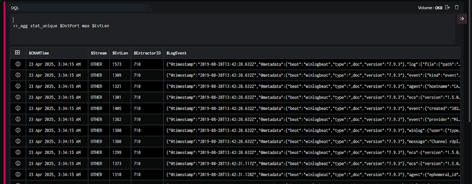

In the result set returned by the \_fetch query function, amongst all rows (events) with the destination port 53, the maximum value of event length was 645. This is highlighted in the image above.

- You can use the keywords min, sum or average (instead of max) to calculate the minimum value, summation or average respectively of a group.

- The number of events fetched by the \_fetch directive is limited to the duration specified in the Date Selector on the Search GUI. By default, the duration is the last 24 hours.

We can also form groups using more than one field. Take a look at the example given below:

```
_fetch $SrcIP, $DstPort, $EvtLen from event where $PStatus=PAD limit 100>>_agg stat_unique $SrcIP, $DstPort max $EvtLen
```

The \_fetch directive retrieves the $SrcIP, $DstPort, and $EvtLen fields for each event where $PStatus is PAD. We limit the result set to the 100 latest events satisfying the where clause. The output is as shown below:

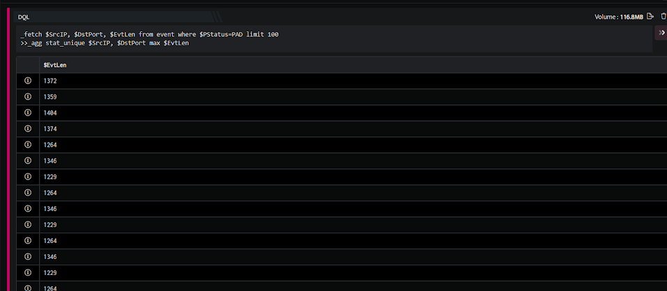

In the pipelined query function, the \_agg directive uses the stat\_unique keyword to aggregate combinations of the $SrcIP (source IP) and $DstPort (destination port) values and give the maximum $EvtLen (event length) for each group using the keyword max. The output is as shown below:

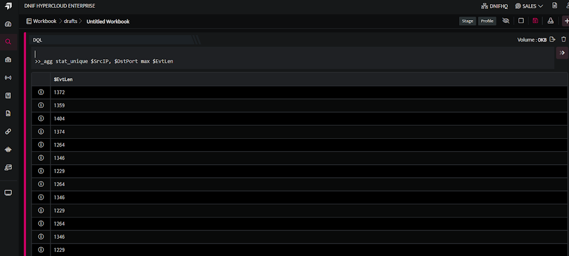

The destination port 8080 has events in the first combination group of destination port and source IP are such that the maximum length is 517.

###### **Count Occurances**

- Count\_distinct is one of the operations under stat\_unique which can perform counting of distinct values on the computed fields with respect to the group files of stat\_unique.

- Count\_distinct can compute only on Single Field.

```
_fetch * from event where $Stream=FIREWALL group stat_unique $SrcIP count_distinct $DstIP limit 100
```

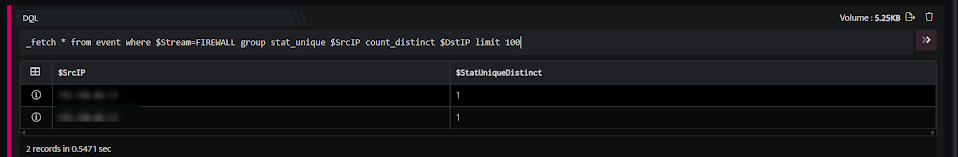

In the above example, the \_fetch directive retrieves all fields for each event where $Stream is FIREWALL. In the pipelined query function, the \_fetch directive uses the stat\_unique keyword to aggregate and group unique $SrcIP (Source ip) values and give the counting of distinct values of $DstIP (Destination ip) for each group (using the keyword count\_distinct). 

```
_fetch * from event where $Stream=FIREWALL group stat_unique $SrcIP, $DstIP count_distinct $SrcCN limit 100
```

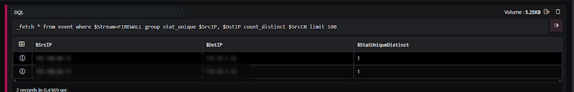

In the above example, the \_fetch directive retrieves all fields for each event where $Stream is FIREWALL. In the pipelined query function, the \_fetch directive uses the stat\_unique keyword to aggregate and group unique $SrcIP (Source ip) and $DstIP (Destination ip) values and give the counting of distinct values of $SrcCN (Source Country) for each group (using the keyword count\_distinct).
