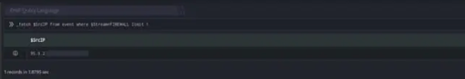
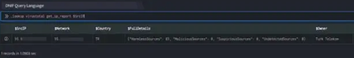

  
lookup is a query directive used to make API calls to third party databases.

Security analysts may want to dig deep and retrieve additional details of an IP address, domain, file, URL and so on. For this, several third parties (providers) continuously analyze these elements, and maintain databases of (security) information. These databases can be accessed via API calls. The \_lookup directive allows you to integrate DNIF with these providers using plugins. Plugins, whose functions can be called using the \_lookup directive, are called lookup plugins.

The \_lookup directive calls specific functions, present in these plugins, that make API calls to third parties to retrieve security information about the parameters passed in the functions.

Only lookup plugins can be used with the \_lookup directive. Lookup plugins are prefixed with lookup-. They must be downloaded/cloned and configured before they can be used in the lookup query functions.

###### **Syntax**

```
_lookup <lookup_plugin_name> <function_name> parameter1, parameter2, ....
```

Here,

- `<lookup\_plugin\_name>`: Name of the plugin being used

- `<function\_name>`: Name of the plugin function being

The examples below use the Virustotal lookup plugin. This plugin has been already downloaded and configured for use.

Example 1

Take a look at the example given below:

```
_fetch $SrcIP from event where $Stream=FIREWALL limit 1>>_lookup virustotal get_ip_report $SrcIP
```

Here:  
The \_fetch directive retrieves $SrcIP (source IP address) for each event in the event index. The result set is limited to the latest event. The output is as shown below



In the pipelined query function, the \_lookup directive calls the get\_ip\_report function of the VirusTotal plugin. $SrcIP is passed as a parameter to the function. This function makes an API call to VirusTotal to get a report of this source IP address. This report contains details about the IP address such as the latest URL hosted on it, domain resolved to it, country to which it belongs and so on. This report can be used for cross-validation or further analysis. The output is as shown below:



 In general, each plugin has various functions which can be called using the \_lookup directive. Details about these different functions, including their purpose, syntax and output fields can be obtained.
