  
The \_store directive is used to write and store the result set, permanently on the hard disk, for later use.

###### **Syntax**

```
_store in_disk <eventstore_name> [ stack_replace | stack_append | key_replace ]
```

Here:

- in\_disk: Stores the result set on hard disk (permanent storage)

- stack\_replace: Replaces the complete event store or creates a new event store

- stack\_append: Appends fetched values to a pre-existing event store

- key\_replace: Replaces all values of a pre-existing key/column in a event store with new values

The result set stored using the \_store directive is referred as an event store.

###### **Event Store type**

###### **in\_disk**

With the in\_disk keyword, you can write a result set to a permanent event store on the DNIF container’s Hard Disk Drive \[HDD\]. This data will remain available unconditionally to the container or host machine even after restart.

Specifying the in\_disk keyword is mandatory. In future, new options addition to in\_disk would be added.

Take a look at the example given below:

```
_fetch * from event where $Duration=12h group count_unique $Action limit 5>>_store in_disk test_ibruk_action_list stack_replace
```

Here:

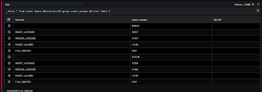

The \_fetch directive retrieves all fields for each event that have been (received and) stored in the last 12 hours ($Duration=12h). The result set is grouped by unique values of $Action along with a count (count\_unique) for each. The result set is sorted in the descending order of count\_unique (by default). It is then limited to 5 rows. The output is as shown below:

In the pipelined query function, the \_store directive stores the result in the DNIF hard disk drive (in\_disk) with the event store name test\_ibruk\_action\_list. The output is as shown below:

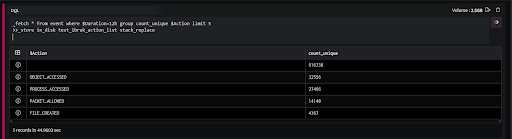

The \_store directive acts as a pass through. It does not modify the result set returned by the previous (in this case, the \_fetch) query function. Hence both result sets above, are identical.

stack\_replace is explained in later in this article.  
You can retrieve the data stored in event store using \_retrieve directive

Stack writing instruction or event store writing instruction refers to the way the result set is written on the storage. You can either replace all the previous rows with new rows (stack\_replace), append new rows after the existing rows (stack\_append) or specify which rows to update and which ones to add afresh (key\_replace).

###### **Stack writing instruction**

In this context, stack refers to the stored result set.

######  **stack\_replace**

This writing instruction is commonly used when creating a new event store. Running the stack\_replace instruction on an existing event store will replace the existing data in the event store with new data.

**Take a look at the example given below:**

```
_fetch * from event where $Duration=2h AND $Stream=FIREWALL group count_unique $SrcIP limit 3>> _store in_disk test_ibruk_store_ipcount stack_replace
```

  
Here:

The \_fetch directive retrieves all fields for each event that have been (received and) stored in the last 2 hours ($Duration=2h) and have $Stream as FIREWALL. The result set is grouped by unique values of $SrcIP along with a count (count\_unique) for each. The result set is sorted in the descending order of count\_unique (by default). It is then limited to 3 rows.

The output is as shown below:


In the pipelined query function, the \_store directive stores the result in the DNIF hard disk drive (in\_disk) with the event store name test\_ibruk\_store\_ipcount.

As the \_store query function acts as a pass through, it does not modify the result set of the earlier query function (in this case \_fetch). The output is as shown below:

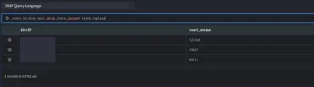

In the last hour, there were events from three unique IP addresses. Since we use the stack\_replace keyword, the previous contents of the event store (if any) are erased and new content is added to it.

In the case of this example, since the event store does not exist, a new one was created.

To view the event store, we use the \_retrieve directive as shown below:

```
_retrieve query eventstorename
```

The result of the \_store query function is stored in the event store test\_ibruk\_store\_ipcount. As this event store has been newly created, it does not have any older information.

###### **key\_replace**

Here, key(s) refers to the values of the field specified in the query while value(s) refers to the corresponding values of the other field. One Key and its corresponding Value make a key-value pair as shown below:

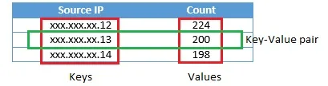

The key\_replace instruction is useful when there is a need to update the data stored for certain pre-existing keys with the latest values. For new keys, this instruction will automatically append the key-value pair to the event store.

The example below is a continuation of the earlier example used in stack\_replace:

```
_fetch * from event where $Duration=3h AND $Stream=FIREWALL group count_unique $SrcIP limit 5>> _store in_disk test_ibruk_store_ipcount key_replace $SrcIP
```

Here:

The \_fetch directive gives a similar result as the one in the stack\_replace example. The only difference is the $Duration. In this example, we fetch events received and stored in the last 3 hours. The output is as shown below:

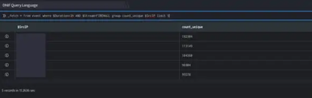

In the pipelined query function, the \_store directive stores the result in the DNIF hard disk drive (in\_disk) in the existing event store test\_ibruk\_store\_ipcount using the stack\_replace option.

As the \_store query directive acts as a pass through, it does not modify the result set of the earlier query function (in this case \_fetch). The output is as shown below:

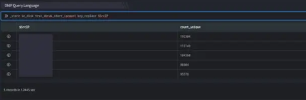

In the last 5 hours there were events from five unique IP addresses. The first three are the same as the earlier example. However, their counts are different.

The key\_replace keyword modifies the existing test\_ibruk\_store\_ipcount event store. Here $SrcIP is the key column. The \_store directive modifies the value (count\_unique) of the key for those keys (values of $SrcIP) that exist in the event store. New $SrcIP(s) (keys) and corresponding count\_unique (values) are appended to the event store.

```
_retrieve test_ibruk_store_ipcount
```

To view the event store, we use the \_retrieve directive. The $SrcIP(s) (keys) for which count\_unique (value) has changed (from our earlier example) now have updated counts. In this example, it is the first 3 IP addresses. These SrcIP-count\_unique) are appended at the end of the event store.

###### **stack\_append**

The stack\_append instruction appends the fetched result at the bottom of the event store. Unlike key\_replace or stack\_replace, this instruction can only append and will not replace any of the existing data. Also, there is no concept of key-value pairs in this case. All records are simply appended at the end of the event store, without any comparisons with existing data.

The example below is a continuation of the earlier example used in key\_replace:

```
_fetch * from event where $Duration=90m AND $Stream=FIREWALL group count_unique $SrcIP limit 2>> _store in_disk test_ibruk_store_ipcount stack_append
```

Here:

The \_fetch directive gives a similar result as the one in the key\_replace example. The only difference is the $Duration. In this example, we fetch events received and stored in the last 90 minutes. The output is as shown below:

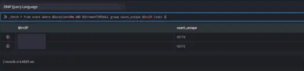

In the pipelined query function, the \_store directive stores the result in the DNIF hard disk drive (in\_disk) in the existing event store test\_ibruk\_store\_ipcount using the stack\_append option.


As shown, there are events from two unique IP addresses in the last 3 hours.

In this case, when we use the stack\_append keyword, pre-existing data will not be updated. These records will be treated as new records and will be appended at the bottom of the event store.

As the \_store query directive acts as a pass through, it does not modify the result set of the earlier query function (in this case, the one with \_fetch). The output is as shown below:

To view the event store, we use the \_retrieve directive.

```
_retrieve test_ibruk_store_ipcount
```

As the \_store query directive acts as a pass through, it does not modify the result set of the earlier query function (in this case, the one with \_fetch).

###### **Keys with multiple columns as Value**

You can specify only one Key column with key\_replace. If there are multiple columns for a single Key value (for example, xxx.xxx.xx.250), all columns apart from Key, represent a single combined Value for that Key. A change in Value could mean a change (addition or deletion) of columns.

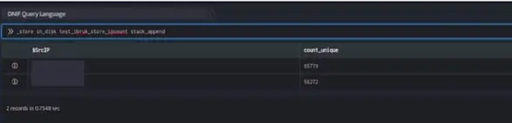

Here, $SrcIP (source IP address) is the Key column.

The first row has a source IP address xxx.xxx.xx.250 (Key) and a count\_unique of 1156 (Value).

The second row has an source IP address xxx.xxx.xxx.126 (Key) but its Value is a combination of two columns $AddrScheme (STATIC) and $DevSrcIP (xxx.xx.xx.153).

If the same Key (xxx.xxx.xxx.126) is updated with a Value of:

- $AddrScheme=DYNAMIC and $DevSrcIP = xxx.xx.xx.160 then both the columns are updated.

- $AddrScheme=DYNAMIC only (and no $DevSrcIP column in the result set), then the $AddrScheme column is updated while the $DevSrcIP column would be blank. If the first row did not exist in our event store, then after this update the $DevSrcIP column would not be present in the event store.

###### **Non-Unique Keys**

If a Key column has repeated values (two Keys are same), then only the first of the two rows are replaced with updated Value columns.

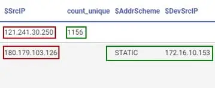

Here $SrcIP is the Key column and the two rows highlighted have the same source IP address.

We update the event store using key\_replace ($SrcIP as the key) with the result set shown below:

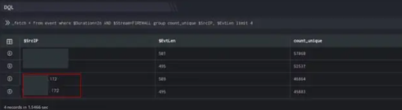

Only the first of the two rows in the result set have updated Value columns as shown below:

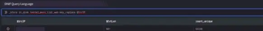
