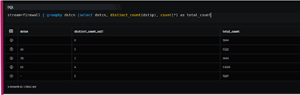

  
The distinct\_count function lets you count unique occurrences of values of a specified field (or a combination of fields) in the result set. It groups rows based on unique values of a specified field (or combination of fields) and displays the count of each group.

```
stream=firewall | groupby dstcn |select dstcn, distinct_count(dstip), count(*) as total_count
```

Here,

- Stream is Firewall

- Groupby function allows to organize similar data into groups i.e. groupby destination country.

- Select function helps you to retrieve records from one or more tables, the records retrieved are known as a result set.

- The **distinct\_count** feature eliminates the repetitive appearance of the same data. The **distinct** feature indicates that the particular value can appear only once in the results.

In this example, on execution it should retrieve all fields for each event where the stream is a firewall, retrieve the total count of rows that match the specific destination ip address, select and group it as per the destination country.


