  
**\_checkif** is a query directive used to apply conditional logic on a result set.

A quick example is given below:

```
_fetch * from event where $Stream=FIREWALL group count_unique $SrcCN limit 2>>_checkif int_compare count_unique <= 30000 include
```

Here:  
The **\_fetch** query directive retrieves all fields for each event where **SrcCN** along with a count (**count\_unique**) for each group. The result set is sorted in the descending order of **count\_unique** (by default). It is then limited to 2 rows. The output is as shown below:

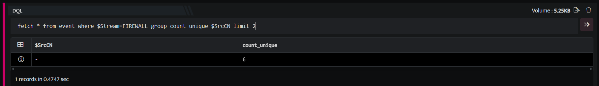

In the pipelined query, the **\_checkif** directive uses the keyword **int\_compare** to check if the count (**count\_unique**) of any group is less than or equal to 30000. Only rows where this condition is satisfied are included in the final result set. The output is as shown below:

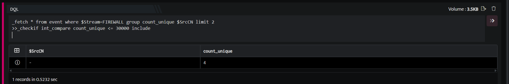

The **\_checkif** directive allows you to:

- Compare two strings, integers, times and timestamps (date and time) and filter the result set based on the comparison

- Filter rows in which no value exists for a specified field.

- Compare the result set of a **\_fetch** query function and an existing event store.

###### **SYNTAX**

The generic syntax of the **\_checkif** directive is as shown below:

```
_checkif [function] [include | exclude]function:int_compare | str_compare | lookupint_compare $field1 > | < | = | != | >= | <= integerstr_compare $field1 [ [ eq | neq | substr ] 'string' | regex ‘regular expression’ ]key_exists $field1lookup eventstore_name join $field1 = $field2 [int_compare | str_compare | key_exists ] [include | exclude]
```

Here:  
**int\_compare:** Compares two integer values.  
**str\_compare:** Compares two string values (or a string against a regular expression).  
**key\_exists:** Checks and filters rows where no value exists for the specified field.  
**lookup:** Compares the result set of a **\_fetch** query function and an eventstore based on specified fields (keyword join) and the condition specified using the above functions.  
**include/exclude:** Includes or excludes rows, from the result set, which satisfy the condition.

###### **int\_compare**

Used to compare integer values in a result set

The **\_checkif** directive can be used to compare integer values in a result set with a specified integer value using the **int\_compare** keyword.

Take a look at the example given below:

```
_fetch * from event where $Stream=FIREWALL group count_unique $SrcIP limit 10>>_checkif int_compare count_unique > 3000 include
```

Here:

1. The **\_fetch** directive retrieves all fields for each event where stream is Firewall. The  result set is grouped by unique values of  **SrcIP** along with a distinct count (**count\_unique)** for each group. The result set is sorted in the descending order of **count\_unique** (by default). It is then limited to 10 rows. The output is as shown below:

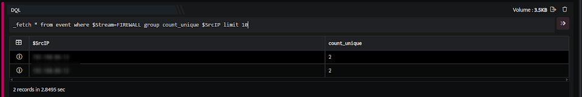

1. In the pipelined query function, the **\_checkif** directive uses the **int\_compare** keyword to compare two integer values. It checks whether the value in the **count\_unique** field is less than 3000 using the **<** symbol/keyword. The keyword **include** is used to include in the result set all the rows where this condition is satisfied. The output is as shown below:  
    

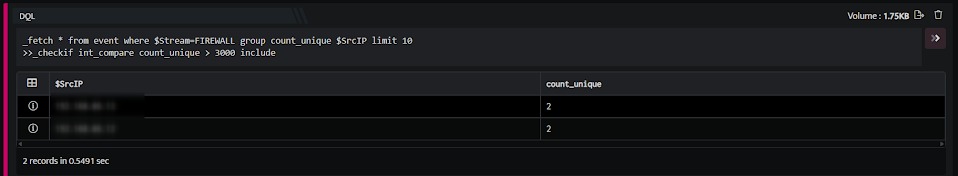

As shown, only those rows where **count\_unique** is less than 3000 are included in the result set of the **\_checkif** function (final result set).

Use the exclude keyword in the **\_checkif** directive to exclude from the result set the rows for which a condition is not satisfied.  
When comparing integers: **\>** implies greater than **<** implies less than **\=** implies equal to **!=** implies not equal to **\>=** implies greater than or equal to **<=** implies less than or equal to

###### **str\_compare**

The **\_checkif** directive can be used to compare string values in a result set with a specified string (or regular expression) using the **str\_compare** keyword along with **eq/neq/substr/regex** keywords.

##### **eq/neq**

Result set are equal to or not equal to a specified string

The **eq/neq** keywords are used along with the **str\_compare** keyword to check if the string values in a result set are equal to or not equal to a specified string. These keywords perform a full and exact match.

  
Take a look at the example given below:

```
_fetch * from event where $Duration=6h AND $Stream=FIREWALL group count_unique $SrcIP limit 10>>_checkif str_compare $SrcIP eq '180.XX.XX.126' include
```

Here:  
The **\_fetch** directive retrieves all fields for each event that have been received (stored) in the last 6 hours (Stream\*\* as **FIREWALL**. The result set is grouped by unique values of **$SrcIP**(source IP) along with with a count (**count\_unique**) for each group. The result set is sorted in the descending order of **count\_unique** (by default). It is then limited to 10 rows. The output is as shown below:

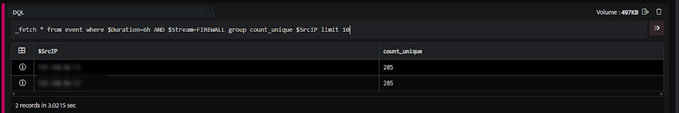

In the pipelined query function, the **\_checkif** directive uses the keyword **str\_compare** to compare two string values. It checks whether the value in the **$SrcIP** field is equal to 180.XX.XX.126 using the **eq** keyword. The keyword **include** is used to include in the result set the rows where this condition is satisfied. The output is as shown below:  


IP addresses are stored as strings in the DNIF database.  
When comparing strings: **eq** implies equal to **neq** implies not equal to.

##### **substr**

Result set contain the specified string.

The **substr** keyword is used along with the **str\_compare** keyword to check if the string values in a result set contain the specified string. Hence, this keyword checks if the specified string is substring of the string in the result set.  
Take a look at the example given below:

```
_fetch * from event where $Duration=6h AND $Stream=FIREWALL limit 10>>_checkif str_compare $Proto substr 'TCP' include
```

Here:

The **\_fetch** directive retrieves all fields for each event that have been received (stored) in the last 6 hours (Stream\*\* as **FIREWALL**. The output is as shown below:  

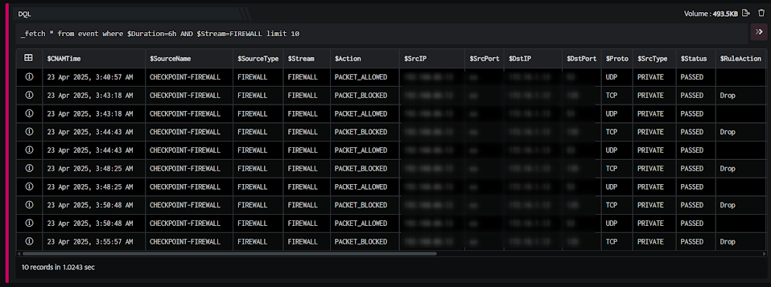

In the pipelined query function, the **\_checkif** directive uses the **str\_compare** keyword to compare two string values. It checks whether **$Proto** contains the string ‘**TCP**’ as a substring using the **substr** keyword. The keyword **include** is used to include in the result set, the rows where this condition is satisfied.The output is as shown below:  

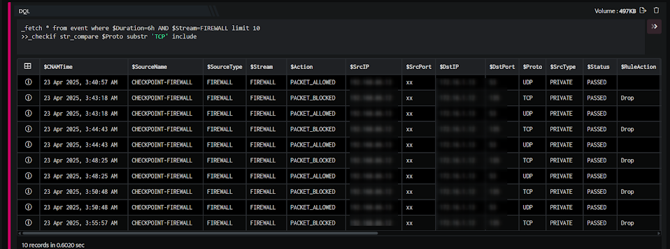

##### **regex**

Result set satisfy a specified regular expression

The **regex** keyword is used along with the **str\_compare** keyword to check if the string values in a result set satisfy a specified regular expression. This keyword offers the flexibility to create and specify your own regular expression to filter results.  
Take a look at the example given below:

```
_fetch * from event where $Duration=6h AND $Stream=FIREWALL limit 10_checkif str_compare $SrcISP regex '^[Cc]loud' include
```

Here:

The **\_fetch** directive retrieves all fields for each event that have been received (stored) in the last 6 hours (Stream\*\* as **FIREWALL**. The output is as shown below:

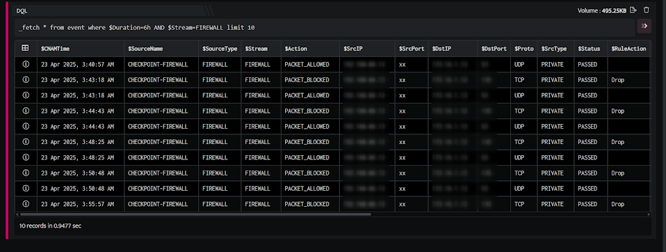

In the pipelined query function, the **\_checkif** directive uses the **str\_compare** keyword to compare string values against a regular expression. It checks whether the values in the **$SrcISP** field satisfy the regular expression **^\[Cc\]loud** using the **substr** keyword. This regular expression checks for strings that begin with _Cloud_\* or **cloud**. The keyword **include** is used to include in the result set, the rows where this condition is satisfied.The output is as shown below:

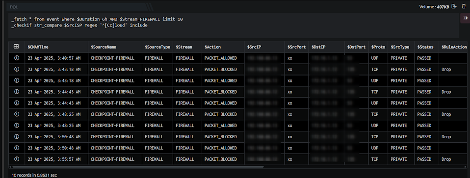

Although the **\_fetch** result set returned two rows where **$SrcISP** contained the word **Cloud**, only one of the two cases begin with the word **Cloud** (as specified in the regular expression).Hence only one row is included in the final result set.

###### **key\_exists**

Used to filter rows where not value exists for specified field.

The **\_checkif** directive can be used to filter rows where no value exists for the specified field using the **key\_exists** keyword. Here, no value refers to both, null values (column/value does not exists) and empty strings (typically created using **“”**).  
Take a look at the example given below:

```
_fetch $SrcCN, $Stream from event limit 7>>_checkif key_exists $SrcCN include
```

Here,  
The **\_fetch** directive retrieves 2 fields: **SrcCN** and **Stream** for each event. The result set is limited to the latest 7 events. The output is as shown below:

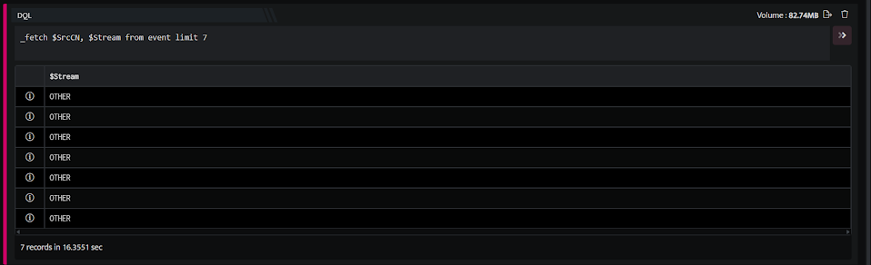

In the pipelined query function, the **\_checkif** directive uses the **key\_exists** keyword to identify rows where the **SrcCN** field has . In this case, as we use the include keyword, all such rows are included from the result set. Rows where the **SrcCN** field has no value (i.e. the **$SrcCN** field itself is either **null/blank** or an **empty string**) are included. The output is as shown below:

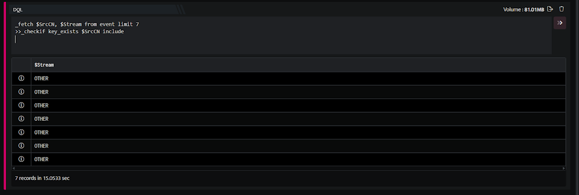

As shown, the 1 row where **$SrcCN** was blank (in the fetch result set) is included in the final result set.

###### **lookup**

The **\_checkif** directive, using the **lookup** keyword, can be used to **include/exclude** rows from the result set currently in the pipeline (result set of the query function preceding this **checkif** query function) by looking up to check whether these rows are present in the specified eventstore (created using the **\_store** directive). This **lookup/comparison** between the result set currently in the pipeline and the eventstore is performed on the fields specified in the **checkif** query function (using the **join** keyword). Additionally, another condition is also specified in the same query function using the above keywords **(int\_compare, str\_compare, or key\_exists).**

Finally, rows are included or excluded, from the final result set, using the **include/exclude** keywords as follows:

- **include:** Include a row of the result set currently in the pipeline, in the final result set, where the value of the field (specified in the join condition) in the fetch result set has:
    - **Condition 1** - The same value in the field (specified in the join condition) in the eventstore (in any of its rows) **AND**
    
    - **Condition 2** - That row (or any of those rows) of the eventstore satisfying condition 1 also satisfy that second condition specified using these keywords: **int\_compare,** **str\_compare**, **key\_exists**. Hence for condition 2 to be satisfied, condition 1 must be satisfied. When this condition (condition 2) is also satisfied, the row is included.

- **exclude**: Exclude a row of the result set currently in the pipeline where the innermost condition (condition 2) explained above is satisfied. The final result set contains those rows where the innermost condition (condition 2) is not satisfied. These rows may have failed condition 1 or, satisfied condition 1 but failed condition 2.

The rows which are present in the final result set (of the **checkif** query function) when using the **include** keyword, will not be present in it when using the **exclude** keyword. Similarly, rows that are present in the final result set when using the **exclude** keyword, will not be present when using the **include** keyword. Basically, they are opposites of each other. 

The result set currently in the pipeline refers to the result set of the current (last) query function executed/displayed. In this context, it refers to the query function immediately preceding the checkif query function begin explained.

We have created a eventstore with the name **DstPrt\_cnt**, for our example as shown below:

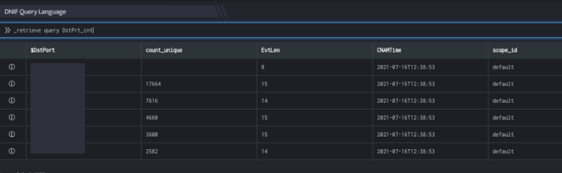

Now, take a look at the example given below:

```
_fetch * from event group count_unique $DstPort limit 7>>_checkif lookup DstPrt_cnt join $DstPort = $DstPort int_compare count_unique = count_unique include
```

Here:

The **\_fetch** directive retrieves all fields for each event. The result set is grouped by unique values of **$DstPort** (destination port) along with a count **(count\_unique)** for each group. The result set is sorted in the descending order of **count\_unique** (by default). It is then limited to 7 rows. The output is as shown below:

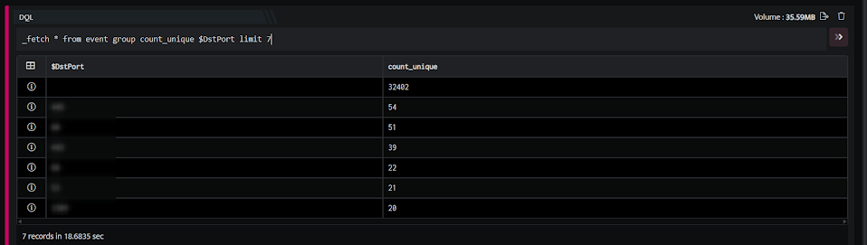

1. In the pipelined query function, the **\_checkif** directive uses the **lookup** keyword to check whether the destination ports (**DstPort**, is present in the store (condition 1). For such rows, additionally, we check (using the **int\_compare** keyword) whether the value of **count\_unique** of a row in the **\_fetch** result set is the same as the value of **count\_unique** in the corresponding row of the eventstore which satisfied condition 1 (condition 2). Only rows, where condition 2 is satisfied, are are included.  
    

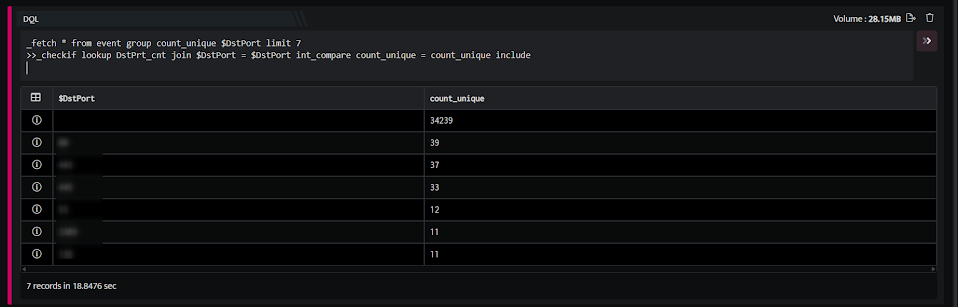

You can compare the result set of the fetch query function and the eventstore. Five destination ports - 67, 23, 445, 443, 22 satisfied condition 1. However, out of these 5, only 2 destination ports - 67 and 22 satisfied condition 2 as well (both had same values of **count\_unique**). Hence they are included in the final result set (shown above)  
You can use the **exclude** keyword (instead of the **include** keyword) in the checkif query function to include all other rows of the fetch result set, in the final result set except these two shown above. The output is as shown below:  

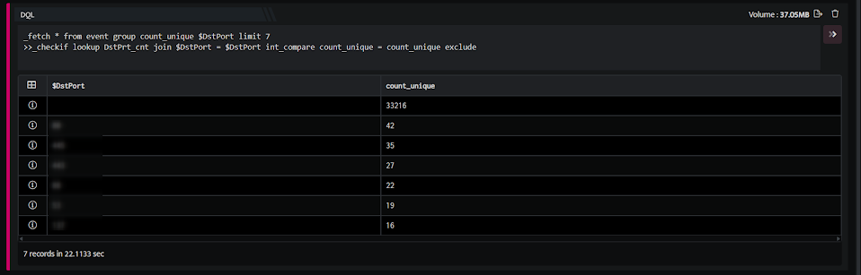

Destination ports 1433 and 5060 did not satisfy condition 1. Destination ports 23, 445, 443, satisfied condition 1 but did not satisfy condition 2.

We can specify the column/field name in the format join Field2 where, $Field1 refers to the column in the eventstore and $Field2 refers to the column in the result set currently in the pipeline.  
In the above example, use int\_compare $DstPort = $DstPort (along with the include keyword) if the join keyword is sufficient and you do not need any additional logic while joining.

IN or NOT IN

You can now compare the results are **in or not in** the eventstore (created using \_store directive or uploaded on eventstores page directly) based on the specified field.

**For Example**

```
stream=stream_name | checkif stream_column_name in / not in eventstore_name.eventstore_column_name
```

Here,

- Stream can be Firewall, Authentication, etc

- The checkif function will compare the column of the stream and eventstore and add or remove the rows depending on the condition (in or not in) specified in the query.

**Sample Query:** 

```
stream=firewall | checkif srcport in src_ports.$SrcPort | limit 10
```

This query will retrieve all the value from stream firewall and will check if srcport is in the eventstore name src\_ports with column name $SrcPort then added it to the result as shown below:

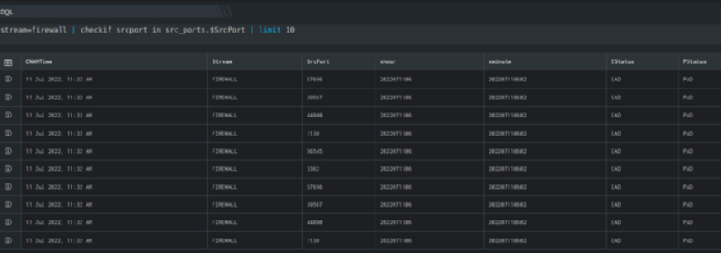

**Sample Query:**

```
stream=firewall | checkif srcport not in src_ports.$SrcPort | limit 10
```

This query will retrieve all the value from stream firewall and will check if srcport is not in the eventstore name src\_ports with column name $SrcPort then remove it to the result as shown below:

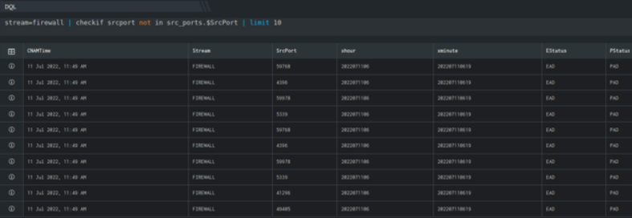
