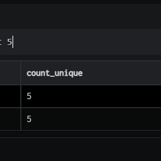
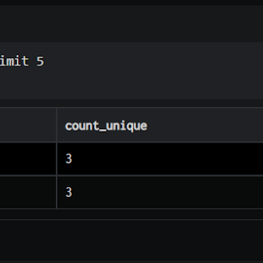
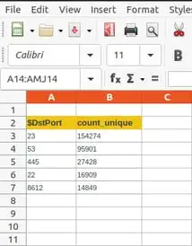

  
\_export is a query directive used to extract a result set from the pipeline and send it to your email inbox. Currently the result set can be sent as an attachment in the XLSX, CSV or JSON formats. The email can be sent by directly specifying the email addresses in the query function.

For the export to work and email to be sent, the SMTP service must be configured on the DNIF systems and the service must allow the size of attachment created.

###### **SYNTAX**

The generic syntax of the \_export directive is as given below:

```
_export [ xlsx | csv | json ] [function]function:notify_email <email address1>, <email address2>, …
```

Here,

- xlsx/csv/json: These are file formats in which the result set can be sent in the email.

- notify\_email: Sends an email to the specified email addresses.

###### **notify\_email**

The \_export directive can be used to send a result set as an attachment to the specified email addresses using the notify\_email keyword.

Take a look at the example given below:

```
_fetch * from event where $Stream=FIREWALL group count_unique $DstPort limit 5>>_export xlsx notify_email <email address>
```

Here:The \_fetch directive retrieves all the fields, for each event where $Stream is FIREWALL. The result set is grouped by unique values of $DstPort along with a count (count\_unique) for each. The result set is sorted in the descending order of count\_unique (by default). It is then limited to 5 rows.The output is as shown below:



In the pipelined query function, the \_export directive extracts the result set in an Excel file (xlsx) and emails the file (notify\_email) to the specified email ID, as shown in the image below:



The image above shows the web console output of the export query function. The images below show the DNIF email as received in the inbox.



The image above shows the attachment (xlsx file) present in the email received from DNIF.
