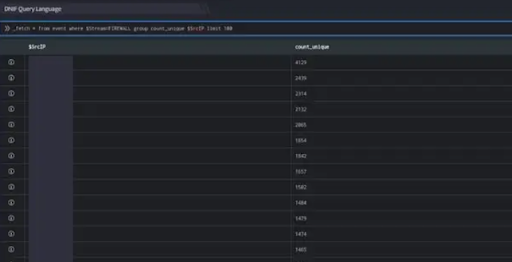
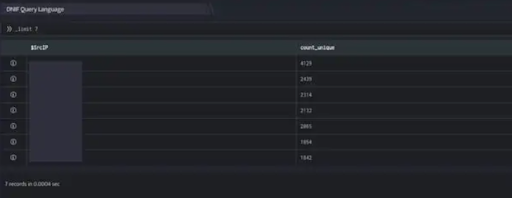

  
\_limit is a query directive used to limit the number of rows in a result set to the integer value specified in the query function. \_limit always picks (includes) rows from the top of the result set of the previous query function in the pipeline.

###### **Syntax**

The generic syntax of the \_limit directive is as given below:

```
_limit &lt;integer&gt;
```

Example

Take a look at the example given below:

```
_fetch * from event where $Stream=FIREWALL group count_unique $SrcIP limit 100>>_limit 7
```

Here:

The \_fetch directive retrieves all fields for each event where $Stream is FIREWALL. The result set is grouped by unique values of $SrcIP along with a count (count\_unique) for each group. The result set is sorted in the descending order of count\_unique (by default). It is then limited to 100 rows. The output is as shown below:



In the pipelined query function, the \_limit directive limits the result set to the first 7 rows (from the top of the result set). The output is as shown below:


