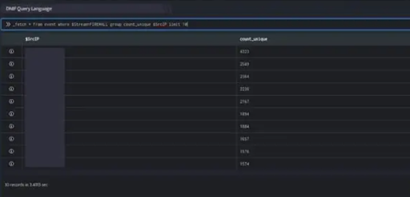
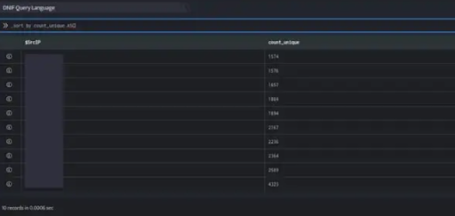

######   
**Programatically realign your result set using sort**

\_sort is a query directive used to sort the result set.

###### **Syntax**

The generic syntax of the \_sort directive is as given below:

```
_sort by <$Field> [ ASC | DESC ]
```

- $Field is the field based on which the result set is sorted.

- ASC | DESC indicates the order of sorting (ascending or descending).

Take a look at the example given below:

```
_fetch * from event where $Stream=FIREWALL group count_unique $SrcIP limit 10>>_sort by count_unique ASC
```

The \_fetch directive retrieves all fields for each event where $Stream is FIREWALL. The result set is grouped by unique values of $SrcIP along with their individual row count.

The result set is sorted in the descending order of count\_unique (by default). It is then limited to 10 rows. The output is as shown below:



In the pipelined query function, the \_sort directive reorders the result set in the ascending order of count\_unique using the ASC keyword. The output is as shown below:



You can also sort an alphanumeric field in ascending (a to z) or descending (z to a) order.
