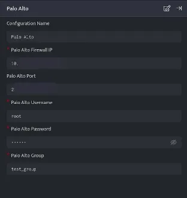
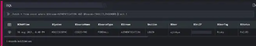
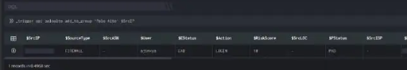

  
\_trigger is a query directive typically used to perform an action in response to an event or an investigation conducted. It can be used to make API calls to perform an action on an external system.

###### **Syntax**

```
_trigger api &lt;plugin_name&gt; &lt;function_name&gt; &lt;‘configuration name’&gt;
```

The \_trigger directive uses the api keyword to trigger a function in an installed plugin to make an (external) API call to perform an action.

Ensure your desired responder integration is [configured](https://dnif.it/kb/uncategorized/configuring-automation/).

###### **Example**

Take a look at the example given below:

Below is the configured **[Palo Alto integration](https://dnif.it/kb/device-integration/palo-alto-device-integration/)**



Execute the following query:

```
_fetch * from event where $Stream=AUTHENTICATION AND $Reason=INVALID_PASSWORD limit 1 
```

Here:

The \_fetch directive retrieves all fields for each event where $Stream is AUTHENTICATION. The result set displays the event where authentication has failed due to invalid password.



```
_trigger api paloalto add_to_group 'Palo Alto' $SrcIP
```

where,  
paloalto is the plugin\_name,  
add\_to\_group is function\_name AND  
Palo Alto is the configuration name



In the pipelined query function, the \_trigger directive uses the api keyword to call the add\_to\_group function in the paloalto plugin. This function takes the source IP address as a parameter and makes an API call to block the source IP address on the firewall.
