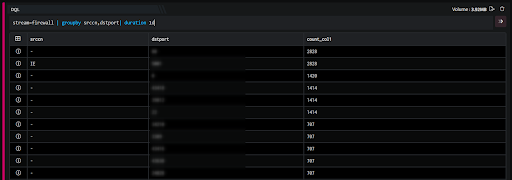

  
The duration lets you specify the start and end timestamp for retrieving events

The following table liis here, and to help search engines find it too.  
sts all the valid duration names and values.

| **Duration name**  | **Value** |
| --- | --- |
| Month | M (uppercase) |
| day | d (lowercase) |
| week | w (lowercase) |
| hour | h (lowercase) |
| minute | m (lowercase) |

On the Search page, by default, we have a duration of five minutes (based on the time you opened the search page) which can be modified using the GUI. However, this can be overridden using the two options below:

```
stream=firewall | groupby srccn,dstport| duration 1d
```

Here,

- Stream is Firewall

- Groupby function allows to organize similar data into groups i.e. groupby source country.

- Duration field helps you to retrieve records for the specified duration

The above query should retrieve all fields for each event where the stream is a firewall, retrieve all records for one day (i.e. specified duration) and group it as per the destination port and source country as shown below:



```
stream=firewall where srcip='10.35.38.1' | duration from 2021-05-20T00:00:00 to 2022-05-22T23:59:00
```

In the second example, Duration from field specifies the start date and time and end date and time for which the records should be retrieved.


