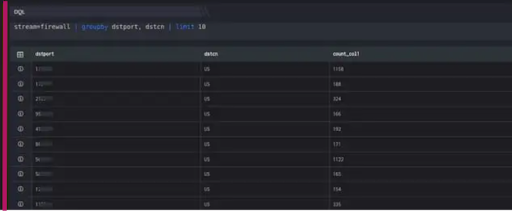

  
Limit indicates the maximum number of results that should be returned by the query. If you do not specify a Limit clause in the query, the default limit will be used.

By default, there is no limit for aggregations whereas for non-aggregated searches, the default limit is 1000.

```
stream=firewall | groupby dstport, dstcn | limit 10
```

Here,

- Stream is Firewall

- Groupby function allows to organize similar data into groups i.e. groupby destination country.

- The limit function is used for limiting the number of rows in the result set of a fetch query function. It is a mandatory clause. It also decides which rows (oldest or newest) are chosen to be a part of the final result set.

- The limit keyword picks the newest or latest events to be a part of the result set. Hence, the latest/newest events appear first in the result set. The result set is then limited to the number of rows specified in the query after the limit keyword.

In this example, on execution it should retrieve all fields for each event where the stream is a firewall. It will group the result as per the destination port, country. However, we limit the result set (limit 10) to only 10 latest events which satisfy the where condition as shown below:


