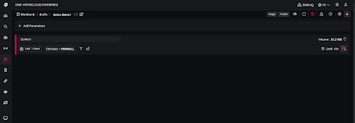
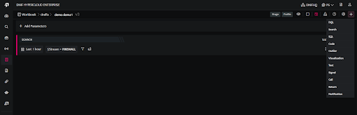

- Click the search icon on the left navigation bar or click the **plus** icon at the top right corner of the Workbooks list page to create a new workbook, the following screen is displayed.  
    

- To edit the workbook name click **/drafts/ Untitled Workbook** on the top left corner of the screen and enter a name of your preference.
    - The first part of the Workbook name indicates the folder where the workbook will be saved. You can also create your own folder by clicking the plus sign at the end of the folder list.

- Click the **plus** icon on this page to add the required blocks to your Workbook.

- The first Block to be added in a Workbook should always be a Search Block / DQL Block / SQL / Text Block.

- Code, Signal, Visualization Blocks can be added only after adding a Search Block / DQL Block

- All query results will be retained only for an hour. 

- Once you have added all the required blocks in the Workbook. Click **Save**, to save your Workbook.
