DNIF library has extractors ready to ingest data from all types of devices. It auto detects devices sending logs to DNIF and the extractors associated with them, this information is listed on the device management screen. It lists the devices that are sending logs to the console along with the IP addresses, extractors and streams associated for informational purposes. In addition, A provision has been made to manually add devices when it is required for the rare case where one needs to make a specific parser mapping for a particular device.

- Extractors are used to extract information from the incoming logs.

- Streams are the logical partitions into which different log types are distributed.

The following actions can be performed in the Collection Status page:  

1. [View Collection Status](#how_to_view_collection_status?)

3. [Add or Edit Description for a source](#add_or_edit_description)

5. [Manually override and rollback an extractor](#manually_override_and_rollback)

7. [Delete an Inactive device](#delete_an_inactive_device)

## **How to view Collection Status?**

- Hover on the **Administration** icon on the left navigation bar of the Home screen and then click on **Collection Status,** to view all the devices sending logs to the console.

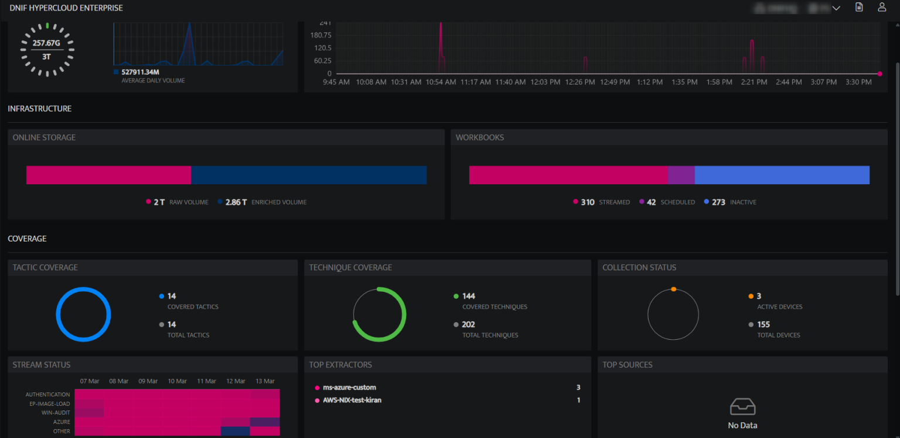

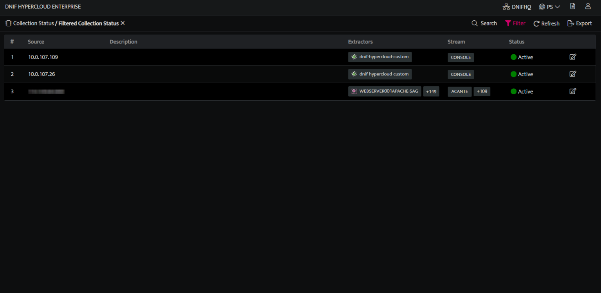

The Collection Status screen displays the following details:

| **Field Name**  | **Description** |
| --- | --- |
| Source | Displays the IP Address/ name of the Connector sending logs to console**Note**: Hover on the details in this column and a copy icon will be displayed, you can copy the details of this column and use it for any further analysis as required. |
| Extractors | Display the extractors mapped to the device |
| Stream | Displays the stream category of the logs |
| Status | Displays the status of the device, active/inactive. You can apply the following filters:**Active:** Lists only the Active collection sources**Inactive:** Lists only the Inactive collection sources**All:** Lists all the active and inactive collection sources |
| Edit | You can override the auto detected extractors by manually adding an extractor from the drop down. The overridden extractors can also be rolled back to its original auto detected value. Refer below **How to manually override and rollback an extractor?** |
| Total Records | Total number of records ingested. |
| Status | Indicates the status of the Connector, Active/Inactive |
| Edit | Use this to edit the existing connector. |
| Delete | Use this to delete the existing connector. |

- Click **Export**, to download the collection status.

- Click **Refresh** icon on the right corner above the list to refresh the list. On successful update the following message will be displayed on screen.  
    **Device List Fetched Successfully**

## **Add or Edit description for a source**

- Click on the following:

| **Fields** | **Description** |
| --- | --- |
| Edit   | Use this to edit the existing connector. |
| Save 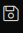 | Click to save the description. |

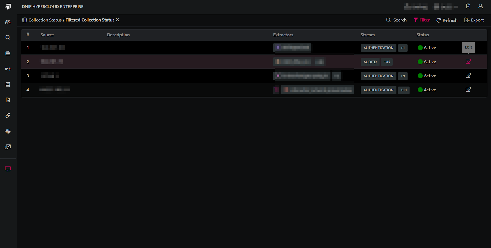   
.
- Click on Save to add the description.  
      
    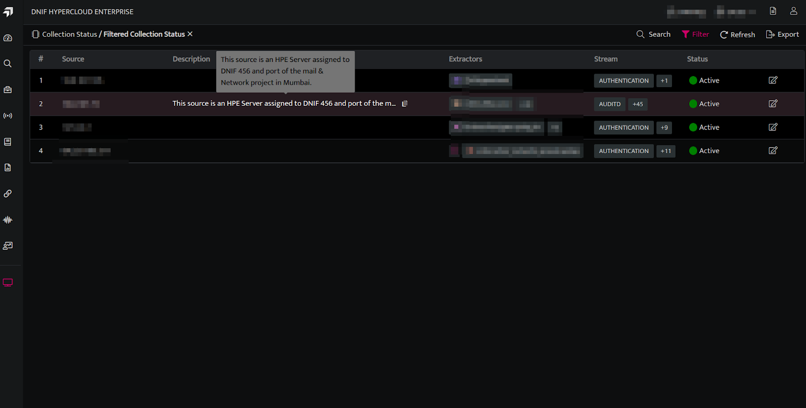

## **How to manually override and rollback an extractor?**

  

## **To manually override an extractor:**

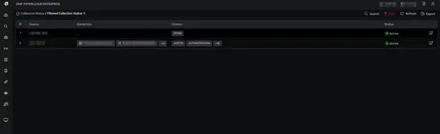

- Click the **Edit** icon against the required device. The extractor column of the device will be changed into edit mode.

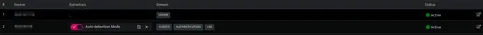

- Select the radio button to manually override the selected extractor.

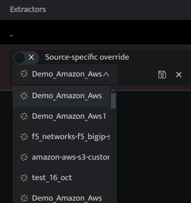

- Select the required extractor from the dropdown and click Save. The Device will be updated with the new extractor as shown below

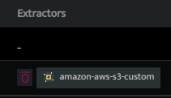

- This **Pink** icon in the above screen indicates that the extractor has been overridden

## **To rollback an overridden extractor**

- Click the edit icon against the overridden device.

- Select the radio button, to rollback the extractor to the original auto detected value. The following screen is displayed

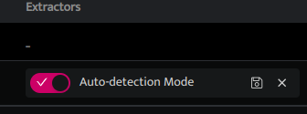

- Click **Save**. The Device will rollback to its original autodetected value as shown below

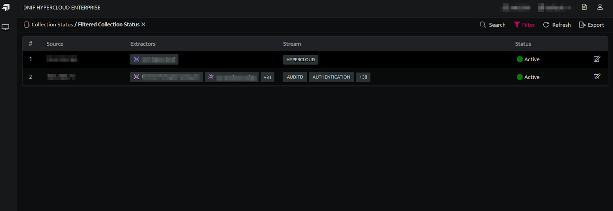

## **How to delete an inactive device?**

**Note:** You must have the Tenant Admin role to delete an inactive device. Once you delete a device, you cannot recover it.

## **Steps to delete inactive devices**

1. To delete inactive devices, click on the Filters icon. By default, it will show all the active devices.  
      
      
    

3. Select status **Inactive** from the list in the dropdown menu and click **Apply**. The page will update to show all inactive devices.  
    

| Field | Description |
| --- | --- |
|  | Active device |
|  | Inactive device |

  
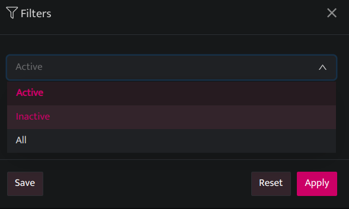  
  
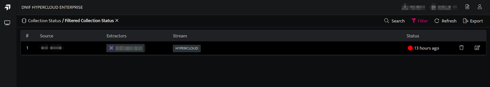  
  

3. Click the **Delete** icon next to the inactive device you want to delete.  
    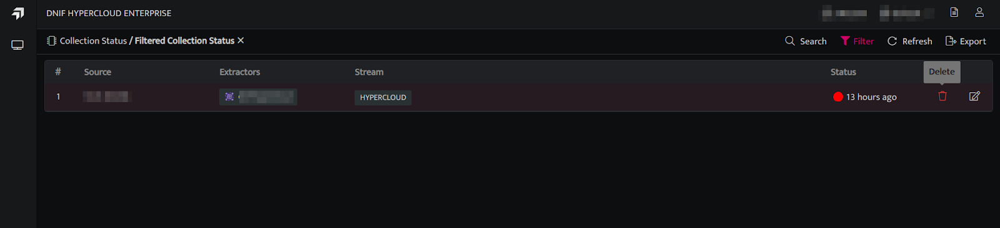  
    

5. When the popup window appears, **click Delete** to confirm. Alternatively, click **Cancel** to close the popup without deleting the device.  
    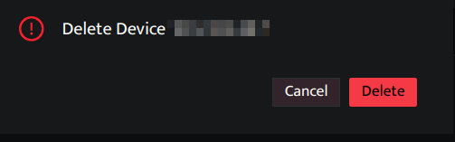
    
