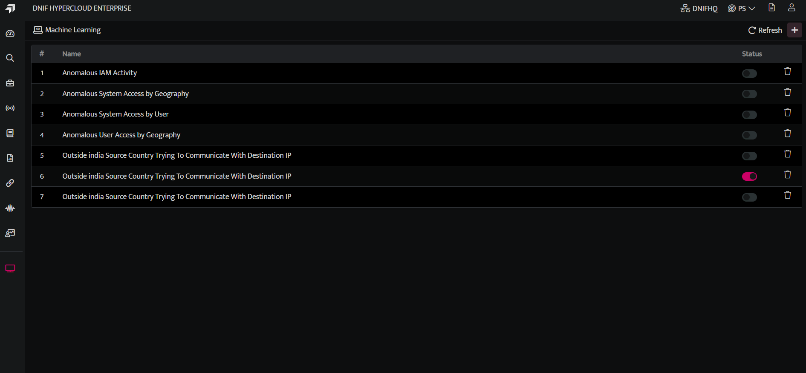
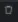
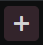
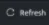
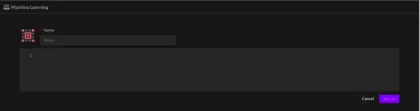

Machine learning (ML) is used to analyze the incoming data that matches the set filters, it allows you to apply multiple ML models to a single stream of data. ML models are applied to the incoming stream of data to help us learn, understand user behavior patterns and any deviations. You can analyze and identify anomalies, suspicious activities and investigate threats based on the ML models applied to the streams. You can also view the list of signals raised for anomalies detected.

## **How to view Machine Learning Models?**


- Hover on the Administration icon on the left navigation panel and select Machine Learning, the following page will be displayed.



The above screen lists Machine Learning models configurations listed in this particular scope along with the following details


| **Field Name** | **Description** |
|----------------|------------------|
| **Model Name** | Displays the type of model and the model name. |
|  | Use this to enable or disable the Baseline and detection for the particular model. |
| | Use this document to delete the particular Machine Learning Model. |
|  | Use this icon to add a new Machine Learning model. |
| | Use this icon to refresh the screen. |

## **How to configure ML Models?**


To create Machine Learning models click the plus icon on the top right corner of the screen, the following page will be displayed, you can add a model as required.



## **Achieving Baseline Machine Learning Models**

The baseline machine learning models are created using YAMLs, these YAMLs are simple to understand and allow transparency in operations. Baseline model tracks 'numeric quantity' and evokes an anomaly signal when that numeric quantity goes beyond normal observed value.

## **Example 1: Abnormal login Failure by a User**

**Context:** The assumption is every user will have a specific pattern associated with their failed login attempts. If this normal behavior is surpassed, it will raise an anomaly signal.

In order to achieve this baseline model, here are the YAML changes one needs to perform.

## **Key sections from YAML**


1. **Filter**

The values under the Filter section are used to narrow down the search criteria for learning and detection. Here, only failed login actions are in our area of interest, hence the two fields that are filtered are Action and Status.

```
filter:

* \$Action=LOGIN
* \$Status=FAILED
```
---


2. **Focus; Stream and Track**

The values under the focus section signifies that for every combination of SrcIP and User, the count of users will be tracked from the Authentication stream.

```
focus:

* \$SrcIP
* \$User

stream: AUTHENTICATION
track: COUNT(\$User)
```
---

This model aggregates every hour and updates the baseline on a nightly basis on the data learnt over the last seven days. The deviation from this baseline will result in an anomaly signal.


3. **Anomaly Signal**

The description of the detection signal can be specified in the DetectionName; you can customize the Signal name as per requirement. The Mitre mapping should be specified for each signal, along with the detection score and detection confidence as these are required to raise any signal.

```
anomaly:
DetectionConfidence: Medium
DetectionName: Abnormal number of time Login Failure by \{User\} on \{SrcIP\}
DetectionScore: 5
DetectionTactic: Defense Evasion
DetectionTechnique: Valid Accounts
TargetHost: \$User
```
---


4. **First seen signal**

First seen signal will be raised whenever a said activity is observed for the first time for a field mentioned in the focus section (here User and SrcIP). The first seen is triggered when the trained data has not encountered that User at all.

```
firstseen:
DetectionConfidence: Medium
DetectionName: Multiple Login Failure by \{User\} on \{SrcIP\} for the first time
DetectionScore: 3
DetectionTactic: Defense Evasion
DetectionTechnique: Valid Accounts
TargetHost: \$User
```
---


5. **Rarity signal**

The Rarity Signal is raised when a said activity takes place after an interval of seven days.

```
rarity:
DetectionConfidence: Low
DetectionName: Rare Login Failure by \{User\} on \{SrcIP\}
DetectionScore: 3
DetectionTactic: Defense Evasion
DetectionTechnique: Valid Accounts
TargetHost: \$User
```
---


6. **Signals raised**

The signals are raised as follows:

- Anomaly

- First seen

- Rarity

**Learning:** This baseline ML model aggregates every hour and updates the baseline on a nightly basis on the data learnt over the last seven days. The YAML based baseline model for detecting the abnormal failed login attempt by a user is demonstrated here.

## **Example 2: Abnormal amount of data transmitted from DNS port**


1. **Filter**

The values under the Filter section are used to narrow down the search criteria for learning and detection. Here, only packet allowed actions over the DNS port is our area of interest hence there are 2 fields that are filtered - Action and DstPort.

```
filter:

* \$Action=PACKET\_ALLOWED
* \$DstPort=53
```
---


2. **Focus, Stream and Track**

The values under the focus section signifies that for every DstIP, the sum of TXLen will be tracked from the Firewall stream.

```
focus:

* \$DstIP

stream: FIREWALL
track: SUM(\$TXLen)
```
---

This model aggregates every hour and updates the baseline on a nightly basis on the data learnt over the last seven days. The deviation from this baseline will result in an anomaly signal.


3. **Anomaly Signal**

The description of the detection signal can be specified in the DetectionName, where one can customize the Signal name as per requirements. The Mitre mapping should be specified for each signal, along with the detection score and detection confidence as these are required to raise any signal.

```
anomaly:
DetectionConfidence: Medium
DetectionName: Abnormal amount of Data transmitted from DNS port
DetectionScore: 5
DetectionTactic: Exfiltration
DetectionTechnique: Exfiltration Over Alternative Protocol
TargetHost: \$DstIP
```
---


4. **First seen signal**

First seen signal will be raised whenever a said activity is observed for the first time for a field mentioned in the focus section (here DstIP). The first seen is triggered when the trained data has not encountered that DstIP at all.

```
firstseen:
DetectionConfidence: Low
DetectionName: First time transmission of abnormal amount of Data from DNS port time on \{ \$DstIP \}
DetectionScore: 3
DetectionTactic: Exfiltration
DetectionTechnique: Exfiltration Over Alternative Protocol
TargetHost: \$DstIP
```
---


5. **Rarity signal**

This is raised when an activity takes place after an interval of seven days.

```
rarity:
DetectionConfidence: Low
DetectionName: Rare amount of Data transmitted from DNS port
DetectionScore: 5
DetectionTactic: Exfiltration
DetectionTechnique: Exfiltration Over Alternative Protocol
TargetHost: \$DstIP
```
---


6. **Signals raised**

The signals are raised as follows:


- Anomaly


- First seen

The YAML based baseline model for detecting the abnormal amount of data transferred over a DNS port is demonstrated here.

Introduced in v9.2.0

Introduced the following configurations:


1. **Training Samples, Train period, and old data** 

- **Training Samples:** This indicates the minimum count of model samples present in the training dataset to consider it to be eligible for training, by default the value is 80.


- **Train period:** This indicates the number of days the model is trained for, if not specified, the default value of seven days will be applied.


- **Old data:** This indicates if the older data prior to enabling the model is to be considered for training.


- By default, the value is True and this is applied if not specified.


-If set to False, data for training will be considered from the datetime of enabling the model.

```
training\_samples: 80
train\_period: 10
old\_data: true
```
---


2.**where:** The where keyword filters data returned by the query based on the conditions you specify immediately after the where keyword.


- It allows filtering capabilities similar to what we support for a DQL block query.


- We support both Filter and where keyword. However, we highly recommend using the where keyword.

```
where: action='LOGIN' and not system like '%man%'
```
---

The following is the complete model configuration yaml for your reference:

```
condition: upper
condition: upper
filter:

* \$Status=PASSED
* \$System!=-
  focus:
* \$System
* \$User
  where: action='LOGIN' and not system like '%man%'
  id: f3694f9fe3e0449d872bd2a708e5d75f
  model: Anomalous System Access by User
  signal:
  anomaly:
  DetectionConfidence: Low
  DetectionName: Excessive Logins detected on \{System\} by \{User\}
  DetectionScore: 3
  DetectionTactic: Initial Access
  DetectionTechnique: Valid Accounts
  SuspectUser: \$User
  TargetHost: \$System
  firstseen:
  DetectionConfidence: Medium
  DetectionName: '\{User\} logged in for the first time to \{System\}'
  DetectionScore: 3
  DetectionTactic: Initial Access
  DetectionTechnique: Valid Accounts
  SuspectUser: \$User
  TargetHost: \$System
  rarity:
  DetectionConfidence: Low
  DetectionName: Rare login seen on \{System\} by \{User\}
  DetectionScore: 3
  DetectionTactic: Initial Access
  DetectionTechnique: Valid Accounts
  SuspectUser: \$User
  TargetHost: \$System
  stream: AUTHENTICATION
  track: COUNT(\*)
  training\_samples: 69
  type: baseline
  window: hour
```
---


3. **Signals raised**

The signal raised is now displayed as follows:

- Rarity

