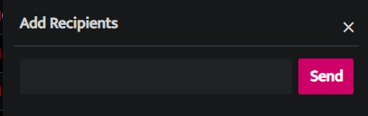
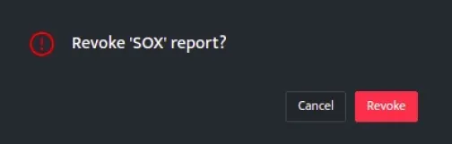

- To invoke a report, click the **play** button on the **Manage Report** list page, Add recipients pop up will be displayed.

- Enter an email address and click **Send** to invoke the report, a time indicator will be displayed indicating that the report is being executed in the background.

- Hover on this time indicator and a red cross mark will be displayed, click on the **red cross mark**.

- A pop-up will be displayed as follows

- Click **Revoke** to cancel the report from being executed or click **Cancel** to continue with the report.

**Introduced in v9.1.1**  
UNET sync is a process that is running on core and it automatically syncs your reports every 30 minutes.
