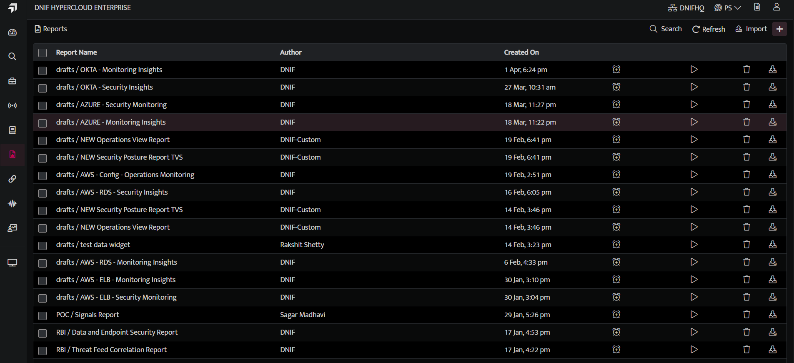
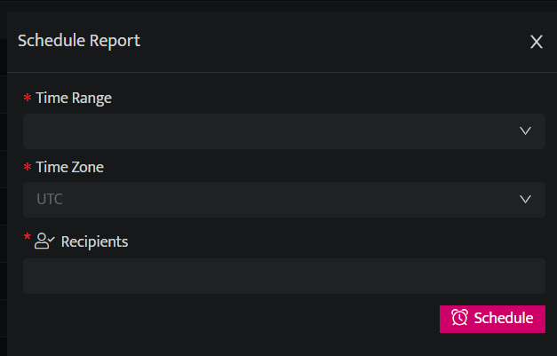
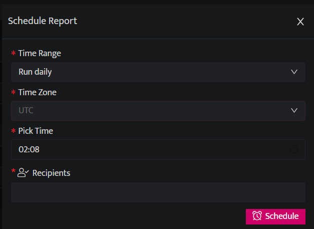

<video width="100%" height="auto" controls>
  <source src="./schedule-a-report-image/schedule-a-report.mp4" type="video/mp4" />
  Your browser does not support the video tag.
</video>

The following are the steps to schedule a report:

- Click the **Reports** icon on the left navigation bar, it will display the list of existing Reports.

- Click **Schedule** icon, against the report name you want to schedule.

The following parameters are available for Scheduling a report:

| **Time Range** | **Description** |
| --- | --- |
| Run Daily | Schedule on a daily basis at a particular time |
| Run Weekly | Schedule on a weekly basis at a particular time. You can schedule it for multiple days in a week. |
| Run Monthly | Schedule on a monthly basis at a particular date and time |
| Run Cron (Custom) | Enter the required Cron Value to be scheduled. The cron value should be entered in format.For example, 21 4 1 2 121 represents minutes4 represents hours1 represents date of the month2 represents month1 represents day of the weekHere in the above example, the scheduler will run at 4:21 on 1st February, 2021 (Monday )|
| Timezone | Select the timezone as per your local time zone. |

- Click **Schedule**, to schedule a report and update the details in the report list page.

For more examples refer the following table:

| **Minute** | **Hour** | **Date of the Month** | **Month** | **Day of the Week** | **Result** |
| --- | --- | --- | --- | --- | --- |
| 21 | 4 | * | 2 | * | The scheduler will run at 4:21 on 1st February, 2021 (Monday) |
| 21 | 4 | * | 2 | 3 | The scheduler will at 4:21 on 3rd February, 2021 (Wednesday )|

- If the value is left as . * * * * * then the cron will be scheduled to run after every minute.

- If the fields for date, year, and day are mentioned as * then it will be scheduled for that set time everyday.

- If the fields for month and day of the week are mentioned as *, then the cron will be scheduled for the particular date and time every month.

- If only the day of the week is mentioned as *, the cron will be scheduled for the particular date of the month.

- Example: 00 01 * 10 * . If the time is set to 1:00 on October and the fields of date and day of the week are marked as *. In this case it will be scheduled to run at 1:00 am. on 1st of October 2020.

- Click the unschedule button to cancel a scheduled report.

You can reschedule or unschedule a report. Click the Schedule icon, Schedule report window will be displayed, update details here and click **Reschedule** or click **Unschedule** to stop the scheduling process of that particular report.
