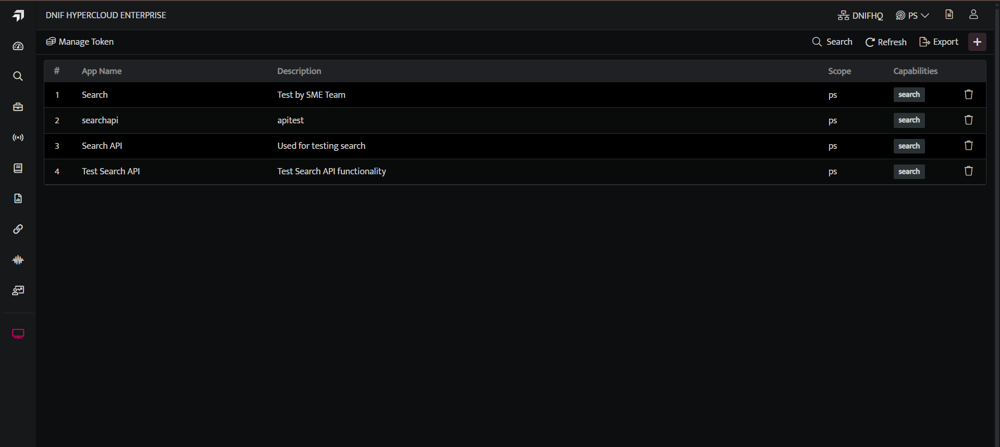
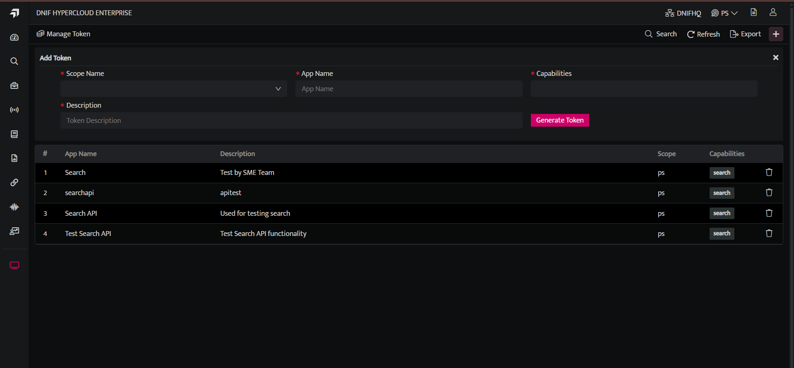
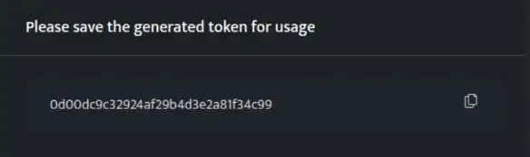

Token management is the process used to authenticate third party applications to access DNIF Integration Services. It is used to secure user access to systems and applications. A token is generated from the DNIF console with all the details of the particular application. Users can access DNIF from an authorized third party application if authenticated using a valid token.

## **How to generate tokens?**

- Hover on the **System** icon on the left sidebar of the Home screen, from the option displayed select **Manage Tokens**, the following screen will be displayed.

- Click **plus** icon to generate a token. The following **Add Token** screen is displayed.

The **Add Token** screen displays the following fields:

| **Field Name**  | **Description** |
| --- | --- |
| Scope Name | Select the scope that you want to access. |
| App Name | Enter the Name of the application through which you will be accessing DNIF |
| Capabilities | Select the required capabilities. |
| Description | Enter a brief description explaining the reason why this token is generated. |

- Select / Enter the required details and click **Generate Token**, to generate a token. A window pops up displaying the generated token

- Copy this generated token and use this token to access DNIF through a third party application.

- Ensure to copy the token at this stage as the token won’t be displayed again. Once you click outside this popup the generated token will be listed as follows.

- If you misplace the token, the application should be deleted from this list and a token should be generated again.
