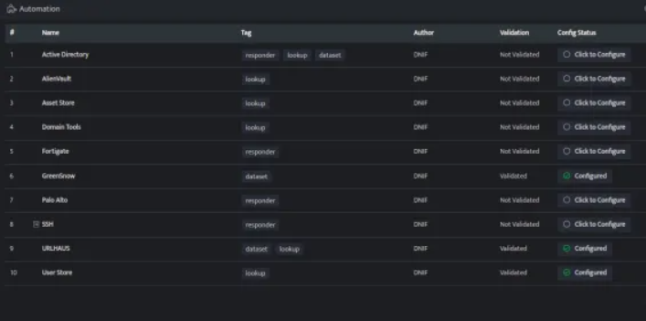
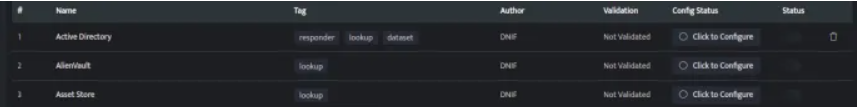

# Configuring Automation

This article will help you to understand the steps on how to configure automation.

## How to Configure Automation?

1. **Navigate to the Automation Module**:
   - Hover on the **System** icon on the left navigation bar of the **Home** screen.
   - From the options displayed, select **Automation**.
   - The following screen will be displayed:

    

**The Automation screen displays the following fields:**

| Field Name     | Description                                                                 |
|----------------|-----------------------------------------------------------------------------|
| **Name**       | Displays the name of the automation.                                        |
| **Tag**        | Displays the type of automation.                                            |
| **Author**     | Displays the name of the user who created the automation.                  |
| **Validation** | Displays whether the automation is successfully validated.                  |
| **Config Status** | Displays whether the automation is configured with DNIF or not.       |
| **Status**     | Toggle button to enable or disable the automation.                          |

2.  If the automation is added but **not configured**, it will be displayed as **Click to Configure** under **Config Status**.

    

3. **Click to configure** to configure the automation, a form will be displayed, enter the required details to configure.

- The form will be different for different automations.

4. Enter the required information and click **Save**. The details will be displayed in grid format.

- The details will be automatically validated with DNIF and if the details are correct, the Validation status will be displayed as Validated and Config Status will be displayed as CONFIGURED.

- Click the Status toggle button to enable or disable a particular automation once it is successfully updated.

