Active Directory (AD) is a directory service that Microsoft developed for Windows domain networks. It is included in most Windows Server operating systems as a set of processes and services.

## **Configuration**

- Follow the initial configuration steps in [How to Configure Automation?](https://dnif.it/kb/uncategorized/configuring-automation/).  
      
      
    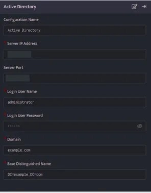

- Click the edit icon to add details.

| **Field**                 | **Description**                                            |
|---------------------------|------------------------------------------------------------|
| Configuration Name        | Enter the configuration name                               |
| Server IP Address         | Enter IP Address of Active Directory Server                |
| Server Port               | Enter Port of Active Directory Server                      |
| Login User Name           | Enter the username with Administrative rights              |
| Login User Password       | Enter a valid password of the above username               |
| Domain name               | Enter the Domain name of the Active Directory              |
| Base Distinguished Name   | Enter a base distinguished name                            |

Enter the above details and click **Save**.

## **Active Directory plugin functions**

### **Get User details**

This function allows you to retrieve the user details from the eventstore.

### **Function\_name**

```
get_userinfo
```

### **Input**

.

- A User for which Active Directory will retrieve the most recent report.

```
_retrieve query UserLookupAD
```

Here:

The UserLookupAD is a custom event store created to demonstrate this example. The \_retrieve directive fetches the $User field for each event in the UserLookupAD (custom) eventstore. The output is as shown below:

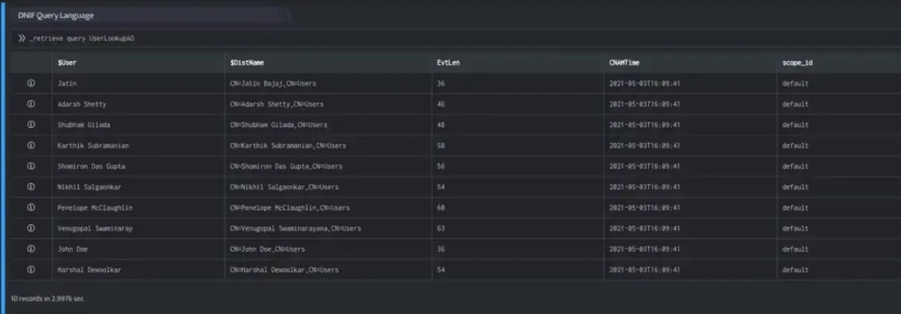

### **Output**

```
_lookup ad get_userinfo 'Active Directory' $User,$DistName
```

In the pipelined query function, the \_lookup directive calls the get\_userinfo function of the Active Directory plugin. $User, $DistName is passed as a parameter to the function. This report contains details about the Source User for lookup, account registration expiry date, Country code, Distinguished Name of user and so on. The output is as shown below:

This report contains details about the User such as the Employee ID, Department, Location of the User and so on.

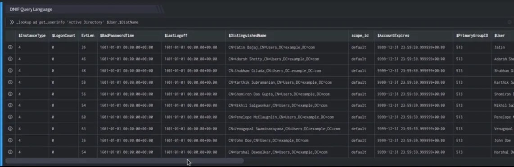

The Lookup call returns output in the following structure for available data

| **Fields** | **Type** | **Description** |
| --- | --- | --- |
| $User | text | Source User for lookup |
| $AccountExpires | text | Account registration expiry date |
| $BadPasswordTime | date | This attribute specifies the last time and date that an attempt to log on to account was made with an invalid password |
| $BadPwdCount | number | This attribute specifies the number of times the user or service account tried to log on to the account by using an incorrect password. |
| $CN | text | Common name for user |
| $CountryCode | number | Country code of the queried user |
| $DisplayName | text | Display name of Active Directory user |
| $DistinguishedName | text | Distinguished Name of user |
| $GivenName | text | Given Name For User |
| $InstanceType | text | User Instance Type |
| $LastLogoff | text | This attribute specifies the last time the user logged off. |
| $LastLogon | text | This attribute specifies the last time the user logged on. |
| $LastLogonTimestamp | date | This attribute specifies the time that the user last logged on to the domain. |
| $LogonCount | number | This attribute specifies the number of times that the account has successfully logged on |
| $Name | text | Name of the user |
| $PrimaryGroupID | text | Primary Group ID of the user |
| $PwdLastSet | text | This attribute specifies the date and time on which the password for the account was last changed. |
| $UserPrincipalName | text | User Principal Name |
| $DNSHostName | text | DNS Host Name |
| $LocalPolicyFlags | text | This attribute specifies flags that determine where a machine gets its policy |
| $OperatingSystem | text | This attribute specifies the operating system name |
| $OperatingSystemVersion | text | This attribute specifies the version of the operating system |
| $ServicePrincipalName | text | Service Principal Name |
| $Department | text | This attribute specifies the department name of the User. |
| $Manager | text | This attribute specifies the manager name of the User. |
| $MemberOf | text | This attribute specifies the group name to which the User belongs. |
| $UserWorkstations | text | This attribute is used to limit the machines from which a user can log on, by DNS or NetBIOS name |

## **Add User to Group**

This function allows you to add a User in a user pre-defined group in Active Directory.

### **Function\_name**

```
add_to_group
```

### **Input**

- User to be added in group

```
_retrieve query UserInfoAD
```

Here:

The UserInfoAD is a custom event store created to demonstrate this example. The \_retrieve directive fetches the $User field for each event in the UserInfoAD (custom) eventstore. The output is as shown below:

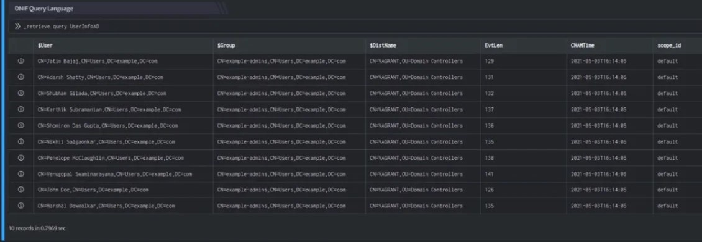

### **Output**

```
_trigger api ad add_to_group 'Active Directory' $User,$Group
```

In the pipelined query function, the \_trigger directive calls the add\_to\_group function of the Active Directory plugin. $User, $Group is passed as a parameter to the function. This report contains details about the User added to group, the status of action triggered for that User/Group and so on. The output is as shown below:

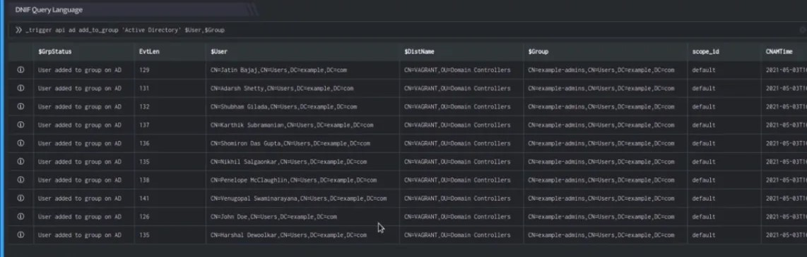

## **Remove User from Group**

This function allows you to remove a User from a user pre-defined group in Active Directory.

### **Function\_name**

```
remove_from_group
```

### **Input**

- User to be removed from Group

```
_retrieve query UserInfoAD
```

Here:

The UserInfoAD is a custom event store created to demonstrate this example. The \_retrieve directive fetches the $User field for each event in the UserInfoAD (custom) eventstore. The output is as shown below:

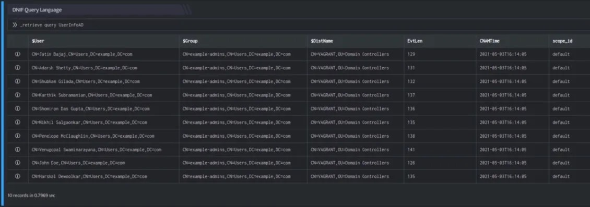

### **Output**

```
_trigger api ad remove_from_group 'Active Directory' $User,$Group
```

In the pipelined query function, the \_trigger directive calls the remove\_from\_group function of the Active Directory plugin. $User, $Group is passed as a parameter to the function. This report contains details about the User removed from group, the status of action triggered for that User/Group and so on. The output is as shown below:

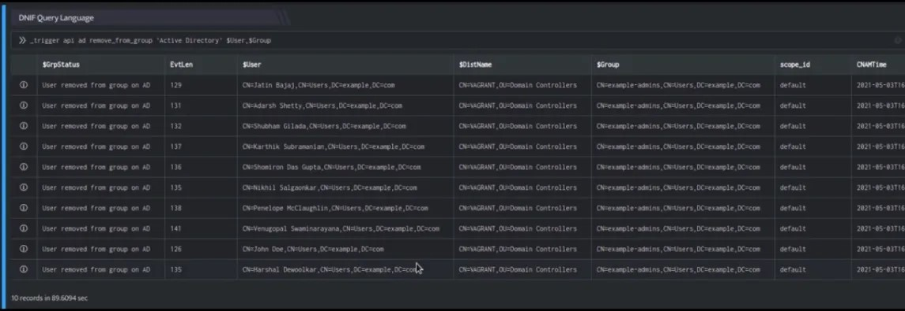

## **Enable User**

This function allows you to enable a User present in the user pre-defined group in Active Directory.

### **Function Name**

```
enable_user
```

### **Input**

- User to be enabled

```
_retrieve query UserEnableAD
```

Here:

The UserEnableAD is a custom event store created to demonstrate this example. The \_retrieve directive fetches the $User field for each event in the UserEnableAD (custom) eventstore. The output is as shown below:

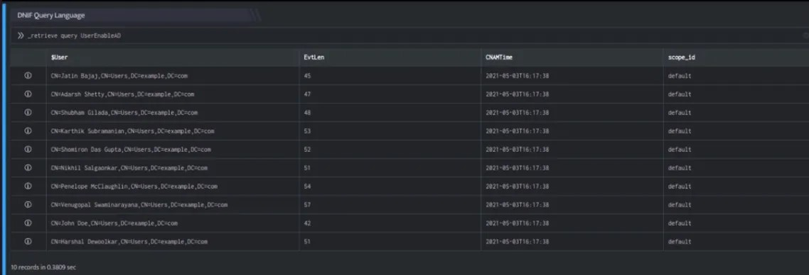

### **Output**

```
_trigger api ad enable_user 'Active Directory' $User
```

In the pipelined query function, the \_trigger directive calls the enable\_user function of the Active Directory plugin. $User is passed as a parameter to the function. This report contains details about the User to be enabled in the user pre-defined group in Active Directory, the status of action triggered for that User and so on. The output is as shown below:

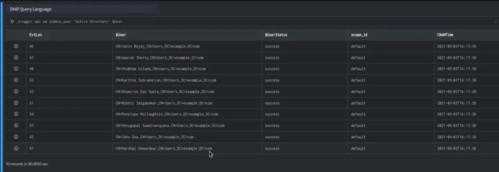

## **Disable User**

This function allows you to disable a User present in the user pre-defined group in Active Directory.

### **Function Name**

```
disable_user
```

### **Input**

- User to be disabled

```
_retrieve query UserEnableAD
```

Here:

The UserEnableAD is a custom event store created to demonstrate this example. The \_retrieve directive fetches the $User field for each event in the UserEnableAD (custom) eventstore. The output is as shown below:

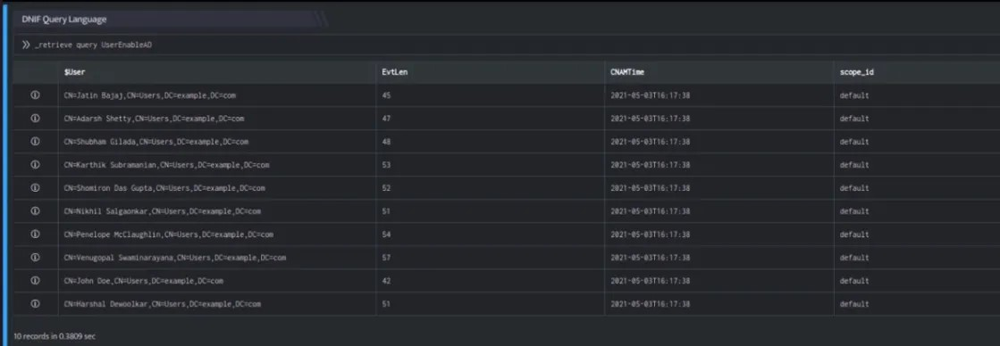

### **Output**

```
_trigger api ad disable_user 'Active Directory' $User
```

In the pipelined query function, the \_trigger directive calls the disable\_user function of the Active Directory plugin. $User is passed as a parameter to the function. This report contains details about the User to be disabled in the user pre-defined group in Active Directory, the status of action triggered for that User and so on. The output is as shown below:

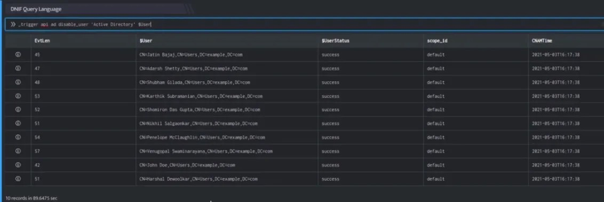

## **Retrieve User intel data**

Retrieve user intel data. Active Directory is a pre-configured integration in DNIF that stores its data as a dataset in an eventstore, this is a scheduled eventstore and can be used to fetch user intel data.

### **Function\_name**

```
import_user_intel
```

### **Input**

```
_retrieve list
```

The above query, retrieves a list of all the existing event stores. The output is as shown below:

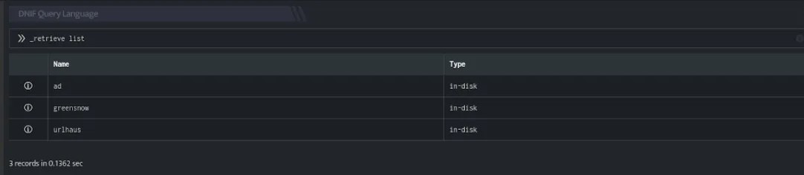

### **Output**

```
_retrieve query ad
```

In the pipelined query function, the \_retrieve directive calls the import\_user\_intel function of the Active Directory plugin, to fetch user intel data.

The output is as shown below:

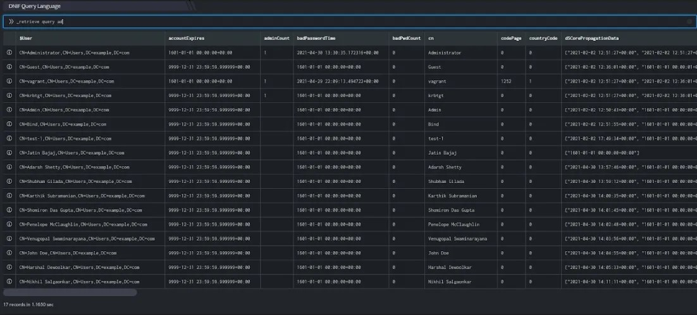
