AlienVault Open Threat Exchange (OTX) is the world's most authoritative open threat information sharing and analysis network. OTX provides access to a global community of threat researchers and security professionals,200,000 participants in 140 countries contribute over 20 million threat indicators daily. OTX allows anyone in the security community to actively discuss, research, validate, and share the latest threat data, trends, and techniques.

OTX provides information on the reliability of threat information, reporter of the threat, and other details of threat investigations. OTX data can be used to enhance threat detection capabilities of security monitoring systems such as DNIF.

## **Pre-requisites**

- You can sign up and set up an OTX account using your email address, or you can use your existing Twitter or Google+ account.

- To create an OTX account:
    - Go to [https://otx.alienvault.com](https://otx.alienvault.com/)
    
    - In the upper-right corner of the home page, click **Sign Up**.  
        

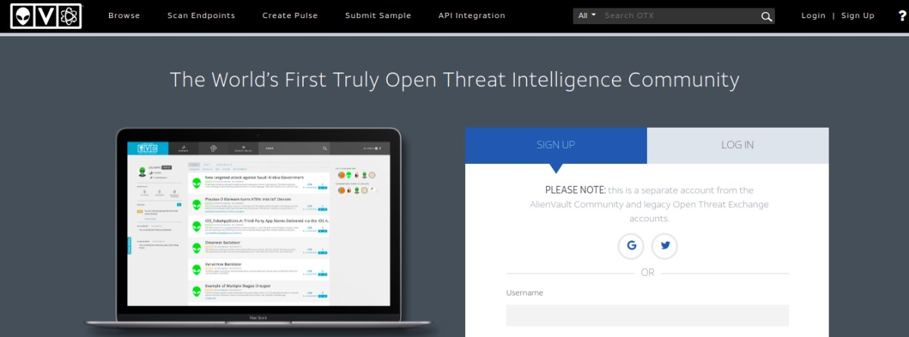

- Enter the details in the form that appears and click **Sign Up**.

- Once you have logged into the OTX user interface, click **Settings**, to view your user profile and also access the **Settings** page.

- On this page you can access your OTX account key which is used to authenticate API calls to AlienVault OTX.  
      
    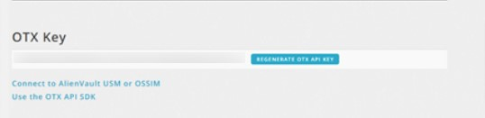  
    

## **Configuration**

- Follow the initial configuration steps in [How to Configure Automation?](https://dnif.it/kb/uncategorized/configuring-automation/).  
      
    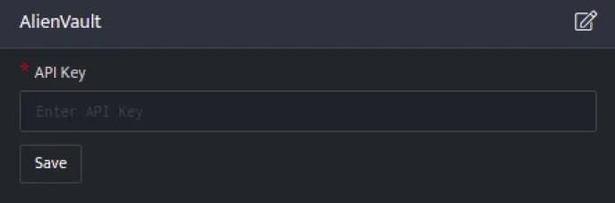  
    

- Click the edit icon to add details.

| **Field** | **Description** |
| --- | --- |
| API Key | AlienVault OTX API Key |

- Enter the above details and click **Save**.  
    

## **Lookups integrated with AlienVault**

### **Retrieve Domain reports**

This function returns a complete report of all threat indicators for a given domain, including data from all the sub-reports.

### **Function_name**

```
get_domain_report
```

### **Input**

A domain name

```
_retrieve query DomainDetails
```

Here:

The DomainDetails is a custom event store created to demonstrate this example. The _retrieve directive fetches the $Domain field for each event in the DomainDetails (custom) eventstore. The output is as shown below:

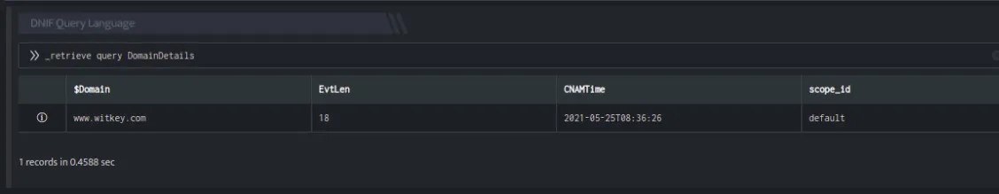

### **Output**

```
_lookup alienvault get_domain_report $Domain
```

In the pipelined query function, the _lookup directive calls the get_domain_report function of the AlienVault plugin. $Domain is passed as a parameter to the function. This report contains details about the domain, the source domain, pulse count and so on. The output is as shown below:

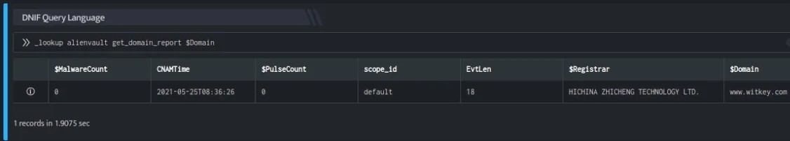

The Lookup call returns output in the following structure for available data

| **Field** | **Type** | **Description** |
| --- | --- | --- |
| $Domain | text | Source domain for lookup |
| $PulseCount | number | Number of pulses that reference the given domain |
| $MalwareCount | number | Malware count for the domain |
| $City | text | City in which the domain is registered |
| $Country | text | Country in which the domain is registered |
| $Org | text | text |
| $Registrar | text | Name of the domain's official registrar |

## **Retrieve IP address details**

This function returns a complete report of all threat indicators for a given IP address,

### **Function_name**

```
get_ip_report
```

### **Input**

A valid IPv4 address in dotted quad notation, for the time being only IPv4 addresses are supported.

```
_fetch $SrcIP from event where $Stream=FIREWALL limit 1
```

Here:

The _fetch directive retrieves $SrcIP (source IP address) for each event. The result set is limited to the latest event. The output is as shown below:

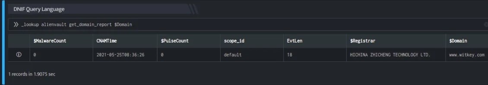

### **Output**

```
_lookup alienvault get_ip_report $SrcIP
```

In the pipelined query function, the _lookup directive calls the get_ip_report function of the AlienVault plugin. $SrcIP is passed as a parameter to the function. This report contains details about the IP address such as the source Ip details, malware coount, threat score for the given IP address and so on. The output is as shown below:

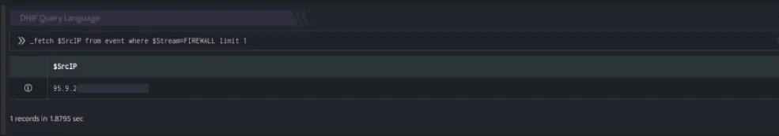

The Lookup call returns output in the following structure for available data

| **Field** | **Type** | Des**c**ription |
| --- | --- | --- |
| $IP | text | Source IP for lookup |
| $MalwareCount | number | Malware count for the IP Address |
| $ThreatScore | number | AlienVault Labs threat score for the given IP address |
| $PulseCount | number | AlienVault pulse count |

## **Retrieve Host Details**

This function returns a complete report of all threat indicators for a given hostname.

### **Function_name**

```
get_hostname_report
```

### **Input**

```
_retrieve query HostDetails
```

- The HostDetails is a custom event store created to demonstrate this example.  
    [host_details.csv](https://m.dnif.it/hubfs/host_details.csv)  
      
      
    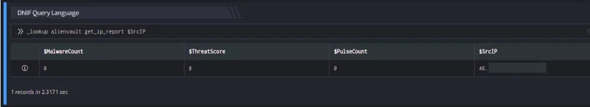  
    

The Search query retrieves the $DevSrcIP field for each event in the HostDetails (custom) eventstore.

### **Output**

```
_lookup alienvault get_hostname_report $DevSrcIP
```

In the pipelined query function, the _lookup directive calls the get_hostname_report function of the AlienVault plugin. $DevSrcIP is passed as a parameter to the function. This output contains details about the Device such as the Hostname, Pulse Count, Malware Count and so on. The output is as shown below:

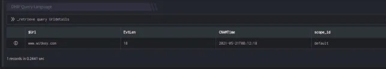

The Lookup call returns output in the following structure for available data

| **Field** | **Type** | **Description** |
| --- | --- | --- |
| $Hostname | text | Host name being queried |
| $PulseCount | number | Pulse count for the hostname |
| $MalwareCount | number | Malware count for the hostname |

## **Retrieve URL scan reports**

This function returns the following information for the given URL:

- Historical geographic information

- Threat indicators gathered from the OTX community pulse stream

- AlienVault Labs' URL analysis results.  
    

### **Function_name**

```
get_url_report
```

### **Input**

A URL for which AlienVault will retrieve the most recent report. You may also specify a scan_id (sha256-timestamp as returned by the URL submission API) to access a specific report.

```
_retrieve query Urldetails
```

Here:

The Urldetails is a custom event store created to demonstrate this example. The _retrieve directive fetches the $Url field for each event in the Urldetails (custom) eventstore. The output is as shown below:

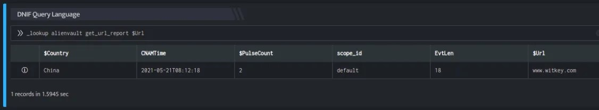

### **Output**

```
_lookup alienvault get_url_report $Url
```

In the pipelined query function, the _lookup directive calls the get_url_report function of the AlienVault plugin. $Url is passed as a parameter to the function. This report contains details about the URL, its pulse count, country to which it belongs and so on. The output is as shown below:

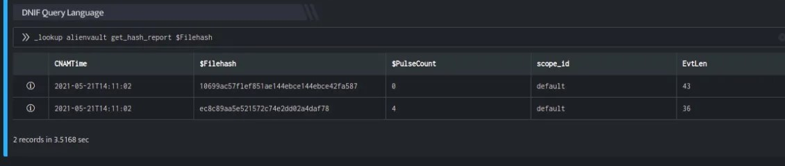

The Lookup call returns output in the following structure for available data

| **Fields** | **Type** | **Description** |
| --- | --- | --- |
| $Url | text | The Url being queries |
| $PulseCount | number | AlienVault pulse count |
| $Country | text | Country in which the given URL's hosting server is deployed |

## **Retrieve hash reports**

This function returns the metadata about the file hash, as well as dynamic and static analysis of the given filehash. The SHA1 or SHA256 hashing algorithm (formats) are acceptable.

### **Function_name**

```
get_hash_report
```

### **Input**

A sha1/sha256 hash will retrieve the most recent report on a given sample.

```
_retrieve query File
```

Here:

The File is a custom event store created to demonstrate this example. The \_retrieve directive fetches the $Filehash field for each event in the File (custom) eventstore. The output is as shown below:

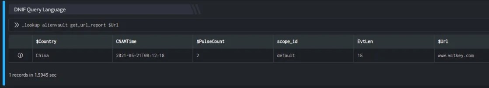

### **Output**

```
_lookup alienvault get_hash_report $Filehash
```

In the pipelined query function, the \_lookup directive calls the get\_file\_report function of the AlienVault plugin. $Filehash is passed as a parameter to the function. This report contains details of the Filehash, File Sha256 Hash, MD5 Sum of the File, and so on. The output is as shown below:

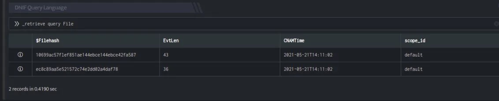

The Lookup call returns output in the following structure for available data

| **Fields** | **Type** | **Description** |
| --- | --- | --- |
| $Hash | text | File hash to be searched |
| $PulseCount | number | AlienVault pulse count |
| $Filesize | text | File size (in bytes) of the given hash's malware file |
| $FileType | text | File type of the given hash's malware file |
| $SHA1 | text | SHA1 hash of the given hash's malware file |
| $SHA256 | text | SHA256 hash of the given hash's malware file |
