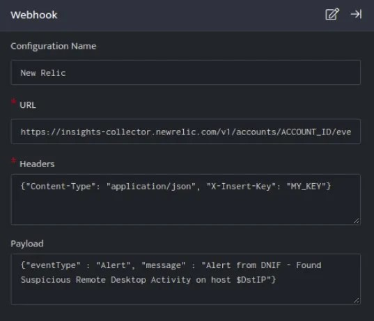
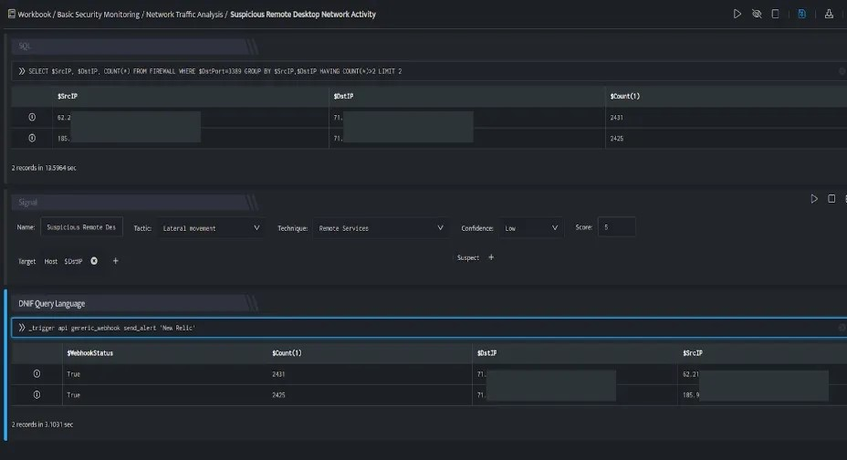

New Relic webhook connections allows you to send alert results to New Relic as a custom event. You can learn more about [New Relic](https://docs.newrelic.com/docs/telemetry-data-platform/ingest-apis/introduction-event-api/).

## **Configuration**

- In the **[Configuration](https://dnif.it/kb/uncategorized/configuring-automation/) Box**, enter the **Configuration Name** to uniquely identify this configuration.

- Identify the content of [headers and payload](https://docs.newrelic.com/docs/telemetry-data-platform/ingest-apis/introduction-event-api/) that you need to provide in the Configuration Box.  
    

Below is an example on how you can leverage this integration to create an event on New Relic.

### **Payload**

```
{   "eventType":"Alert",   "message":"Alert from DNIF - Found Suspicious Remote Desktop Activity on host $DstIP"}
```



New Relic, creates an event on the New Relic account based on the values given in the payload.



In the above figure, a workbook named **Suspicious Remote Desktop Network Activity** is executed which contains the following blocks:

- **SQL Block:** Displays two suspicious Destination IPs on execution of the workbook

- **Signal Block:** This will raise a signal on detecting the suspicious IPs.

- **DQL block with \_trigger query:** Using **Webhook integration for New Relic**, an event will be created on New Relic based on the values given in the payload.
