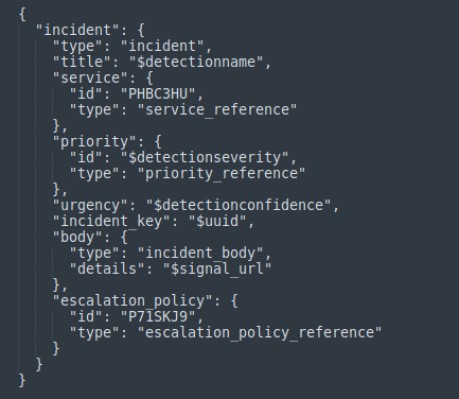

PagerDuty webhook connections allow you to send alert results as a PagerDuty notification. You can learn more about [PagerDuty webhooks](https://developer.pagerduty.com/docs/webhooks/v2-overview/).

## **Configuration**

- The webhook configuration requires the following fields:
    - Configuration Name
    
    - Request Method
    
    - URL
    
    - Headers
    
    - Payload

**Here's a detailed explanation of each configuration field:**

- **Configuration Name:** This field specifies the name you want to give to the webhook configuration.

- **Request Method:** The HTTP method used to create an incident in PagerDuty. As per PagerDuty's documentation, the "**POST**" method is required for this purpose.

- **URL:** The PagerDuty REST API endpoint to which the request is sent.

[https://api.pagerduty.com/incidents](https://api.pagerduty.com/incidents)

NOTE: In the configurations mentioned below, please replace '&lt;&gt;' with the actual required value.

- **Headers:** The headers needed for the HTTP request, usually including authorization tokens and content type.

  ```json
  {"Accept": "application/json", "Authorization": "Token token=&lt;&gt;", "Content-Type": "application/json", "From": "&lt;&gt;"}
  ```

You can find the **token** by logging into PagerDuty. Alternatively, you can click on the link below, and once the page loads, you will find your token in the Authorization section.

[https://developer.pagerduty.com/api-reference/a7d81b0e9200f-create-an-incident](https://developer.pagerduty.com/api-reference/a7d81b0e9200f-create-an-incident)

- **Payload:** The JSON payload containing the incident details.

  ```json
  {
    "incident": {
      "type": "incident",
      "title": "$detectionname",
      "service": {
        "id": "<service id>",
        "type": "service_reference"
      },
      "priority": {
        "id": "$severity",
        "type": "priority_reference"
      },
      "urgency": "$detectionconfidence",
      "incident_key": "$uuid",
      "body": {
        "type": "incident_body",
        "details": "$signal_url"
      },
      "escalation_policy": {
        "id": "<escalation policy id>",
        "type": "escalation_policy_reference"
      }
    }
  }
  ```

In the payload above, you will find the **service ID** in the link shared below:

[https://developer.pagerduty.com/api-reference/e960cca205c0f-list-services](https://developer.pagerduty.com/api-reference/e960cca205c0f-list-services)

Additionally, here is the reference link where you can find the escalation **policy ID** to mention in the payload:

[https://developer.pagerduty.com/api-reference/51b21014a4f5a-list-escalation-policies](https://developer.pagerduty.com/api-reference/51b21014a4f5a-list-escalation-policies)

**Sample Payload Configuration:**

  


## **Workbook details:**

### 1. **DQL Block:**

stream=signals where detectionseverity="High" or detectionseverity="Medium" or detectionseverity="Low" | duration 5m |select \*, lower(detectionconfidence) as detectionconfidence | limit 100

### **Note: You can modify the DQL block query to suit your needs.**

### **2\. Code Block:**

```python
{''}def transform(inward_array):  
  outward_array = \[\]  
  for log in inward_array:  
    temp = {}  
    for key, value in log.items():  
      temp\[key\] = value  
    ioc=log\["detectionscore"\]  
    if ioc in \[1, 2, 3, 4\]:  
      temp\["severity"\] = "<P4 priority id>"  
    elif ioc in \[5, 6\]:  
      temp\["severity"\] = "<P3 priority id>"  
    elif ioc in \[7, 8\]:  
      temp\["severity"\] = "<P2 priority id>"  
    elif ioc in \[9, 10\]:  
      temp\["severity"\] = "<P1 priority id>"  
    outward_array.append(temp)  
  return outward_array{''}
```

Please refer to the link below to include the Priority ID in the code block:  
[https://developer.pagerduty.com/api-reference/0fa9ad52bf2d2-list-priorities](https://developer.pagerduty.com/api-reference/0fa9ad52bf2d2-list-priorities)

### 3. **DQL block with trigger query:** 
Using Webhook integration for PagerDuty, an alert will be sent to the PagerDuty account.

_trigger api generic_webhook send_alert '&lt;&gt;'

By following the above documentation, you can integrate DNIF with PagerDuty to automatically create detailed and relevant incidents based on detected signals.
